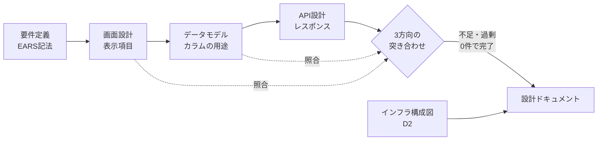
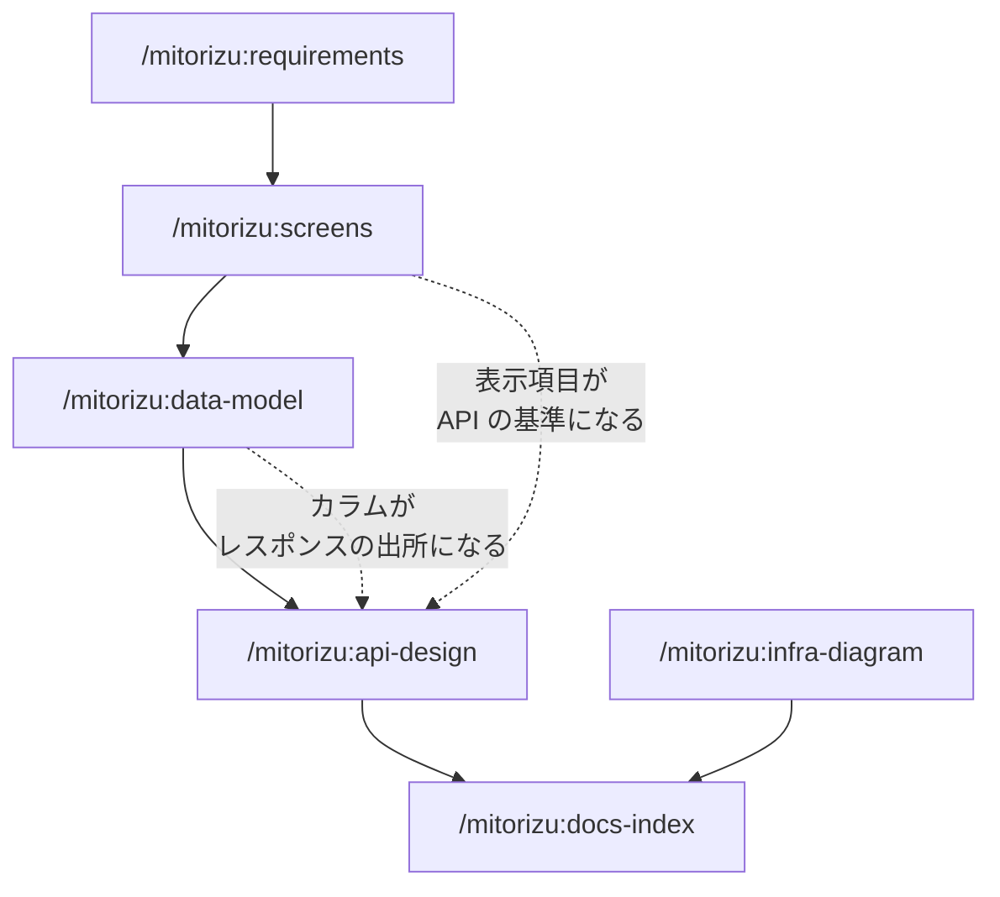

<div align="center">

# mitorizu

**要件定義から設計成果物までを、対話のラリーで組み立てる Claude Code プラグイン**

[](./LICENSE)
[](https://code.claude.com/docs/en/plugins)
[](https://github.com/joe41203/mitorizu/actions/workflows/ci.yml)
[](#16のスキル)

空リポジトリから MVP を作るまでの設計を、対話しながら進めます。<br>
要件定義書・画面設計・ER図・テーブル定義・API設計・インフラ構成図を生成し、<br>
最後に **それらの整合性を機械的に検証** します。

</div>

---

見取図 (みとりず) は、細部の施工図ではなく **全体を大づかみに把握するための図** です。

```
/mitorizu:init           →  実行環境を準備する (任意)
/mitorizu:discovery      →  Web調査で課題と機能候補を洗い出す
/mitorizu:features       →  機能を実装単位に分割する
/mitorizu:business-flow  →  関係者・現状・将来の業務を業務の言葉で描く
/mitorizu:requirements   →  何を作るのかを対話で固める
/mitorizu:non-functional →  性能・可用性・セキュリティを決める
/mitorizu:state-machine  →  状態遷移を設計する (必要な場合)
/mitorizu:screens        →  画面に何を表示するかを決める
/mitorizu:data-model     →  テーブルとカラムを設計する
/mitorizu:api-design     →  API を設計し、整合性を検証する
/mitorizu:sequence       →  処理順序と失敗時の扱いを決める
/mitorizu:infra-diagram  →  インフラ構成図を描く
/mitorizu:docs-index     →  全部を1枚のドキュメントに束ねる
/mitorizu:validate       →  整合性を再検証する
/mitorizu:tasks          →  実装タスクに分解する
/mitorizu:adr            →  後から変えられない決定を記録する
```

## 目次

- [3分で分かる mitorizu](#3分で分かる-mitorizu)
- [何が違うか](#何が違うか)
- [インストール](#インストール)
- [使い方](#使い方)
- [16のスキル](#16のスキル)
- [生成される成果物](#生成される成果物)
- [設計上の選択](#設計上の選択)
- [よくある質問](#よくある質問)

---

## 3分で分かる mitorizu

設計ドキュメントが散らばって整合性が取れなくなる問題を、**成果物の間に検証可能な関係を持たせる** ことで解決します。



順序に意味があります。**画面 → データモデル → API** と進めることで、次の不変条件が成り立ちます。

```
画面の表示項目  =  API レスポンス  ⊆  テーブルのカラム + 導出値
```

- 左の **等号** は、不足も過剰も許さないという意味
- 右の **包含** は、レスポンスが必ずデータモデルに裏付けられるという意味

この関係を `traceability.md` として出力し、**0件でなければ設計は完了としません**。

---

## 何が違うか

仕様駆動開発のツールは既にいくつもあります
([spec-kit](https://github.com/github/spec-kit) /
[OpenSpec](https://github.com/Fission-AI/OpenSpec) /
[tsumiki](https://github.com/classmethod/tsumiki) など)。
mitorizu が埋めるのは、**要件定義とスキーマ / API 設計の接続部** です。

<table>
<tr><th width="50%">よくある設計ドキュメント</th><th width="50%">mitorizu</th></tr>
<tr valign="top"><td>

```
| カラム   | 型      | NULL |
|---------|---------|------|
| status  | string  | 不可  |
| user_id | bigint  | 不可  |
```

型と制約だけ。**スキーマの写し** でしかなく、
そのカラムがなぜ必要なのか分からない。

</td><td>

```
| カラム | 用途 | 参照元 |
|-------|------|--------|
| status | 注文の進行状態。バッジ表示と
          キャンセル可否の判定 | SCR-002(表示),
                               SCR-002(内部) |
```

**用途と参照元が必須**。
書けないカラムは作らない。

</td></tr>
</table>

### 1. カラムの「用途」まで書く

各カラムに **用途** と **参照元** を必須列として持たせます。

| カラム | 型 | 用途 | 参照元 |
| --- | --- | --- | --- |
| `status` | string | 注文の進行状態。バッジ表示とキャンセル可否の判定 | SCR-002(表示), SCR-002(内部) |
| `total_amount` | integer | 注文時点で確定した合計金額。商品価格が変わっても不変 | SCR-002(表示) |
| `isbn` | string | (空欄) | **(空欄)** ← このカラムは作らない |

用途は「そのカラムが無いと何ができなくなるか」を書きます。型から自明なこと (`status: 状態`) は書きません。

> **参照元が書けないカラムは作りません。**
> 例外として認めるのは 監査 / 外部キー / 論理削除 / 楽観ロック / カウンタキャッシュ のみ。

### 2. API レスポンスの過不足を検証する

画面・API・テーブルの3方向を突き合わせ、**不足と過剰の両方** を検出します。

| 検出 | 意味 | 放置するとどうなるか |
| --- | --- | --- |
| **不足** | 画面に表示するが API が返さない | 画面が描画できない。N+1 リクエストを誘発する |
| **過剰** | API が返すがどの画面でも使わない | 不要なクエリ、情報漏洩、消せないフィールドが残る |
| **出所不明** | API が返すがテーブルに裏付けが無い | 実装時に「このデータどこから来るの?」となる |

レスポンスの各フィールドには **画面IDを含む用途** が必須です。

| フィールド | 型 | 用途 | 出所 |
| --- | --- | --- | --- |
| `items[].id` | string | SCR-002 詳細への遷移、キャンセルAPIのキー | `orders.id` |
| `items[].number` | string | SCR-002 注文番号列に表示 | `orders.number` |
| `items[].cancellable` | boolean | SCR-002 キャンセルボタンの出し分け | `orders.status` から導出 |
| `items[].customer.name` | string | SCR-002 顧客名列に表示 | `users.name` (関連) |

画面に文字として出ないフィールドでも、以下は正当な用途として認めます。

- 後続 API のキー (`id`)
- クライアント側の分岐 (`editable`)
- キャッシュ制御 (`updated_at`)
- ページネーション (`next_cursor`)

認めないのは「将来使うかもしれない」「あると便利」「他の API が返しているから」です。

### 3. 一気に決めず、ラリーで固める

3〜5問のまとまりで質問し、各ラウンドで **現在地** と **AIの解釈** を提示します。

```
[フェーズ 2/5: データモデル]
確定済み: 認証はメール+パスワード / 多言語対応なし / 想定10万ユーザー
未決: エンティティの粒度、履歴保持の要否

Q1. 注文のキャンセルは誰ができますか?
    A: 注文者本人のみ (推奨。実装が単純)
    B: 管理者も可能 (権限管理が必要)
    C: 発送前なら誰でも

...(3〜5問)

--- 回答を受けて ---

つまり、キャンセルは注文者本人のみが、発送前に限って実行できる。
管理者による代理キャンセルは MVP では実装しない、と理解しました。
```

1問ずつでは全体像を見失い、一括ドラフトでは AI の独走を許します。この粒度が両方の失敗を防ぎます。

### 4. AI の推測を可視化する

全項目に信頼性マーカーを付けます。

| マーカー | 意味 | あなたの対応 |
| --- | --- | --- |
| `[確実]` | 回答・既存コードに明示的な根拠がある | 確認不要 |
| `[推測]` | 一般的な慣行からの合理的な補完 | 目視で流す |
| `[要確認]` | 判断材料が不足し、仮置きした | **必ず確認する** |

```
[確実] REQ-001: 利用者がログインボタンを押したとき、システムはメールアドレスと
       パスワードを検証し、成功時はダッシュボードへ遷移すること。

[要確認] REQ-003: セッションが30分間無操作の間、システムは自動ログアウトすること。
       (30分は仮置き。業務要件により変わる)
```

`[要確認]` は各フェーズ末と README に集約されるので、**確認すべき箇所だけを追えます**。

### 5. MVP のスコープを削る判断を支援する

機能を足す提案は誰でもできますが、削る判断は明示的に行わないと際限なく膨らみます。

| 機能 | 代替 | 後から追加する難易度 |
| --- | --- | --- |
| 管理画面 | Rails console / 直接 SQL | 低 |
| 通知 (メール・プッシュ) | 手動連絡 | 低 |
| 検索・絞り込み | 一覧 + ブラウザの Ctrl+F | 低 |
| 権限の細分化 | 単一ロール | 中 |
| 監査ログ | なし | 中 (後付けは過去分が残らない) |
| 論理削除 | 物理削除 | **高 (データが失われる)** |
| 多言語対応 | 単一言語 | **高 (全画面に影響)** |

難易度「高」のものは **MVP でも設計に織り込みます**。後から足すとコストが跳ね上がるためです。

---

## インストール

```
/plugin marketplace add https://github.com/joe41203/mitorizu.git
/plugin install mitorizu@mitorizu
```

### 必要なもの

| ツール | 必須 | 用途 |
| --- | --- | --- |
| Claude Code | 必須 | プラグインの実行 |
| [d2](https://d2lang.com) | 任意 | インフラ図の SVG 生成 |
| [mermaid-cli](https://github.com/mermaid-js/mermaid-cli) | 任意 | mermaid ブロックの構文検証 |

**任意のものは未インストールでも動きます。**

- d2 が無い場合: `.d2` ソースのみ生成。後から図にできます
- mmdc が無い場合: 検証をスキップします (図の描画は GitHub 側で行われます)

### d2 をプロジェクトローカルに導入する

```
/mitorizu:init
```

システムには何もインストールしません。`.mitorizu/bin/d2` に置き、`.gitignore` に追記します。

- **確認を取ってからダウンロードします** — 取得元 URL・配置先・サイズを提示してから実行
- 取得元は GitHub Releases の公式配布物のみ (`curl | sh` 形式のインストーラは使いません)
- 取得後に SHA-256 を表示し、`d2 --version` で動作を確認します
- アンインストールは `rm -rf .mitorizu` だけ

`brew install d2` でシステムに入れる方法も選べます。どちらでも `infra-diagram` が自動で見つけます (ローカル優先)。

---

## 使い方

空のリポジトリで、以下の順に実行します。

```
/mitorizu:requirements     要件定義 + データフロー図
/mitorizu:screens          画面設計 (表示項目を定義)
/mitorizu:data-model       ER図 + テーブル定義 + DDL
/mitorizu:api-design       API 設計 + 3方向の突き合わせ
/mitorizu:infra-diagram    インフラ構成図 (D2)
/mitorizu:docs-index       全成果物の README を生成
```

### 設計を直したら再検証する

```
/mitorizu:validate
```

各スキルの検証は実行時にしか走りません。**設計を手で修正した後や、
2つ目以降の機能を作った後** は、このスキルで横断的に検証します。

| 検証する範囲 | 内容 |
| --- | --- |
| 機能内 | 不足 / 過剰 / 出所不明 / 用途の空欄 / 要件の追跡漏れ |
| 機能間 | 用語のブレ / エンティティ重複 / 要件の矛盾 |
| 形式 | 信頼性マーカー / EARS 記法 / 命名規約 / 図の構文 |

**このスキルは何も生成せず、修正もしません。** 報告だけを行い、
何を直すかは利用者が判断します。

### 順序に意味があります



画面設計を先に行うことで、API 設計時に「画面に必要なデータが返るか」「使わないデータを返していないか」を機械的に判定できます。逆順だと、この検証ができません。

### 2つ目以降の機能を追加するとき

`glossary.md` (用語集) と `entities.md` (エンティティカタログ) を読み、既存の設計と矛盾しないか検査します。

- **用語の衝突** — 同じ概念に別名 (User / Account / Member) が付いていないか
- **エンティティの重複** — 既にあるものを再定義していないか
- **要件の矛盾** — 既存要件と両立しない要件を追加していないか

矛盾を見つけた場合、要件定義書を書く前に提示します。

---

## 16のスキル

| スキル | 役割 | 主な成果物 |
| --- | --- | --- |
| **init** | 実行環境を準備する (d2 の導入) | `.mitorizu/bin/d2` |
| **discovery** | Web調査で課題と機能を洗い出す | `discovery/` 一式 |
| **features** | 機能を実装単位に分割する | `features.md` |
| **business-flow** | 関係者・As-Is/To-Be・業務ルールを描く | `business-flow.md` |
| **requirements** | 対話のラリーで要件を固める | `requirements.md` (EARS記法)<br>`interview.md`<br>`dataflow.md` |
| **screens** | 画面の表示項目・操作・遷移を定義 | `screens.md` |
| **data-model** | ER図とテーブル定義を作る | `data-model.md` (用途・参照元つき)<br>`entities.md` |
| **api-design** | API を設計し整合性を検証 | `api.md`<br>`traceability.md` |
| **infra-diagram** | D2 でインフラ構成図を描く | `production.d2`<br>`production.svg` |
| **docs-index** | 全成果物を1枚に束ねる | `docs/mitorizu/README.md` |
| **validate** | 整合性を横断的に検証する | (報告のみ・生成しない) |
| **tasks** | 設計を実装タスクに分解する | `tasks.md` |
| **non-functional** | 性能・可用性・セキュリティを決める | `non-functional.md` |
| **state-machine** | 状態遷移を設計する | `state-machine.md` |
| **adr** | 変えられない決定を記録する | `adr/ADR-NNN-*.md` |
| **sequence** | 処理順序と失敗時の扱いを決める | `sequence.md` |

すべて `disable-model-invocation: true` を設定しており、**あなたが明示的に呼び出したときだけ起動します**。Claude が勝手に要件定義を始めることはありません。

---

## 生成される成果物

```
docs/mitorizu/
├── README.md                   ← 全成果物の目次と要約 (これ1枚で全体が分かる)
├── glossary.md                 用語集 (ユビキタス言語)
├── entities.md                 エンティティカタログ
├── decisions.md                確定事項のスナップショット
├── adr/                        アーキテクチャ決定記録
├── features/
│   └── <機能名>/
│       ├── requirements.md     要件定義書 (EARS 記法 + 信頼性マーカー)
│       ├── interview.md        ヒアリング記録
│       ├── screens.md          画面設計 (表示項目・操作・遷移)
│       ├── dataflow.md         データフロー図 (mermaid)
│       ├── data-model.md       ER図 + テーブル定義 + DDL
│       ├── api.md              API 設計 (パス・レスポンス・用途)
│       └── traceability.md     画面 → API → テーブル の追跡表
└── infra/
    ├── production.d2           インフラ構成図のソース
    └── production.svg          生成された図
```

### 生成物のサンプル

<details>
<summary><b>requirements.md</b> — 要件定義書 (EARS 記法 + 信頼性マーカー)</summary>

```markdown
## 2. スコープ

### やらないこと

| 機能 | 理由 | 後から追加する難易度 |
| --- | --- | --- |
| 通知 | MVP では手動連絡で回せる | 低 |
| 予約 | 貸出可視化の仮説検証に不要 | 低 |
| 論理削除 | — | **高** (MVP でも設計に織り込む) |

## 5. 機能要件

[確実] **REQ-001**: 社員が貸出ボタンを押したとき、システムは書籍を貸出中にし、
       返却期限を貸出日の14日後に設定すること。

[確実] **REQ-002**: もし書籍が既に貸出中の場合、システムは貸出を拒否し、
       現在の借り手名を表示すること。

[要確認] **REQ-010**: 返却期限を過ぎている間、システムは一覧で該当行を
       強調表示すること。
  - 仮置きの根拠: 一般的な貸出期間から14日とした
  - 確認事項: 業務ルール上の妥当な期間

## 11. 要確認項目の一覧

| 項目 | 内容 | 仮置きした値 | 確認すべきこと |
| --- | --- | --- | --- |
| REQ-010 | 返却期限 | 14日 | 業務ルール上の妥当性 |
| BR-004 | 同時貸出の上限 | 5冊 | 運用上の制限 |
```

</details>

<details>
<summary><b>data-model.md</b> — テーブル定義 (用途・参照元つき)</summary>

```markdown
### lendings (貸出記録)

| カラム名 | 型 | NULL | 用途 | 参照元 | 制約 |
| --- | --- | --- | --- | --- | --- |
| `id` | bigint | 不可 | 主キー | 関連・API のキー | PK |
| `book_id` | bigint | 不可 | 貸出対象の書籍 | 関連 (Lending -> Book) | FK, index |
| `employee_id` | bigint | 不可 | 借り手。一覧に氏名を表示する | SCR-001(表示: 借り手名) | FK, index |
| `lent_at` | datetime | 不可 | 貸出日時。返却期限の起点 | SCR-001(内部) | - |
| `due_on` | date | 不可 | 返却期限。超過判定と一覧の強調表示に使う | SCR-001(表示・ソート) | index |
| `returned_at` | datetime | 可 | 返却日時。NULL である間が貸出中を意味し、状態判定の唯一の材料 | SCR-001(表示: 状態の導出元) | - |

#### インデックス

| 名前 | 対象 | 種別 | 理由 |
| --- | --- | --- | --- |
| `index_lendings_on_book_id_unique_active` | `book_id` | 部分一意<br>`WHERE returned_at IS NULL` | REQ-002 の二重貸出を DB レベルで防ぐ |
```

</details>

<details>
<summary><b>traceability.md</b> — 3方向の突き合わせ結果</summary>

```markdown
## 2. 過剰の検出 (API -> 画面)

| API | フィールド | 用途 (画面ID必須) | 判定 |
| --- | --- | --- | --- |
| GET /books | `items[].title` | SCR-001 書名列に表示 | OK |
| GET /books | `items[].lendable` | SCR-001 貸出ボタンの出し分け | OK |
| GET /books | `items[].isbn` | **用途なし** | **過剰: 削除** |

## 4. カラムの利用状況 (テーブル -> API)

| カラム | API での利用 | 判定 |
| --- | --- | --- |
| `books.title` | GET /books | 利用中 |
| `books.isbn` | **返さない・用途不明** | **要確認** |
| `books.created_at` | 返さない | 監査用 (正常) |

## 5. 検証サマリ

| 検証 | 件数 | 状態 |
| --- | --- | --- |
| 不足 (画面にあるが API に無い) | 0 | OK |
| 過剰 (API にあるが画面で使わない) | 1 | **要対応** |
| 出所不明 (API にあるがテーブルに無い) | 2 | **要対応** |

**全て0件でなければ、API 設計は完了していない。**
```

</details>

<details>
<summary><b>production.d2</b> — インフラ構成図のソース</summary>

```d2
direction: right

users: Users { shape: person }
cf: CloudFront

vpc: VPC 10.0.0.0/16 {
  alb: ALB
  az_a: ap-northeast-1a {
    private_a: Private Subnet {
      app: App Container
    }
  }
  db: RDS PostgreSQL
}

users -> cf: HTTPS
cf -> vpc.alb: /api/*
vpc.alb -> vpc.az_a.private_a.app
vpc.az_a.private_a.app -> vpc.db: 5432
```

生成した SVG を Markdown から `` で参照します。
GitHub は D2 をネイティブレンダリングしないためです。

</details>

### `docs/mitorizu/README.md` が入口になります

単なる目次ではなく、**各成果物の要約を含む読み応えのある1枚** です。

- サービス概要と MVP のスコープ (含むもの / 意図的に外したもの)
- 機能一覧と進捗状況 (どのフェーズまで完了したか)
- 全機能を統合した ER 図
- エンドポイント一覧
- インフラ構成図
- **検証結果** (不足・過剰・出所不明の件数)
- **要確認項目の集約** (全機能の `[要確認]` を1箇所に)

各スキルが実行のたびに該当節を更新するので、常に最新の状態が保たれます。

---

## 設計上の選択

| 項目 | 選択 | 理由 |
| --- | --- | --- |
| 要件の記法 | EARS | 曖昧さを排し、そのまま受入基準に変換できる |
| 命名規約 | Rails way (既定) | 既存スキーマがあればそちらを優先 |
| API スタイル | リソース駆動 (REST) | 画面変更のたびに API が変わるのを避ける |
| API 設計書 | Markdown の表 | OpenAPI の YAML は階層が深く用途が埋もれる |
| 通常の図 | mermaid | GitHub でそのまま描画される |
| インフラ図 | D2 | クラウドのアイコンと VPC の入れ子が必要 |
| 配布形態 | Plugin marketplace | インストーラ不要、名前空間が衝突しない |

### なぜインフラ図だけ D2 か

mermaid にはクラウドベンダーのサービスアイコンがなく、VPC → AZ → Subnet の入れ子も3段以上で破綻するためです。

D2 には注意点があります。**Mermaid 記法をエラーにせず黙って受理します。**

```d2
a -> b
q -.|bad| r     # Mermaid の点線記法。D2 では無効
```

`d2 validate` は exit 0 を返しますが、実際には `q -.|bad| r` という **文字列1個のノード** になります。

同梱の `verify-d2.sh` が shapes / edges の数を突き合わせてこれを検出します。

| ケース | 期待 | shapes | edges | 判定 |
| --- | --- | --- | --- | --- |
| `a -> b` / `q -.\|bad\| r` | 4 / 2 | 3 | 1 | **不一致 = 検出** |
| `a -> b` / `q -> r: bad` | 4 / 2 | 4 | 2 | 一致 |

---

## よくある質問

<details>
<summary><b>Rails 以外のプロジェクトでも使えますか?</b></summary>

使えます。命名規約の既定が Rails way というだけで、**既存のスキーマが検出できればそちらに従います**。

`schema.rb` / `prisma/schema.prisma` / `migrations/` を読み、そこで使われている規約を優先します。既存と新規で命名がぶれるほうが害が大きいためです。

指定があれば別の規約にも従います。
</details>

<details>
<summary><b>既存プロジェクトに追加できますか?</b></summary>

できます。ただし主用途は「空リポジトリから MVP」です。

既存プロジェクトの場合、要件定義の前に既存スキーマ・API・認証まわりを調査し、分かったことを提示してから質問に入ります。既に決まっていることは聞きません。
</details>

<details>
<summary><b>OpenAPI の YAML は生成できますか?</b></summary>

明示的に希望すれば生成します。ただし **既定では生成しません**。

YAML は階層が深く、フィールドの用途が `description` に埋もれて一覧できないためです。設計を確認する用途には Markdown の表が適しています。

コード生成やモックサーバに使う場合は、`api.md` を正として YAML を導出する形にしてください。
</details>

<details>
<summary><b>非対話で (バッチや CI から) 実行できますか?</b></summary>

できます。`AskUserQuestion` が使えない環境では、推奨案を採用して進みます。

採用した選択には `[推測]` または `[要確認]` が付き、想定した質問と回答が `interview.md` に記録されます。完了時に「ユーザー確認が必要な項目」として一覧が提示されます。
</details>

<details>
<summary><b>検証で不足・過剰が0件にできない場合は?</b></summary>

**数を0に見せるために上流を書き換えることはしません。** 不整合を隠すと実装時に必ず表面化するためです。

検出した不整合を `traceability.md` に全て残し、`api.md` の冒頭に警告ブロックを置いて暫定出力します。どのファイルを直せば解決するかも併記します。
</details>

<details>
<summary><b>Claude が勝手に要件定義を始めませんか?</b></summary>

始めません。全スキルに `disable-model-invocation: true` を設定しているため、`/mitorizu:requirements` のように **明示的に呼び出したときだけ** 起動します。

この設定により、スキルの description すら通常時はコンテキストに載らないので、固定コストも下がります。
</details>

---

## 既存ツールとの違い

仕様駆動開発 (SDD) のツールは既に成熟しています。mitorizu を作る前に主要なものを調査し、
**どこが埋まっていないか** を確認しました。

### 機能の比較

| | mitorizu | [spec-kit](https://github.com/github/spec-kit) | [OpenSpec](https://github.com/Fission-AI/OpenSpec) | [tsumiki](https://github.com/classmethod/tsumiki) | [Kiro](https://kiro.dev/docs/specs/) |
| --- | :-: | :-: | :-: | :-: | :-: |
| 要件定義 | あり | あり | あり | あり | あり |
| EARS 記法 | あり | - | - | あり | あり |
| 画面の表示項目定義 | **あり** | - | - | あり | - |
| ER図・テーブル定義 | **あり** | 枠のみ | - | - | - |
| **カラムの用途・参照元** | **あり** | - | - | - | - |
| API 設計 | **あり** | 枠のみ | - | - | - |
| **レスポンスの過不足検証** | **あり** | - | - | - | - |
| インフラ構成図 | **あり** | - | - | - | - |
| AI の推測の可視化 | あり | - | - | あり | - |
| 実装フェーズ | - | あり | あり | あり | あり |
| 逆生成 (コード→仕様) | - | - | - | あり | - |
| 対応 AI ツール | Claude Code | 30+ | 多数 | Claude Code | 専用 IDE |

「枠のみ」は、テンプレートに `data-model.md` や `contracts/` という**項目は定義されているが、
中身の書式が規定されていない**という意味です
([spec-kit の plan-template.md](https://github.com/github/spec-kit/blob/main/templates/plan-template.md) を実際に読んで確認)。

### 埋めたのはどこか

調査の結論は、**「要件の構造化」と「スキーマ/API 成果物の生成」は別々の道具として存在し、
その接続部が空いている** ということでした。

```
要件定義          ←→          [ 空白 ]          ←→        スキーマ/API
spec-kit                                                   ER図ツール
OpenSpec                    ← mitorizu →                  OpenAPI生成器
tsumiki                                                    Prisma/Rails
Kiro
```

- 要件側のツールは、要件を構造化するところまでで止まる
- スキーマ側のツールは、**既にあるスキーマ**を可視化・変換するもので、要件からは始まらない
- 両者を繋ぐ「この要件だから、このカラムが要る」という導出が手作業で残る

mitorizu はここだけを担当します。そのため**実装フェーズを持ちません**。
実装は spec-kit や tsumiki、あるいは通常の Claude Code に任せる想定です。

### 各ツールから採ったもの

| プロジェクト | 採用した設計 |
| --- | --- |
| [tsumiki](https://github.com/classmethod/tsumiki) | **信頼性マーカー** (AI の推測を可視化する)、サブエージェント委譲によるコンテキスト節約、npx から Plugin marketplace への移行 |
| [AWS Kiro](https://kiro.dev/docs/specs/) | **EARS 記法** (要件をそのまま受入基準に変換できる形にする) |
| [claude-code-requirements-builder](https://github.com/rizethereum/claude-code-requirements-builder) | 段階的な質問による要件抽出 (回答負荷を下げつつ曖昧性を潰す) |
| [github/spec-kit](https://github.com/github/spec-kit) | 原則を先に固定してから仕様を書く構成 |

### 採らなかったもの

| 設計 | 採らなかった理由 |
| --- | --- |
| 1000行超の単一プロンプト (tsumiki の `kairo-requirements.md` は1061行) | 保守が困難。SKILL.md は 500行以内に抑え、詳細は `references/` に分割した |
| OpenAPI YAML を主成果物にする | 階層が深く、フィールドの用途が `description` に埋もれて一覧できない |
| npx インストーラ | tsumiki 自身が Plugin marketplace へ移行済み。インストーラの実装・保守が不要になる |
| 絵文字によるマーカー | 本プロジェクトでは絵文字を使わない方針のため、`[確実]` `[推測]` `[要確認]` のテキストにした |

---

## ライセンス

[MIT](./LICENSE)

<div align="center">
<sub>設計は、細部の施工図の前に見取図から。</sub>
</div>
