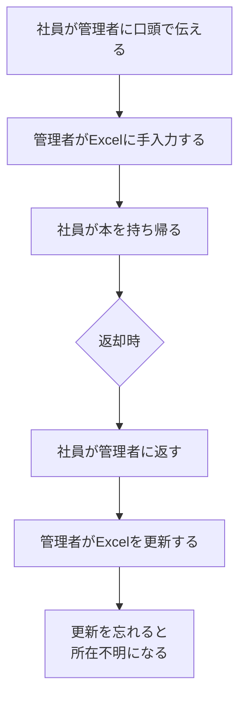
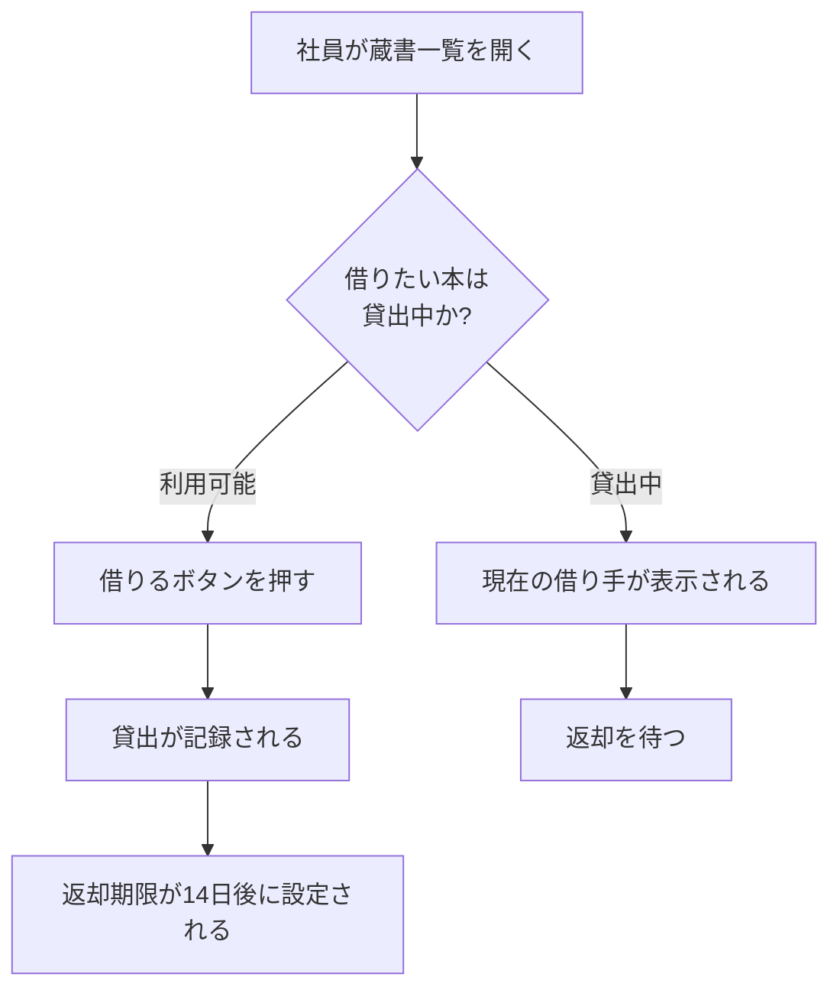

# 業務フロー

**業務担当者・発注者が読める図** を作る。

エンジニア向けの設計書とは別に、**技術を知らない人が「誰が何をするとどうなるか」を
理解できる**ドキュメントを残す。

**要件定義は本来、発注者と合意するためのもの。**
業務担当者が読めない要件定義書は、合意の役に立たない。

**共通規約 `${CLAUDE_PLUGIN_ROOT}/references/conventions.md` を必ず先に読むこと。**
特に第4節の「読み手と用語の使い分け」に従う。

## 開始前に必ず読むもの

```bash
cat docs/mitorizu/.feedback/overrides.md 2>/dev/null
cat docs/mitorizu/.feedback/learnings.md 2>/dev/null
```

## 位置づけ

**このスキルは requirements の「前」に実行する。**

```
features       機能を分割する
business-flow  業務の流れを業務担当者と合意する  <- ここ
requirements   合意した業務を厳密な要件に落とす
screens        画面に落とす
data-model     データ構造に落とす
```

**業務側で合意してから、技術側に落とす。** 逆順にしない。
技術で決めてから業務向けに翻訳すると、業務担当者は
「もう決まっているものの説明を受けている」と感じ、合意にならない。

## 前提

`features.md` があること。どの機能の業務フローかを特定するため。
`requirements.md` は**まだ無くてよい**。このスキルの出力が requirements の入力になる。

## 成果物

```
docs/mitorizu/features/<feature-slug>/
  business-flow.md    # 業務フロー (非エンジニア向け)
```

## 最重要: 技術用語を使わない

**この文書だけは技術用語を一切使わない。**

| 使わない | 代わりに書く |
| --- | --- |
| エンティティ / テーブル / レコード | 情報、記録、1件 |
| カラム / フィールド / 項目名 | 項目 |
| API / エンドポイント / リクエスト | (書かない。「システムが〜する」で表現) |
| バリデーション | 入力チェック |
| トランザクション | (書かない。「まとめて処理される」) |
| 論理削除 / 物理削除 | 「記録を残して削除」「完全に削除」 |
| ステータス / enum | 状態、区分 |
| 認証 / 認可 / セッション | ログイン、権限 |
| 非同期 / ジョブ / キュー | 「あとで処理される」 |
| N+1 / インデックス / 正規化 | (書かない。性能の話はしない) |

**判断に迷ったら「業務担当者に口頭で説明するとき、この言葉を使うか」で決める。**
使わないなら書かない。

### 数値と条件は残す

用語は平易にするが、**業務ルールの厳密さは落とさない。**

```
悪い: しばらく経つと自動でログアウトします
良い: 30分間何も操作しないと、自動でログアウトします
```

「〜など」「適切に」で濁さない。ここは要件定義と同じ。

## 進め方

### Phase 1: 登場人物を洗い出す

**役割ごとに、何ができるかを表にする。**

```markdown
| 登場人物 | 説明 | できること |
| --- | --- | --- |
| 社員 | 書籍を借りる人 | 蔵書を見る、借りる、返す |
| 管理者 | 蔵書を管理する人 | 上記に加えて、蔵書の登録・削除 |
| システム | 自動で動く部分 | 返却期限の判定、通知の送信 |
```

**「システム」も登場人物として書く。** 自動処理があることを明示する。
書かないと「誰かが手作業でやる」と誤解される。

### Phase 2: 現状の業務を描く (As-Is)

**将来こうしたい、の前に、今どうしているかを描く。**

これを飛ばすと以下が起きる。

| 飛ばすと | 何が起きるか |
| --- | --- |
| 現状が分からない | 何が改善されるのか業務担当者に伝わらない |
| 手作業の把握漏れ | システム化しない部分が残ることに気づかない |
| 移行の見積もり不能 | 既存データをどう移すか決められない |
| 業務の変更点が不明 | 導入時に現場が混乱する |



**現状の問題点を図中または表で明示する。**

```markdown
| # | 現状の問題 | 影響 |
| --- | --- | --- |
| 1 | 管理者が不在だと借りられない | 業務が滞る |
| 2 | Excel の更新漏れが起きる | 所在が分からなくなる |
| 3 | 誰が借りているか調べるのに時間がかかる | 探す手間 |
```

**現状に問題が無いなら、システムを作る理由が無い。**
問題が挙がらない場合、その業務はシステム化の対象ではない可能性がある。

#### 既存のデータを確認する

**現状で使っている記録を確認する。** 移行の要否が決まる。

| 確認すること | 例 |
| --- | --- |
| 何で記録しているか | Excel、紙の台帳、既存システム |
| 何件あるか | 蔵書300件、貸出履歴2年分 |
| 移行が必要か | 蔵書は移行する。履歴は移行しない |
| 移行しない場合どうするか | 過去の履歴は Excel を残して参照する |

**「空リポジトリから作る」場合でも、業務データは必ず存在する。**
移行を後回しにすると、リリース直前に慌てることになる。

### Phase 3: 将来の業務を描く (To-Be)

mermaid `flowchart` で描く。**技術要素を含めない。**



**書き方の注意:**

- ノードのラベルは**必ずダブルクォートで囲む**
- 主語を明示する。「社員が」「システムが」
- 分岐の条件は疑問文にする。「〜か?」
- 1つの図に10ノードを超えたら分割する

書いたら検証する。

```bash
"${CLAUDE_PLUGIN_ROOT}/scripts/check-mermaid.sh" docs/mitorizu/features/<slug>/business-flow.md
```

#### 現状から何が変わるかを対比する

**As-Is と To-Be の差分を明示する。** これが導入の価値そのもの。

```markdown
| # | 現状 (As-Is) | 将来 (To-Be) | 何が良くなるか |
| --- | --- | --- | --- |
| 1 | 管理者に口頭で伝える | 自分でボタンを押す | 管理者が不在でも借りられる |
| 2 | 管理者がExcelに手入力 | 自動で記録される | 更新漏れが無くなる |
| 3 | 誰が借りたか調べるのに時間がかかる | 一覧で即座に分かる | 探す手間が無くなる |
```

**変わらない部分も書く。** 現場の不安を減らす。

```markdown
| 変わらないこと |
| --- |
| 本を持ち帰って読むこと自体は今までどおり |
| 返却時に管理者に声をかける習慣は残してよい |
```

#### 業務担当者の負担が増える部分を隠さない

**システム化で楽になる部分だけを書かない。** 増える手間も書く。

```markdown
| 増える手間 | 理由 | 軽減策 |
| --- | --- | --- |
| 蔵書の初期登録 (300件) | システムにデータが必要 | 管理者が1週間かけて登録。CSV取込も検討 |
| ログイン操作 | 誰が借りたかを記録するため | 社内ネットワークからは自動ログイン |
```

隠すと導入時に反発を招く。**先に伝えて合意を取る。**

### Phase 4: 操作と結果を表にする

**図だけでは細部が書けない。** 表で補う。

```markdown
| # | 誰が | 何をすると | どうなるか | 例外 |
| --- | --- | --- | --- | --- |
| 1 | 社員 | 借りるボタンを押す | 貸出が記録され、返却期限が14日後に設定される | 既に貸出中の場合は借りられない |
| 2 | 社員 | 返すボタンを押す | 返却が記録され、他の人が借りられるようになる | - |
| 3 | 管理者 | 蔵書を登録する | 一覧に表示され、借りられるようになる | 同じ書名でも別々に登録される |
| 4 | システム | 毎日0時に判定する | 返却期限を過ぎた貸出に印が付く | - |
```

**「例外」の列を必ず埋める。** うまくいかない場合の扱いが、
業務担当者が最も知りたいこと。

### Phase 5: 判断が必要な場面を明示する

**人が判断する場面を洗い出す。** システムが自動で決められないもの。

```markdown
| 場面 | 誰が判断するか | 判断の基準 | システムの支援 |
| --- | --- | --- | --- |
| 蔵書を破棄するか | 管理者 | 破損の程度 | 貸出履歴を表示する |
| 延滞者への対応 | 管理者 | 延滞日数と事情 | 延滞一覧を表示する |
```

**システムが自動化しない部分を明示することが重要。**
「システムが全部やってくれる」という誤解を防ぐ。

### Phase 6: 業務が回らない場合を書く

**異常時に業務としてどうするかを書く。** 技術的な障害対応ではない。

```markdown
| 状況 | 業務としてどうするか |
| --- | --- |
| 本が見つからない (紛失) | 管理者が蔵書から削除する。記録は残る |
| 借りた人が退職した | 管理者が代理で返却処理をする |
| システムが使えない | 紙のノートに記録し、復旧後に手入力する |
```

**「システムが使えないとき」は必ず書く。** 業務は止められない。

### Phase 7: 用語を統一する

**業務担当者が使う言葉で書く。** 開発側の用語に合わせない。

```markdown
| このドキュメントでの呼び方 | 意味 | 開発側の呼び方 |
| --- | --- | --- |
| 蔵書 | 会社が所有する書籍 | Book |
| 貸出 | 社員が本を借りること | Lending |
| 社員 | このシステムを使う人 | Employee / User |
```

**右列 (開発側の呼び方) は参考情報。** 業務担当者は読み飛ばしてよい。
`glossary.md` との対応が付くようにするために書く。

### Phase 8: 確認と次のステップ

1. `[要確認]` を一覧で再掲する
2. `docs/mitorizu/README.md` の該当機能の節に業務フロー図を追加する

**この文書は業務担当者に見せて合意を取るためのもの。**
完成したら、レビューを依頼するよう案内する。

```
業務フローを作成しました。

  docs/mitorizu/features/book-lending/business-flow.md

この文書は技術用語を使わずに書いています。
業務担当者の方にレビューしていただき、
「実際の業務と違う」箇所があれば教えてください。

要件定義書 (requirements.md) は同じ内容をより厳密に書いたものです。
両方の内容が食い違わないよう、修正時は両方を更新します。
```

### 終了前: 学んだことを記録する

利用者から訂正を受けたら、次回も同じ判断をすべきものだけを
`docs/mitorizu/.feedback/overrides.md` に追記する。**確認してから書く。**

## requirements.md との関係

**このドキュメントが先。** requirements はこれを厳密化したもの。

| | business-flow.md (先) | requirements.md (後) |
| --- | --- | --- |
| 読み手 | 業務担当者・発注者 | 業務担当者 + エンジニア |
| 表現 | 平易な言葉、図中心 | EARS 記法、厳密 |
| 目的 | **業務の合意** | 実装の根拠 |
| 粒度 | 業務の流れ | 個々の振る舞い |
| 決めること | 誰が何をするか | システムがどう振る舞うか |

### 引き継ぎ方

**Phase 3 の操作表が、そのまま要件の元になる。**

```
業務フロー:
| 1 | 社員 | 借りるボタンを押す | 貸出が記録され、返却期限が14日後に設定される |
                    ↓ requirements で厳密化
[確実] REQ-001: 社員が貸出ボタンを押したとき、システムは書籍を貸出中にし、
       返却期限を貸出日の14日後に設定すること。
```

対応関係を記録しておく。requirements 実行時に使う。

```markdown
| 業務フローの項番 | 対応する要件 (requirements 実行後に記入) |
| --- | --- |
| 1 (借りる) | REQ-001, REQ-002 |
| 2 (返す) | REQ-003 |
```

### 修正が入ったとき

**業務フローを直したら requirements も直す。** 逆も同じ。

ただし**業務フローが正**。requirements で「実装しにくいから変えたい」となった場合、
**業務担当者に確認してから業務フローを直し、それから requirements を直す。**
勝手に requirements だけ変えると、合意した内容と実装がずれる。

## よくある失敗

### 1. 技術用語が混ざる

「APIが」「テーブルに」と書いた時点で読まれなくなる。
**書いた後に読み返し、技術用語を探して置き換える。**

### 2. 図が細かすぎる

**業務担当者は処理の詳細を知りたいのではない。**
「自分が何をすると、何が起きるか」だけが知りたい。
1つの図は10ノード以内に収める。

### 3. 例外を書かない

「うまくいく場合」だけ書いても価値が薄い。
**業務担当者が知りたいのは「うまくいかない場合どうなるか」。**

### 4. システムが判断することと人が判断することを混ぜる

自動化される部分と、人の判断が必要な部分を明確に分ける。
混ざっていると「システムを入れれば全部解決する」と誤解される。

### 5. 数値をぼかす

用語は平易にしてよいが、**業務ルールの数値は残す。**
「14日後」を「しばらく後」にしない。

## 参照

- `${CLAUDE_SKILL_DIR}/references/business-flow-template.md` — 業務フローのテンプレート
- `${CLAUDE_PLUGIN_ROOT}/references/conventions.md` — 第4節「読み手と用語の使い分け」
