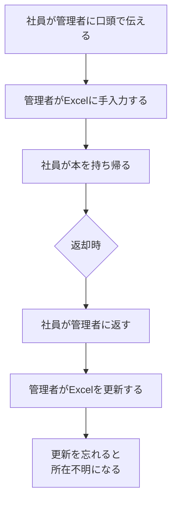
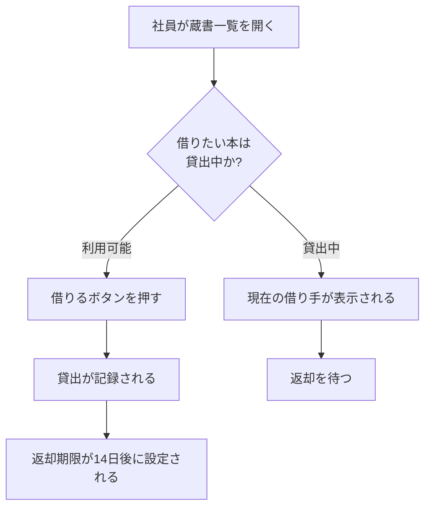
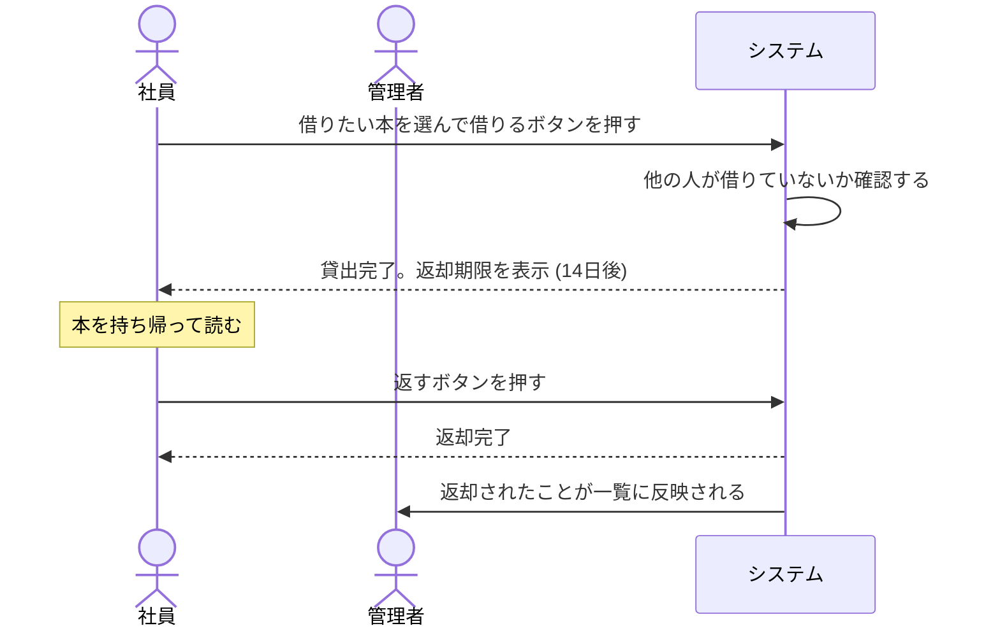
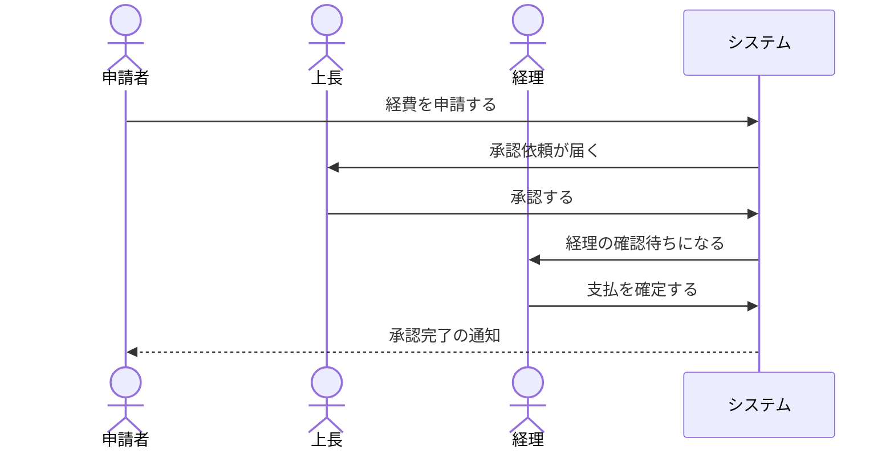

# 業務フロー

**業務担当者・発注者が読める図** を作る。
技術を知らない人が「誰が何をするとどうなるか」を理解できる形で残す。

**要件定義は本来、発注者と合意するためのもの。**
業務担当者が読めない要件定義書は、合意の役に立たない。

**共通規約 `${CLAUDE_PLUGIN_ROOT}/references/conventions.md` を必ず先に読むこと。**
特に第4節の「読み手と用語の使い分け」に従う。

## 開始前に必ず読むもの

```bash
cat docs/mitorizu/.feedback/overrides.md 2>/dev/null
cat docs/mitorizu/.feedback/learnings.md 2>/dev/null
```

## 位置づけ

**requirements の「前」に実行する。**
`features` -> **`business-flow`** -> `requirements` -> `screens` -> `data-model`

**業務側で合意してから、技術側に落とす。** 逆順にしない。
技術で決めてから業務向けに翻訳すると「合意」ではなく「報告」になる。

## 前提

`features.md` があること。どの機能の業務フローかを特定するため。
`requirements.md` は**まだ無くてよい**。このスキルの出力が requirements の入力になる。

## 成果物

```
docs/mitorizu/features/<feature-slug>/
  business-flow.md    # 業務フロー (非エンジニア向け)
```

## 最重要: 技術用語を使わない

**この文書だけは技術用語を一切使わない。**

置き換え表は `${CLAUDE_PLUGIN_ROOT}/references/conventions.md` 第4節にある。
主なものだけ挙げる。

| 使わない | 代わりに書く |
| --- | --- |
| テーブル / カラム / レコード | 情報 / 項目 / 1件 |
| API / トランザクション / 非同期 | (書かない。「システムが〜する」で表現) |
| 認証 / セッション | ログイン、権限 |

**判断に迷ったら「業務担当者に口頭で説明するとき、この言葉を使うか」で決める。**
使わないなら書かない。

### 数値と条件は残す

用語は平易にするが、**業務ルールの厳密さは落とさない。**

```
悪い: しばらく経つと自動でログアウトします
良い: 30分間何も操作しないと、自動でログアウトします
```

「〜など」「適切に」で濁さない。ここは要件定義と同じ。

## 進め方

### Phase 1: 関係者を3層で洗い出す

**使う人だけを見ない。** 使わないが影響を受ける人、決める人を含める。

| 層 | 説明 | 見落としやすい例 |
| --- | --- | --- |
| **使う人** | 日常的に操作する | - |
| **影響を受ける人** | 使わないが業務が変わる | 経理、上長、取引先 |
| **決める人・止める人** | 承認・予算・規制 | 決裁者、法務、情報システム部門 |

**3層目が最も見落とされ、最も後から効いてくる。**
「情シスに確認したら社外アクセスは VPN 必須と言われた」で設計をやり直す、が典型。

```markdown
| 関係者 | 立場 | 関心事 | 想定される要求 | 影響度 |
| --- | --- | --- | --- | --- |
| 社員 | 使う人 | 手間なく借りたい | 3クリック以内で貸出できる | 高 |
| 管理者 | 使う人 | 所在を把握したい | 一覧で貸出状況が分かる | 高 |
| 経理 | 影響を受ける | 資産管理との整合 | 取得価額を記録できる | 中 |
| 情報システム部門 | 決める人 | 社内標準に沿うか | SSO 連携、ログの保全 | **高** |
```

**影響度は「この人の要求を無視したらどうなるか」で決める。**

| 影響度 | 意味 |
| --- | --- |
| 高 | 無視すると導入できない、または作り直しになる |
| 中 | 無視すると後から機能追加が必要になる |
| 低 | 無視しても大きな問題にならない |

#### 承認が必要なことを特定する

| 種類 | 誰が承認するか | いつ確認するか |
| --- | --- | --- |
| 予算 | 決裁者 | 着手前 |
| セキュリティ | 情報システム部門 | **設計前** |
| 個人情報 | 法務 | **設計前** |
| 業務ルール | 現場のリーダー | 要件定義時 |

**「設計前」の確認を後回しにしない。**
セキュリティと個人情報の要求は、後から満たすのが最も高コスト。

#### 対立する要求を見つける

**関係者の要求は必ず対立する。** 先に見つけて調整する。

典型的な対立: 利便性 vs セキュリティ / 記録 vs プライバシー。
表の書き方はテンプレート 2-3 を参照。

調整案が出せない対立は、**決裁者に判断を仰ぐ。** 設計側で勝手に決めない。

#### 業務フローの登場人物に落とす

上記のうち、**業務フローに登場する人**を抜き出す。

```markdown
| 登場人物 | 説明 | できること |
| --- | --- | --- |
| 社員 | 書籍を借りる人 | 蔵書を見る、借りる、返す |
| 管理者 | 蔵書を管理する人 | 上記に加えて、蔵書の登録・削除 |
| システム | 自動で動く部分 | 返却期限の判定、通知の送信 |
```

**「システム」も登場人物として書く。** 自動処理があることを明示する。
書かないと「誰かが手作業でやる」と誤解される。

#### 個人開発の場合

**関係者が自分だけなら3行で終える。** 過剰な分析はしない。
ただし「会社の規約に触れるか」「個人情報を扱うか」だけは確認する。

### Phase 2: 現状の業務を描く (As-Is)

**将来こうしたい、の前に、今どうしているかを描く。**

飛ばすと、何が改善されるのか伝わらず、手作業の把握漏れが起き、
既存データの移行を見積もれなくなる。



**現状の問題点を図中または表で明示する。**

```markdown
| # | 現状の問題 | 影響 |
| --- | --- | --- |
| 1 | 管理者が不在だと借りられない | 業務が滞る |
| 2 | Excel の更新漏れが起きる | 所在が分からなくなる |
| 3 | 誰が借りているか調べるのに時間がかかる | 探す手間 |
```

**現状に問題が無いなら、システムを作る理由が無い。**
問題が挙がらない場合、その業務はシステム化の対象ではない可能性がある。

#### 既存のデータを確認する

**現状で使っている記録を確認する。** 移行の要否が決まる。

| 確認すること | 例 |
| --- | --- |
| 何で記録しているか | Excel、紙の台帳、既存システム |
| 何件あるか | 蔵書300件、貸出履歴2年分 |
| 移行が必要か | 蔵書は移行する。履歴は移行しない |
| 移行しない場合どうするか | 過去の履歴は Excel を残して参照する |

**「空リポジトリから作る」場合でも、業務データは必ず存在する。**
移行を後回しにすると、リリース直前に慌てることになる。

### Phase 3: 将来の業務を描く (To-Be)

mermaid `flowchart` で描く。**技術要素を含めない。**



**書き方の注意:**

- ノードのラベルは**必ずダブルクォートで囲む**
- 主語を明示する。「社員が」「システムが」
- 分岐の条件は疑問文にする。「〜か?」
- 1つの図に10ノードを超えたら分割する

書いたら検証する。

```bash
"${CLAUDE_PLUGIN_ROOT}/scripts/check-mermaid.sh" docs/mitorizu/features/<slug>/business-flow.md
```

#### 現状から何が変わるかを対比する

**As-Is と To-Be の差分を明示する。** これが導入の価値そのもの。

```markdown
| # | 現状 (As-Is) | 将来 (To-Be) | 何が良くなるか |
| --- | --- | --- | --- |
| 1 | 管理者に口頭で伝える | 自分でボタンを押す | 管理者が不在でも借りられる |
| 2 | 管理者がExcelに手入力 | 自動で記録される | 更新漏れが無くなる |
| 3 | 誰が借りたか調べるのに時間がかかる | 一覧で即座に分かる | 探す手間が無くなる |
```

**変わらない部分も書く。** 現場の不安を減らす。

```markdown
| 変わらないこと |
| --- |
| 本を持ち帰って読むこと自体は今までどおり |
| 返却時に管理者に声をかける習慣は残してよい |
```

#### 業務担当者の負担が増える部分を隠さない

**システム化で楽になる部分だけを書かない。** 増える手間も書く。

```markdown
| 増える手間 | 理由 | 軽減策 |
| --- | --- | --- |
| 蔵書の初期登録 (300件) | システムにデータが必要 | 管理者が1週間かけて登録。CSV取込も検討 |
| ログイン操作 | 誰が借りたかを記録するため | 社内ネットワークからは自動ログイン |
```

隠すと導入時に反発を招く。**先に伝えて合意を取る。**

### Phase 4: 業務のやり取りを時系列で描く

**フロー図は「流れ」だが、シーケンス図は「誰と誰のやり取り」を示す。**

複数の人が関わる業務では、こちらの方が分かりやすい。
「自分が何をすると、次に誰が何をするのか」が一目で分かる。



**技術用語を使わない。** 「API を呼ぶ」ではなく「ボタンを押す」。

#### 承認や引き継ぎがある業務では特に有効



**誰から誰に渡るかが明確になる。** 表だけでは追いにくい。

#### 待ち時間と期限を書く

**業務では「いつまでに」が重要。** `alt` で分岐を書き、期限を図中に入れる。
記述例はテンプレートを参照。

#### 描く対象を絞る

| 描く | 描かない |
| --- | --- |
| 複数の人が関わる業務 | 1人で完結する操作 |
| 承認・引き継ぎがある | 単純な閲覧 |
| 待ち時間や期限がある | 即座に完了する |

**1機能につき1〜3本。** 全操作を描かない。書いたら検証する (Phase 3 と同じ)。

### Phase 5: 操作と結果を表にする

**図だけでは細部が書けない。** 表で補う。

```markdown
| # | 誰が | 何をすると | どうなるか | 例外 |
| --- | --- | --- | --- | --- |
| 1 | 社員 | 借りるボタンを押す | 貸出が記録され、返却期限が14日後に設定される | 既に貸出中の場合は借りられない |
| 2 | 社員 | 返すボタンを押す | 返却が記録され、他の人が借りられるようになる | - |
| 3 | 管理者 | 蔵書を登録する | 一覧に表示され、借りられるようになる | 同じ書名でも別々に登録される |
| 4 | システム | 毎日0時に判定する | 返却期限を過ぎた貸出に印が付く | - |
```

**「例外」の列を必ず埋める。** うまくいかない場合の扱いが、
業務担当者が最も知りたいこと。

### Phase 6: 業務ルールを採番して一覧にする

**判定基準・計算式・条件を、業務フローとは別に一覧化する。**

業務ルールは複数の画面・API に影響する。フローの中に埋めると、
再利用も横断確認もできない。**`BR-NNN` で採番し、フローから参照する。**

```markdown
| ID | 業務ルール | 適用される場面 | 根拠 | マーカー |
| --- | --- | --- | --- | --- |
| BR-001 | 返却期限は貸出日の14日後 | 貸出時 | 現行の運用に合わせた | [要確認] |
| BR-002 | 1人が同時に借りられるのは5冊まで | 貸出時 | 蔵書数と利用者数から | [要確認] |
| BR-003 | 貸出中の蔵書は削除できない | 蔵書削除時 | 所在不明を防ぐ | [確実] |
| BR-004 | 返却期限を過ぎたら延滞とする | 毎日0時の判定 | - | [確実] |
| BR-005 | 延滞中でも新たに借りられる | 貸出時 | 罰則は設けない方針 | [確実] |
```

#### 何を業務ルールとして切り出すか

| 種類 | 例 |
| --- | --- |
| **判定基準** | 「貸出中かどうか」「延滞かどうか」の定義 |
| **計算式** | 返却期限の算出、金額の計算 |
| **上限・下限** | 同時貸出5冊まで、1回の注文は99個まで |
| **可否の条件** | 誰が何をできるか、いつできるか |
| **例外の扱い** | 特別な場合にどうするか |

#### 業務フローからルールを参照する

**フローの表に `BR-NNN` を書く。** どのルールがどこで効くかが追える。

```markdown
| # | 誰が | 何をすると | どうなるか | 適用ルール |
| --- | --- | --- | --- | --- |
| 1 | 社員 | 借りるボタンを押す | 貸出が記録される | BR-001, BR-002 |
| 3 | 管理者 | 蔵書を削除する | 一覧から消える | BR-003 |
```

#### なぜ採番するか

**後続フェーズで機械的に追跡できるようになる。**

```
BR-002 (同時5冊まで)
  -> requirements で REQ-012 として要件化されているか
  -> screens で上限到達時の表示が定義されているか
  -> api-design でエラーコードが定義されているか
  -> data-model で判定に必要なデータがあるか
```

**どこからも参照されていない `BR-NNN` は、実装されない業務ルール。**
`/mitorizu:validate` がこれを検出する。

同じルールが画面ごとに違う実装になる事故を防げる。

### Phase 7: 判断が必要な場面を明示する

**人が判断する場面を洗い出す。** システムが自動で決められないもの。

```markdown
| 場面 | 誰が判断するか | 判断の基準 | システムの支援 |
| --- | --- | --- | --- |
| 蔵書を破棄するか | 管理者 | 破損の程度 | 貸出履歴を表示する |
| 延滞者への対応 | 管理者 | 延滞日数と事情 | 延滞一覧を表示する |
```

**システムが自動化しない部分を明示することが重要。**
「システムが全部やってくれる」という誤解を防ぐ。

### Phase 8: 業務が回らない場合を書く

**異常時に業務としてどうするかを書く。** 技術的な障害対応ではない。

```markdown
| 状況 | 業務としてどうするか |
| --- | --- |
| 本が見つからない (紛失) | 管理者が蔵書から削除する。記録は残る |
| 借りた人が退職した | 管理者が代理で返却処理をする |
| システムが使えない | 紙のノートに記録し、復旧後に手入力する |
```

**「システムが使えないとき」は必ず書く。** 業務は止められない。

### Phase 9: 用語を統一する

**業務担当者が使う言葉で書く。** 開発側の用語に合わせない。

```markdown
| このドキュメントでの呼び方 | 意味 | 開発側の呼び方 |
| --- | --- | --- |
| 蔵書 | 会社が所有する書籍 | Book |
| 貸出 | 社員が本を借りること | Lending |
| 社員 | このシステムを使う人 | Employee / User |
```

**右列 (開発側の呼び方) は参考情報。** 業務担当者は読み飛ばしてよい。
`glossary.md` との対応が付くようにするために書く。

### Phase 10: 書き終えたら自己点検する

**技術用語の grep だけでは足りない。** 4点を確認する。

| 点検項目 | 確認方法 |
| --- | --- |
| 技術用語の混入 | 禁止語を grep する |
| **節の抜け** | テンプレートの13節と見出しを突き合わせる |
| **`[要確認]` の再掲漏れ** | 本文中の件数と再掲節の項目数を突き合わせる |
| mermaid の構文 | `check-mermaid.sh` |

**節の抜けと再掲漏れは禁止語 grep では見つからない。**
数を数えて突き合わせる。コマンドはテンプレートの末尾を参照。

### Phase 11: 確認と次のステップ

1. `[要確認]` を一覧で再掲する
2. `docs/mitorizu/README.md` の該当機能の節に業務フロー図を追加する

**この文書は業務担当者に見せて合意を取るためのもの。**
完成したら、レビューを依頼するよう案内する。

```
業務フローを作成しました。

  docs/mitorizu/features/book-lending/business-flow.md

この文書は技術用語を使わずに書いています。
業務担当者の方にレビューしていただき、
「実際の業務と違う」箇所があれば教えてください。

要件定義書 (requirements.md) は同じ内容をより厳密に書いたものです。
両方の内容が食い違わないよう、修正時は両方を更新します。
```

### 終了前: 学んだことを記録する

利用者から訂正を受けたら、次回も同じ判断をすべきものだけを
`docs/mitorizu/.feedback/overrides.md` に追記する。**確認してから書く。**

## requirements.md との関係

**このドキュメントが先。** requirements はこれを厳密化したもの。

| | business-flow.md (先) | requirements.md (後) |
| --- | --- | --- |
| 読み手 | 業務担当者・発注者 | 業務担当者 + エンジニア |
| 表現 | 平易な言葉、図中心 | EARS 記法、厳密 |
| 目的 | **業務の合意** | 実装の根拠 |
| 粒度 | 業務の流れ | 個々の振る舞い |
| 決めること | 誰が何をするか | システムがどう振る舞うか |

### 引き継ぎ方

**Phase 5 の操作表と Phase 6 の業務ルールが、そのまま要件の元になる。**

```
| 1 | 社員 | 借りるボタンを押す | 貸出が記録される | BR-001, BR-002 |
        ↓ requirements で厳密化
[確実] REQ-001: 社員が貸出ボタンを押したとき、システムは書籍を貸出中にし、
       返却期限を貸出日の14日後に設定すること。(BR-001)
```

**要件から `BR-NNN` を参照させる。** どの業務ルールが実装されたかを追える。
対応表はテンプレートの「対応する要件」節に記録する。

### 修正が入ったとき

**業務フローが正。** requirements で「実装しにくいから変えたい」となった場合、
**業務担当者に確認してから業務フローを直し、それから requirements を直す。**
勝手に requirements だけ変えると、合意した内容と実装がずれる。

## 参照

- `${CLAUDE_SKILL_DIR}/references/business-flow-template.md` — 業務フローのテンプレート
- `${CLAUDE_PLUGIN_ROOT}/references/conventions.md` — 第4節「読み手と用語の使い分け」
