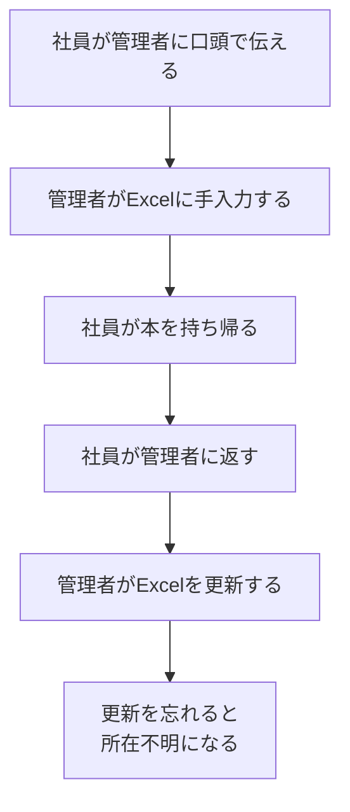
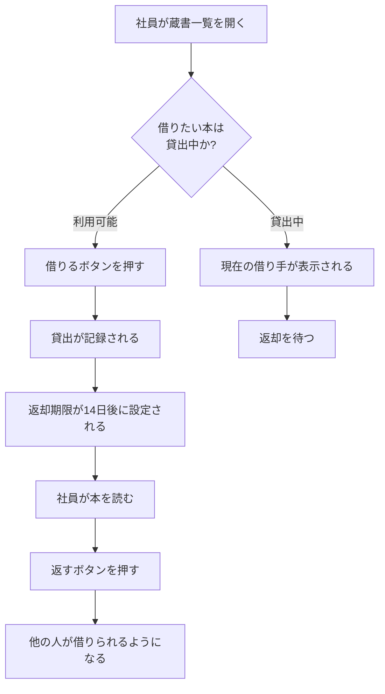
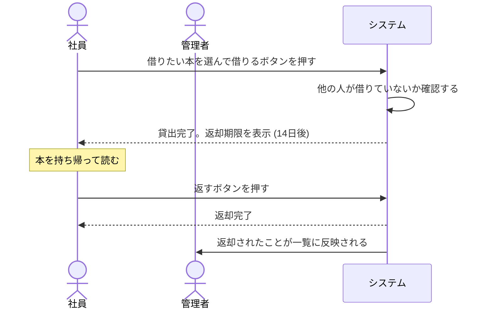
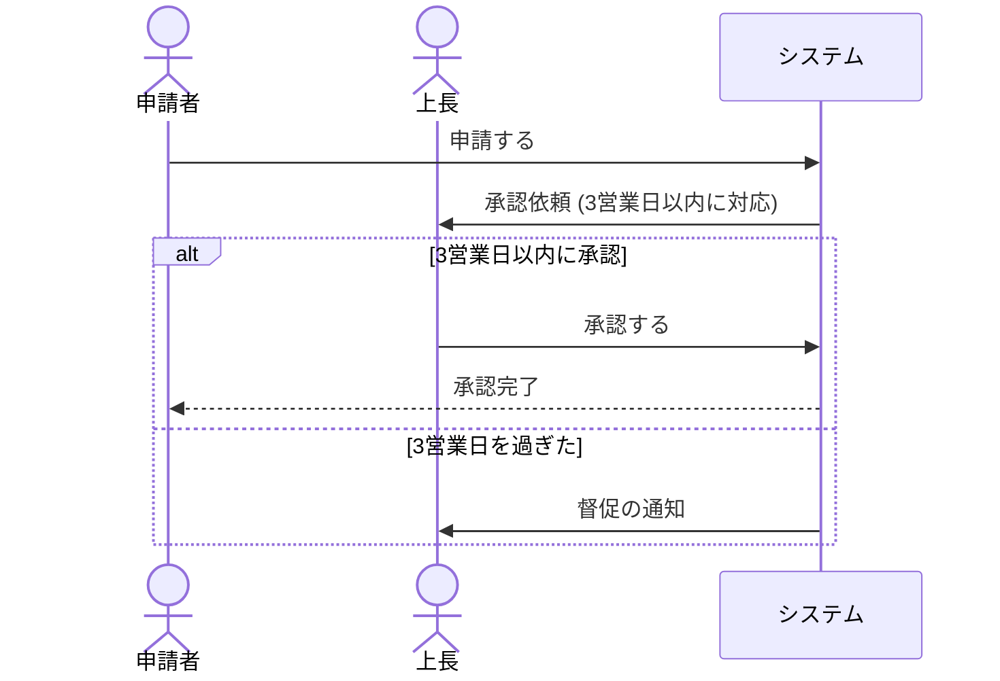

# 業務フローのテンプレート

`docs/mitorizu/features/<feature-slug>/business-flow.md` の雛形。

**この文書だけは技術用語を一切使わない。**
業務担当者・発注者が読んで、業務と合っているかを判断できる状態にする。

---

# 業務の流れ: <機能名>

- 作成日: YYYY-MM-DD
- この文書は、システムを使う方に読んでいただくためのものです
- 技術的な詳細は別の資料 (`requirements.md` 以降) にあります

## 1. この機能で解決すること

<3〜5行。何に困っていて、どう変わるか>

現在は Excel で貸出を管理しており、誰が何を借りているか分からなくなっています。
このシステムでは、貸出の状況が一覧で確認でき、借りるときも返すときも
ボタン1つで記録されます。

## 2. 関係者

### 2-1. 3層で洗い出す

**使う人だけを見ない。** 使わないが影響を受ける人、決める人を含める。

| 関係者 | 立場 | 関心事 | 想定される要求 | 影響度 |
| --- | --- | --- | --- | --- |
| 社員 | 使う人 | 手間なく借りたい | 3クリック以内で貸出できる | 高 |
| 管理者 | 使う人 | 所在を把握したい | 一覧で貸出状況が分かる | 高 |
| 経理 | 影響を受ける | 資産管理との整合 | 取得価額を記録できる | 中 |
| 情報システム部門 | 決める人 | 社内標準に沿うか | ログの保全、認証方式 | **高** |

**影響度**: 高 = 無視すると導入できない / 中 = 後から機能追加が必要 / 低 = 影響小

### 2-2. 承認が必要なこと

**このシステムを作る・導入するために誰の承認が要るか。**
(業務の中の承認フローとは別。それは 4章・7章に書く)

| 種類 | 誰が承認するか | いつ確認するか | 状態 |
| --- | --- | --- | --- |
| 予算 | 総務部長 | 着手前 | 確認済 |
| セキュリティ | 情報システム部門 | **設計前** | **未確認** |
| 個人情報 | 法務 | **設計前** | **未確認** |
| 業務ルール | 現場のリーダー | 要件定義時 | 確認済 |

**「設計前」を後回しにしない。** 後から満たすのが最も高コスト。

### 2-3. 対立する要求

| 対立 | 一方の要求 | 他方の要求 | 調整案 | マーカー |
| --- | --- | --- | --- | --- |
| 利便性 vs セキュリティ | 社員: 入力を減らしたい | 情シス: 認証を厳格に | 社内は自動ログイン | [要確認] |

調整案が出せない対立は**決裁者に判断を仰ぐ。** 設計側で勝手に決めない。

### 2-4. 業務フローの登場人物

上記のうち、業務フローに登場する人を抜き出す。

| 登場人物 | 説明 | できること |
| --- | --- | --- |
| 社員 | 書籍を借りる人 | 蔵書を見る、借りる、返す |
| 管理者 | 蔵書を管理する人 | 上記に加えて、蔵書の登録・削除 |
| システム | 自動で動く部分 | 返却期限の判定、延滞の表示 |

**「システム」も登場人物として書く。** 自動処理があることを明示するため。

## 3. 現状の業務 (As-Is)

**将来こうしたい、の前に、今どうしているかを描く。**

### 3-1. 現状の問題

| # | 現状の問題 | 影響 |
| --- | --- | --- |
| 1 | 管理者が不在だと借りられない | 業務が滞る |
| 2 | Excel の更新漏れが起きる | 所在が分からなくなる |
| 3 | 誰が借りているか調べるのに時間がかかる | 探す手間 |

**現状に問題が無いなら、システムを作る理由が無い。**

### 3-2. 既存のデータ

| 確認すること | 現状 |
| --- | --- |
| 何で記録しているか | Excel (共有フォルダ) |
| 何件あるか | 蔵書300件、貸出履歴2年分 |
| 移行が必要か | 蔵書は移行する。履歴は移行しない |
| 移行しない場合どうするか | 過去の履歴は Excel を残して参照する |

**「空リポジトリから作る」場合でも業務データは必ず存在する。**

## 4. 将来の業務 (To-Be)

### 4-1. 現状から何が変わるか

**As-Is と To-Be の差分が導入の価値そのもの。**

| # | 現状 (As-Is) | 将来 (To-Be) | 何が良くなるか |
| --- | --- | --- | --- |
| 1 | 管理者に口頭で伝える | 自分でボタンを押す | 管理者が不在でも借りられる |
| 2 | 管理者がExcelに手入力 | 自動で記録される | 更新漏れが無くなる |
| 3 | 調べるのに時間がかかる | 一覧で即座に分かる | 探す手間が無くなる |

### 4-2. 変わらないこと

**現場の不安を減らす。**

| 変わらないこと |
| --- |
| 本を持ち帰って読むこと自体は今までどおり |
| 返却時に管理者に声をかける習慣は残してよい |

### 4-3. 増える手間

**楽になる部分だけを書かない。** 隠すと導入時に反発を招く。

| 増える手間 | 理由 | 軽減策 |
| --- | --- | --- |
| 蔵書の初期登録 (300件) | システムにデータが必要 | 管理者が1週間かけて登録。CSV取込も検討 |
| ログイン操作 | 誰が借りたかを記録するため | 社内からは自動ログイン |

## 5. 業務のやり取り (時系列)

複数の人が関わる業務は、シーケンスで描くと分かりやすい。

### 期限がある場合

## 6. 誰が何をすると、どうなるか

| # | 誰が | 何をすると | どうなるか | うまくいかない場合 |
| --- | --- | --- | --- | --- |
| 1 | 社員 | 借りるボタンを押す | 貸出が記録され、返却期限が14日後に設定される | 既に他の人が借りている場合は借りられず、借りている人の名前が表示される |
| 2 | 社員 | 返すボタンを押す | 返却が記録され、他の人が借りられるようになる | - |
| 3 | 管理者 | 蔵書を登録する | 一覧に表示され、借りられるようになる | 同じ書名の本でも、1冊ずつ別々に登録します |
| 4 | 管理者 | 蔵書を削除する | 一覧から消える | 貸出中の本は削除できません |
| 5 | システム | 毎日0時に判定する | 返却期限を過ぎた貸出に印が付く | - |

**「うまくいかない場合」を必ず埋める。**
業務担当者が最も知りたいのは、想定外のときにどうなるか。

## 7. 業務ルール

判定基準・計算式・条件を採番して一覧にする。
**業務フローと要件の両方から `BR-NNN` で参照する。**

| ID | 業務ルール | 適用される場面 | 根拠 | マーカー |
| --- | --- | --- | --- | --- |
| BR-001 | 返却期限は貸出日の14日後 | 貸出時 | 現行の運用に合わせた | [要確認] |
| BR-002 | 1人が同時に借りられるのは5冊まで | 貸出時 | 蔵書数と利用者数から | [要確認] |
| BR-003 | 貸出中の蔵書は削除できない | 蔵書削除時 | 所在不明を防ぐ | [確実] |

**どこからも参照されない `BR-NNN` は、実装されない業務ルール。**
`/mitorizu:validate` が検出する。

## 8. 人が判断すること

**システムが自動で決められないこと。** 誰かが判断する必要があります。

| 場面 | 誰が判断するか | 判断の基準 | システムができること |
| --- | --- | --- | --- |
| 破損した本を破棄するか | 管理者 | 破損の程度 | 貸出履歴を表示する |
| 延滞している人への対応 | 管理者 | 延滞日数と事情 | 延滞している一覧を表示する |
| 同じ本を追加購入するか | 管理者 | 貸出の頻度 | 貸出回数を表示する |

**システムが自動化しない部分を明示することが重要。**
「システムを入れれば全部解決する」という誤解を防ぎます。

## 9. 業務が止まらないようにするために

| 状況 | 業務としてどうするか |
| --- | --- |
| 本が見つからない (紛失) | 管理者が蔵書から削除します。誰が最後に借りたかの記録は残ります |
| 借りた人が退職した | 管理者が代理で返却の処理をします |
| システムが使えない | 紙のノートに記録し、復旧後にまとめて入力します |
| 間違えて借りてしまった | すぐに返却の処理をすれば、記録は残りますが問題ありません |

**「システムが使えないとき」は必ず書く。** 業務は止められません。

## 10. 決まっていないこと

判断が必要な項目です。ご確認をお願いします。

| # | 項目 | 現在の想定 | 確認したいこと |
| --- | --- | --- | --- |
| 1 | 返却期限 | 借りてから14日後 | 業務上、この期間で問題ないか |
| 2 | 同時に借りられる冊数 | 5冊まで | 制限が必要か。必要なら何冊か |
| 3 | 延滞したときの扱い | 印が付くだけ | 借りられなくする等の制限が必要か |

## 11. このシステムで扱わないこと

以下は、このシステムでは対応しません。

| 対象外のこと | 理由 | 代わりの方法 |
| --- | --- | --- |
| 本の予約 | 最初の版では対応しません | 返却されるまで待つか、直接お願いする |
| 購入の申請 | 別の仕組みで行っています | 既存の稟議で申請する |
| 電子書籍の管理 | 貸出の概念がありません | 対象外 |

**「やらないこと」を明示する。** 期待とのずれを防ぎます。

## 12. 言葉の対応

このシステムで使う言葉です。

| このシステムでの呼び方 | 意味 |
| --- | --- |
| 蔵書 | 会社が所有する書籍。1冊ごとに登録します |
| 貸出 | 社員が本を借りること、およびその記録 |
| 返却期限 | いつまでに返すかの日付 |
| 延滞 | 返却期限を過ぎている状態 |

**業務担当者が普段使っている言葉に合わせる。**
開発側の用語に合わせない。

## 13. 対応する要件

(requirements.md 作成後に記入します。業務担当者は読み飛ばして構いません)

| 業務フローの項番 | 対応する要件 |
| --- | --- |
| 1 (借りる) | REQ-001, REQ-002 |
| 2 (返す) | REQ-003 |
| 5 (延滞判定) | REQ-010 |
