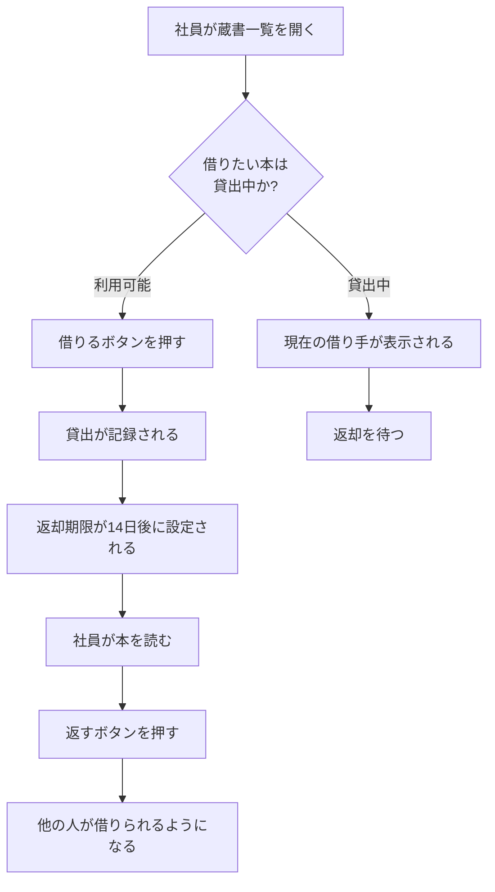
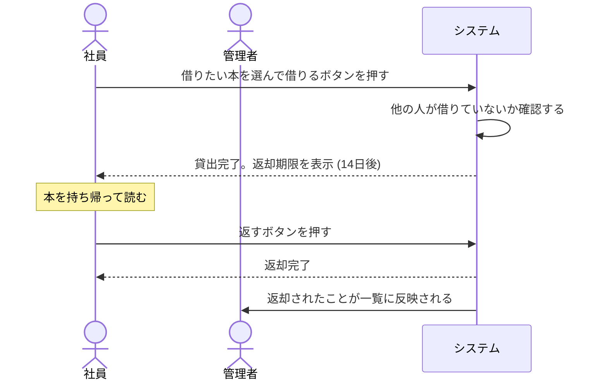
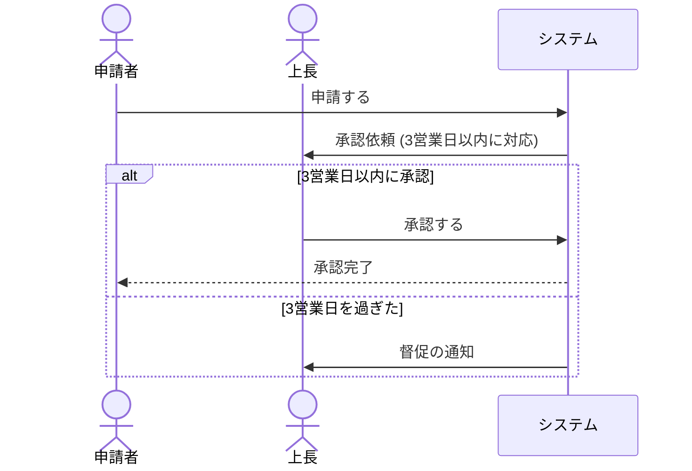

# 業務フローのテンプレート

`docs/mitorizu/features/<feature-slug>/business-flow.md` の雛形。

**この文書だけは技術用語を一切使わない。**
業務担当者・発注者が読んで、業務と合っているかを判断できる状態にする。

---

# 業務の流れ: <機能名>

- 作成日: YYYY-MM-DD
- この文書は、システムを使う方に読んでいただくためのものです
- 技術的な詳細は別の資料 (`requirements.md` 以降) にあります

## 1. この機能で解決すること

<3〜5行。何に困っていて、どう変わるか>

現在は Excel で貸出を管理しており、誰が何を借りているか分からなくなっています。
このシステムでは、貸出の状況が一覧で確認でき、借りるときも返すときも
ボタン1つで記録されます。

## 2. 登場人物

| 登場人物 | 説明 | できること |
| --- | --- | --- |
| 社員 | 書籍を借りる人 | 蔵書を見る、借りる、返す |
| 管理者 | 蔵書を管理する人 | 上記に加えて、蔵書の登録・削除 |
| システム | 自動で動く部分 | 返却期限の判定、延滞の表示 |

**「システム」も登場人物として書く。** 自動処理があることを明示するため。
書かないと「誰かが手作業でやる」と誤解される。

## 3. 業務の流れ

## 4. 業務のやり取り (時系列)

複数の人が関わる業務は、シーケンスで描くと分かりやすい。

### 期限がある場合

## 5. 誰が何をすると、どうなるか

| # | 誰が | 何をすると | どうなるか | うまくいかない場合 |
| --- | --- | --- | --- | --- |
| 1 | 社員 | 借りるボタンを押す | 貸出が記録され、返却期限が14日後に設定される | 既に他の人が借りている場合は借りられず、借りている人の名前が表示される |
| 2 | 社員 | 返すボタンを押す | 返却が記録され、他の人が借りられるようになる | - |
| 3 | 管理者 | 蔵書を登録する | 一覧に表示され、借りられるようになる | 同じ書名の本でも、1冊ずつ別々に登録します |
| 4 | 管理者 | 蔵書を削除する | 一覧から消える | 貸出中の本は削除できません |
| 5 | システム | 毎日0時に判定する | 返却期限を過ぎた貸出に印が付く | - |

**「うまくいかない場合」を必ず埋める。**
業務担当者が最も知りたいのは、想定外のときにどうなるか。

## 6. 業務ルール

判定基準・計算式・条件を採番して一覧にする。
**業務フローと要件の両方から `BR-NNN` で参照する。**

| ID | 業務ルール | 適用される場面 | 根拠 | マーカー |
| --- | --- | --- | --- | --- |
| BR-001 | 返却期限は貸出日の14日後 | 貸出時 | 現行の運用に合わせた | [要確認] |
| BR-002 | 1人が同時に借りられるのは5冊まで | 貸出時 | 蔵書数と利用者数から | [要確認] |
| BR-003 | 貸出中の蔵書は削除できない | 蔵書削除時 | 所在不明を防ぐ | [確実] |

**どこからも参照されない `BR-NNN` は、実装されない業務ルール。**
`/mitorizu:validate` が検出する。

## 7. 人が判断すること

**システムが自動で決められないこと。** 誰かが判断する必要があります。

| 場面 | 誰が判断するか | 判断の基準 | システムができること |
| --- | --- | --- | --- |
| 破損した本を破棄するか | 管理者 | 破損の程度 | 貸出履歴を表示する |
| 延滞している人への対応 | 管理者 | 延滞日数と事情 | 延滞している一覧を表示する |
| 同じ本を追加購入するか | 管理者 | 貸出の頻度 | 貸出回数を表示する |

**システムが自動化しない部分を明示することが重要。**
「システムを入れれば全部解決する」という誤解を防ぎます。

## 8. 業務が止まらないようにするために

| 状況 | 業務としてどうするか |
| --- | --- |
| 本が見つからない (紛失) | 管理者が蔵書から削除します。誰が最後に借りたかの記録は残ります |
| 借りた人が退職した | 管理者が代理で返却の処理をします |
| システムが使えない | 紙のノートに記録し、復旧後にまとめて入力します |
| 間違えて借りてしまった | すぐに返却の処理をすれば、記録は残りますが問題ありません |

**「システムが使えないとき」は必ず書く。** 業務は止められません。

## 9. 決まっていないこと

判断が必要な項目です。ご確認をお願いします。

| # | 項目 | 現在の想定 | 確認したいこと |
| --- | --- | --- | --- |
| 1 | 返却期限 | 借りてから14日後 | 業務上、この期間で問題ないか |
| 2 | 同時に借りられる冊数 | 5冊まで | 制限が必要か。必要なら何冊か |
| 3 | 延滞したときの扱い | 印が付くだけ | 借りられなくする等の制限が必要か |

## 10. このシステムで扱わないこと

以下は、このシステムでは対応しません。

| 対象外のこと | 理由 | 代わりの方法 |
| --- | --- | --- |
| 本の予約 | 最初の版では対応しません | 返却されるまで待つか、直接お願いする |
| 購入の申請 | 別の仕組みで行っています | 既存の稟議で申請する |
| 電子書籍の管理 | 貸出の概念がありません | 対象外 |

**「やらないこと」を明示する。** 期待とのずれを防ぎます。

## 11. 言葉の対応

このシステムで使う言葉です。

| このシステムでの呼び方 | 意味 |
| --- | --- |
| 蔵書 | 会社が所有する書籍。1冊ごとに登録します |
| 貸出 | 社員が本を借りること、およびその記録 |
| 返却期限 | いつまでに返すかの日付 |
| 延滞 | 返却期限を過ぎている状態 |

**業務担当者が普段使っている言葉に合わせる。**
開発側の用語に合わせない。

## 12. 対応する要件

(requirements.md 作成後に記入します。業務担当者は読み飛ばして構いません)

| 業務フローの項番 | 対応する要件 |
| --- | --- |
| 1 (借りる) | REQ-001, REQ-002 |
| 2 (返す) | REQ-003 |
| 5 (延滞判定) | REQ-010 |
