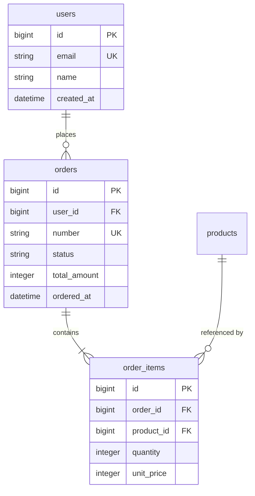

# データモデル設計

ER図・テーブル定義・DDL を作る。

**このスキルの中核は「カラムごとに用途と参照元を記録すること」。**
型と制約だけを並べた定義書は、スキーマの写しでしかない。
そのカラムが何のために存在し、どの画面・API で読み書きされるかまで書く。

**共通規約 `${CLAUDE_PLUGIN_ROOT}/references/conventions.md` を必ず先に読むこと。**
特に第8節の命名規約 (Rails way) に従う。

## 開始前に必ず読むもの

**成果物を書き始める前に、このプロジェクトの学習内容を読む。**
既定より優先度が高い。

```bash
cat docs/mitorizu/.feedback/overrides.md 2>/dev/null
cat docs/mitorizu/.feedback/learnings.md 2>/dev/null
```

無ければ既定で進める。あれば**そちらを優先する**。
詳細は共通規約の「フィードバックの蓄積と反映」を参照。

## 前提

以下が存在すること。無ければ先に実行するよう案内する。

- `requirements.md` — `/mitorizu:requirements`
- `screens.md` — `/mitorizu:screens`

`screens.md` の表示項目に書かれた「出所」が、このスキルで確定する。

## 成果物

```
docs/mitorizu/features/<feature-slug>/
  data-model.md      # ER図 + テーブル定義 + DDL
docs/mitorizu/
  entities.md        # エンティティカタログ (追記・全機能で共有)
```

## 進め方

### Phase 1: エンティティの抽出

1. `requirements.md` の名詞を拾う
2. `screens.md` の表示項目の「出所」を集める
3. `docs/mitorizu/entities.md` を読み、**既存エンティティと重複しないか確認する**

既存に同じ概念があれば、新規作成せず既存を拡張する。
用語が違うだけの同一概念 (User / Account / Member) を作らない。
これは大規模サービスで最大の負債になる。

エンティティ一覧をユーザーに提示して確認を取る。

### Phase 2: カラム定義 (最重要)

**各カラムに以下を記録する。**

| 列 | 内容 | 必須 |
| --- | --- | --- |
| カラム名 | Rails 規約に従う | 必須 |
| 型 | PostgreSQL の型 | 必須 |
| NULL | 可 / 不可 | 必須 |
| 既定値 | デフォルト値 | - |
| **用途** | **何のために存在するか** | **必須** |
| **参照元** | **どの画面・API で読み書きされるか** | **必須** |
| 制約 | 一意・チェック制約など | - |

#### 用途の書き方

「そのカラムが無いと何ができなくなるか」を書く。
型から自明なことを繰り返さない。

```
悪い: status | 注文のステータス
良い: status | 注文の進行状態。一覧のバッジ表示と、キャンセル可否の判定に使う
```

```
悪い: created_at | 作成日時
良い: created_at | 注文日として画面に表示。月次集計の基準にも使う
```

#### 参照元の書き方

画面ID (`SCR-NNN`) と、後で確定する API のエンドポイントを書く。
API はこの時点では未定なので、画面IDだけでよい。

```
| status | enum | 不可 | pending | 注文の進行状態。バッジ表示とキャンセル可否判定 | SCR-002(表示), SCR-003(表示) |
```

読み書きの区別を括弧で示す。

- `(表示)` — 画面に表示される
- `(入力)` — フォームから入力される
- `(内部)` — 画面に出ないがシステムが使う (ボタンの出し分け、API のキーなど)
- `(集計)` — 集計・検索の対象
- `(ソート)` — 並び替えに使う

**全ての区分を使う必要はない。** 一覧画面しかない機能では `(入力)` は登場しない。
該当する区分だけを書く。

#### enum 相当のカラムは値を全て列挙する

**取りうる値が決まっているカラムは、値を全て書く。**
「status: 注文の進行状態」だけでは実装できない。

対象になるのは以下。

| 種類 | 例 |
| --- | --- |
| 状態を表すもの | `status`, `state`, `phase` |
| 種別を表すもの | `kind`, `category`, `role` |
| 区分を表すもの | `payment_method`, `priority` |
| 真偽以外の選択肢 | `visibility` (public/private/limited) |

**カラム定義の直後に値の一覧表を置く。**

```markdown
| カラム名 | 型 | NULL | 既定値 | 用途 | 参照元 |
| --- | --- | --- | --- | --- | --- |
| `status` | string | 不可 | `pending` | 注文の進行状態。バッジ表示とキャンセル可否の判定 | SCR-002(表示), SCR-002(内部) |

##### status の値

| 値 | 表示名 | 意味 | 遷移先 | 要件ID |
| --- | --- | --- | --- | --- |
| `pending` | 受付済 | 注文を受け付けた。決済待ち | `paid`, `cancelled` | REQ-001 |
| `paid` | 支払済 | 決済が完了した | `shipped`, `cancelled` | REQ-005 |
| `shipped` | 発送済 | 発送した (終端) | - | REQ-010 |
| `cancelled` | 取消済 | 取り消された (終端) | - | REQ-008 |
```

書くべき列は以下。

| 列 | 内容 | 必須 |
| --- | --- | --- |
| 値 | DB に入る実際の文字列 | 必須 |
| 表示名 | 画面に出す日本語 | 必須 |
| 意味 | どういう状態か | 必須 |
| 遷移先 | 状態を持つ場合のみ | - |
| 要件ID | 対応する REQ-NNN | - |

**表示名を必ず書く。** 画面には `pending` ではなく「受付済」と出す。
これが無いと画面実装時に毎回考えることになり、表記がぶれる。

##### 値の命名

| 規則 | 例 |
| --- | --- |
| 英小文字とアンダースコア | `in_progress` |
| 単語で意味が分かる | `cancelled` (`c` や `3` にしない) |
| 過去分詞か形容詞 | `shipped`, `active` |
| 否定形を避ける | `inactive` より `archived` |

**数値を使わない。** `status: 1` は DB を見ても意味が分からない。

##### 値を追加する余地

将来値が増える見込みがあれば明記する。

```markdown
[推測] 将来 `refunded` (返金済) が追加される可能性がある。
       string 型にしているため、マイグレーション無しで追加できる。
```

##### 状態遷移がある場合

**遷移が複雑なら `/mitorizu:state-machine` で別途設計する。**
ここには値の一覧と、遷移先の概略だけを書く。

判断基準:

| 状況 | 対応 |
| --- | --- |
| 値が2つ、遷移も単純 | ここに書くだけでよい |
| 値が3つ以上 | state-machine を検討する |
| 遷移に条件や副作用がある | **state-machine で設計する** |

#### 参照元が書けないカラムは作らない

**どの画面からも参照されないカラムは、作る理由がない。**
「将来使うかもしれない」は理由にならない。必要になったら追加する。

ただし以下は例外として認める。参照元に理由を書く。

| 種類 | 例 | 参照元の書き方 |
| --- | --- | --- |
| 監査 | `created_at`, `updated_at` | 監査 (Rails 標準) |
| 外部キー | `user_id` | 関連 (Order -> User) |
| 論理削除 | `discarded_at` | 論理削除 (REQ-015) |
| 楽観ロック | `lock_version` | 同時更新の検出 (REQ-020) |
| カウンタキャッシュ | `comments_count` | SCR-005(表示) の N+1 回避 |

### Phase 3: 画面に現れないデータを確認する

**このスキルは画面の表示項目を起点にする。**
そのため**どの画面にも出ないデータが構造的に漏れる。**

以下を1つずつ確認する。「不要」と判断したなら、それも記録する。

| 種類 | 何のために必要か | 後付けの難易度 |
| --- | --- | --- |
| **監査ログ** | 誰がいつ何を変更したか | **高** (過去分が残らない) |
| **履歴・世代管理** | 変更前の値を参照する | **高** (過去分が残らない) |
| **論理削除** | 削除したデータを復元する | **高** (物理削除済みは戻らない) |
| **冪等キー** | 二重実行を防ぐ | 中 |
| **楽観ロック** | 同時更新を検出する | 中 |
| **集計の元データ** | 画面には集計後しか出ない | 中 |
| **外部連携のID** | 決済IDなど、相手システムの識別子 | 中 |
| **バッチの実行記録** | 処理済みかを判定する | 低 |

```markdown
| 種類 | 必要か | 理由 | 対応 |
| --- | --- | --- | --- |
| 監査ログ | **必要** | 誰が貸出したかを後から追う (NFR-030) | `lendings` に operator_id を持つ |
| 履歴 | 不要 | 貸出記録自体が履歴になる | - |
| 論理削除 | 不要 | 蔵書の削除は稀。物理削除でよい | - |
| 冪等キー | **必要** | 貸出の二重実行を防ぐ | 部分一意インデックスで代替 |
| 楽観ロック | 不要 | 同一レコードの同時編集が無い | - |
| 集計元 | 不要 | 集計は都度計算 | - |
```

**「不要」と判断した理由も書く。** 後から「なぜ入れなかったのか」を問われる。

#### 特に見落としやすいもの

**外部サービスとやり取りするIDは必ず保存する。**

```
決済ゲートウェイの決済ID -> 照会・返金に必要。画面には出ない
メール配信サービスのメッセージID -> 配信状況の確認に必要
```

これが無いと、障害時に相手システムと突き合わせられない。

### Phase 4: 導出値の判断

`screens.md` で `(導出)` と書かれた項目は、ここで判断する。

| 選択肢 | 適する場合 | 例 |
| --- | --- | --- |
| **都度計算** | 更新頻度が高い / 件数が少ない | 明細の合計金額 |
| **カウンタキャッシュ** | 件数の表示のみ / 更新が疎 | `comments_count` |
| **非正規化カラム** | 集計が重い / 履歴として固定したい | 注文時点の税率、確定した合計金額 |

**注文金額のように「時点で固定すべき値」は必ず保存する。**
商品価格が後で変わっても、過去の注文金額は変わってはいけない。
これは正規化の原則より優先される。

判断に迷ったら、ユーザーに以下を確認する。

- この値は後から変わってもよいか (変わってはいけないなら保存する)
- 一覧で何件表示するか (多いなら N+1 を避ける設計にする)

### Phase 4: ER図

mermaid `erDiagram` で描く。



**mermaid erDiagram の注意点:**

- リレーションのラベルは**ダブルクォートで囲む**
- カーディナリティ記法: `||--o{` (1対多)、`}o--o{` (多対多)、`||--||` (1対1)
- テーブル名は実際のテーブル名 (複数形・スネークケース) を使う
- 型は `bigint` `string` `integer` `datetime` `boolean` `decimal` などを使う
- 全カラムを書く必要はない。**主要なカラムと FK に絞る**と読みやすい

書いたら検証する。

```bash
"${CLAUDE_PLUGIN_ROOT}/scripts/check-mermaid.sh" docs/mitorizu/features/<slug>/data-model.md
```

### Phase 5: インデックス設計

**外部キーには必ずインデックスを張る。Rails は自動で張らない。**

| 対象 | 判断基準 |
| --- | --- |
| 外部キー | 必ず張る |
| 一意制約が必要な列 | `unique: true` で張る |
| WHERE 句で頻出する列 | 画面の絞り込み条件から判断 |
| ORDER BY で使う列 | 一覧のソート順から判断 |
| 複合インデックス | 絞り込み + ソートの組み合わせ |

`screens.md` の一覧画面の「絞り込み」「並び順」を見て判断する。

インデックス名は `index_<table>_on_<columns>` (Rails 規約)。

### Phase 6: DDL とマイグレーション

Rails のマイグレーションと、確認用の DDL を出力する。

```ruby
class CreateOrders < ActiveRecord::Migration[7.1]
  def change
    create_table :orders do |t|
      t.references :user, null: false, foreign_key: true
      t.string :number, null: false
      t.string :status, null: false, default: "pending"
      t.integer :total_amount, null: false, default: 0
      t.datetime :ordered_at, null: false
      t.timestamps
    end

    add_index :orders, :number, unique: true
    add_index :orders, [:user_id, :ordered_at]
  end
end
```

**金額は integer (最小単位) で持つ。** float は誤差が出る。
小数が必要なら `decimal` に精度を指定する。

### Phase 7: エンティティカタログの更新

`docs/mitorizu/entities.md` に、今回定義したエンティティを追記する。

```markdown
| エンティティ | テーブル | 説明 | 定義した機能 |
| --- | --- | --- | --- |
| Order | orders | 顧客の注文 | order-management |
```

**次の機能を設計するとき、このカタログを見て重複を防ぐ。**

### 終了前: 学んだことを記録する

このフェーズで**利用者から訂正や指示**を受けたら、
次回も同じ判断をすべきものだけを `docs/mitorizu/.feedback/overrides.md` に追記する。

**記録する前に利用者に確認する。**

```
以下を次回以降の既定にしますか?
  「テーブル名は単数形を使う」(今回のご指摘)

A: 記録する (次回から自動で適用)
B: 今回限り (記録しない)
```

その場限りの指示 (機能名、今回の値) は記録しない。

### Phase 8: 確認と次のステップ

1. `[要確認]` を一覧で再掲する
2. **参照元が空欄のカラムが無いか確認する**
3. `docs/mitorizu/decisions.md` に確定事項を追記する
4. **`docs/mitorizu/README.md` の該当節を更新する**
   - 「4. データモデル」の全体 ER 図に、今回のエンティティを統合する
   - 「4. データモデル」のエンティティ一覧に行を追加する
   - 「4. データモデル」の設計上の主要な決定に、削除方式・enum の型などを追記する
   - 「3. 機能一覧」のこの機能の行の「データ」を「完了」にする
   - 該当節のみを更新し、他の節には触れない
   - README が無ければ新規作成する (テンプレートの見出し構造を作り、担当節のみ埋める)

```
次のステップ:
- /mitorizu:api-design  OpenAPI (このデータモデルと screens.md を突き合わせる)
```

## 設計上の判断基準

### 論理削除か物理削除か

**MVP でも必ず決める。後から論理削除に変えるのは高コスト。**

| 選択 | 適する場合 |
| --- | --- |
| 物理削除 | 削除後に参照する必要が無い / 法的要件が無い |
| 論理削除 (`discarded_at`) | 履歴を残す / 誤削除から復旧したい / 関連レコードがある |

論理削除にする場合、**全てのクエリでフィルタが必要**になる点を伝える。
discard gem を使うと `Order.kept` で絞り込める。

### enum の持ち方

| 選択 | 適する場合 |
| --- | --- |
| string | 値が増える / DB を直接見て意味が分かるほうがよい |
| integer | 値が固定 / 性能を重視 |
| 別テーブル | 値にメタデータが付く / 管理画面で編集する |

**MVP では string を推奨。** 値の追加が簡単で、DB を見れば意味が分かる。

### タイムゾーン

`datetime` は UTC で保存し、表示時に変換する (Rails の既定)。
`_on` (日付のみ) はタイムゾーンの影響を受けるため、
「どのタイムゾーンでの日付か」を明確にする。

## 参照

- `${CLAUDE_PLUGIN_ROOT}/references/conventions.md` — 命名規約 (Rails way)、信頼性マーカー
- `${CLAUDE_SKILL_DIR}/references/data-model-template.md` — テーブル定義書のテンプレート
