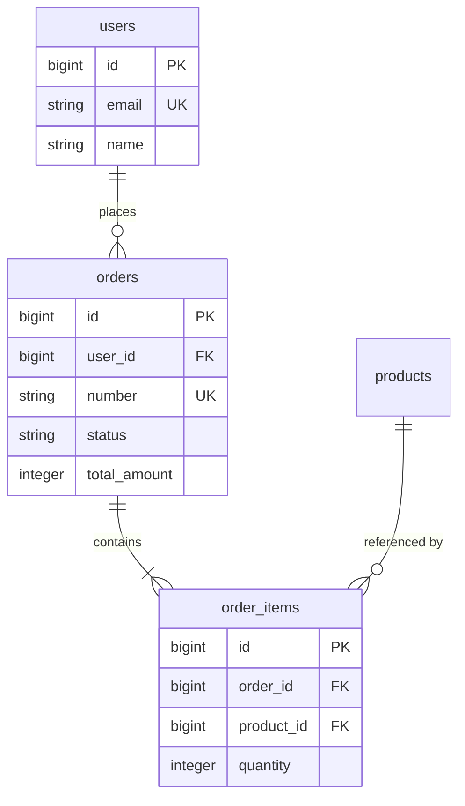

# テーブル定義書テンプレート

`docs/mitorizu/features/<feature-slug>/data-model.md` の雛形。

---

# データモデル: <機能名>

- 機能スラッグ: `<feature-slug>`
- 作成日: YYYY-MM-DD
- 対応する要件定義: `requirements.md`
- 対応する画面設計: `screens.md`
- 命名規約: Rails way (共通規約 第7節)

## 1. ER図



## 2. テーブル定義

### orders (注文)

- 説明: <このテーブルが表す概念>
- 対応要件: REQ-NNN
- 想定レコード数: <MVP時 / 1年後>

| カラム名 | 型 | NULL | 既定値 | 用途 | 参照元 | 制約 |
| --- | --- | --- | --- | --- | --- | --- |
| `id` | bigint | 不可 | auto | 主キー | 関連・API のキー | PK |
| `user_id` | bigint | 不可 | - | 注文者。誰の注文かを特定する | 関連 (Order -> User), SCR-002(表示: 顧客名) | FK, index |
| `number` | string | 不可 | - | 顧客に伝える注文番号。id を外部に晒さないため | SCR-002(表示), SCR-003(表示) | unique |
| `status` | string | 不可 | `pending` | 注文の進行状態。バッジ表示とキャンセル可否の判定 | SCR-002(表示), SCR-003(表示), SCR-002(内部: ボタン出し分け) | - |
| `total_amount` | integer | 不可 | 0 | 注文時点で確定した合計金額 (税込・円)。商品価格が後で変わっても不変 | SCR-002(表示), SCR-003(表示) | - |
| `ordered_at` | datetime | 不可 | - | 注文日。一覧の既定ソート順、月次集計の基準 | SCR-002(表示・ソート), SCR-002(集計) | index |
| `created_at` | datetime | 不可 | now | レコード作成日時 | 監査 (Rails 標準) | - |
| `updated_at` | datetime | 不可 | now | レコード更新日時 | 監査 (Rails 標準) | - |

**用途の書き方**: そのカラムが無いと何ができなくなるかを書く。
型から自明なこと (「status は注文のステータス」) を繰り返さない。

**参照元の書き方**: 画面ID + 読み書きの区別。
`(表示)` `(入力)` `(内部)` `(集計)` `(ソート)` を使い分ける。

**参照元が空欄のカラムは作らない。** 例外は監査・外部キー・論理削除・楽観ロックのみ。

#### インデックス

| 名前 | 対象カラム | 種別 | 理由 |
| --- | --- | --- | --- |
| `index_orders_on_user_id` | `user_id` | 通常 | 外部キー (Rails は自動で張らない) |
| `index_orders_on_number` | `number` | 一意 | 注文番号での検索・重複防止 |
| `index_orders_on_user_id_and_ordered_at` | `user_id`, `ordered_at` | 複合 | SCR-002 の絞り込み + ソート |

#### 状態遷移 (status を持つ場合)

| 値 | 意味 | 遷移先 | 要件ID |
| --- | --- | --- | --- |
| `pending` | 注文受付 | `paid`, `cancelled` | REQ-005 |
| `paid` | 決済完了 | `shipped` | REQ-006 |
| `cancelled` | 取消済 | (終端) | REQ-008 |

### order_items (注文明細)

(同じ構造を繰り返す)

## 3. 導出値の扱い

`screens.md` で `(導出)` と書かれた項目の実装方針。

| 表示項目 | 画面 | 方針 | 理由 |
| --- | --- | --- | --- |
| 合計金額 | SCR-002 | **カラムで保存** (`total_amount`) | 注文時点で固定すべき値。商品価格の変更に影響されてはいけない |
| 明細件数 | SCR-003 | 都度計算 (`order_items.count`) | 詳細画面のみで1件ずつ。N+1 にならない |
| 顧客の注文回数 | SCR-005 | カウンタキャッシュ (`orders_count`) | 一覧で N 件分表示するため N+1 を避ける |

**時点で固定すべき値は必ず保存する。** 正規化の原則より優先される。

## 4. マイグレーション

```ruby
class CreateOrders < ActiveRecord::Migration[7.1]
  def change
    create_table :orders do |t|
      t.references :user, null: false, foreign_key: true
      t.string :number, null: false
      t.string :status, null: false, default: "pending"
      t.integer :total_amount, null: false, default: 0
      t.datetime :ordered_at, null: false
      t.timestamps
    end

    add_index :orders, :number, unique: true
    add_index :orders, [:user_id, :ordered_at]
  end
end
```

## 5. 設計上の決定

| 論点 | 決定 | 理由 | マーカー |
| --- | --- | --- | --- |
| 削除方式 | 物理削除 | 注文の取消は status で表現するため、レコード削除は発生しない | [確実] |
| enum の型 | string | 値の追加が容易で、DB を直接見て意味が分かる | [確実] |
| 金額の型 | integer (円) | float は誤差が出る。最小単位で保持する | [確実] |
| 楽観ロック | 使わない | 同一注文を複数人が同時編集する要件が無い | [推測] |

後から変更が高コストな決定は ADR に記録する。

## 6. 要確認項目

| 項目 | 内容 | 仮置きした値 | 確認すべきこと |
| --- | --- | --- | --- |
| `orders.number` | 採番規則 | UUID | 顧客に伝える番号として妥当か。連番が必要か |

## 7. API 設計への引き継ぎ

このドキュメントのカラムが、API レスポンスの出所になる。

- API レスポンスの各フィールドは、**このテーブルのカラムか導出値**でなければならない
- 逆に、**参照元にどの画面も書かれていないカラムは API で返さない**

`api-design` スキルで、以下の3方向を突き合わせる。

```
screens.md の表示項目  =  API レスポンスのフィールド  ⊆  テーブルのカラム + 導出値
```
