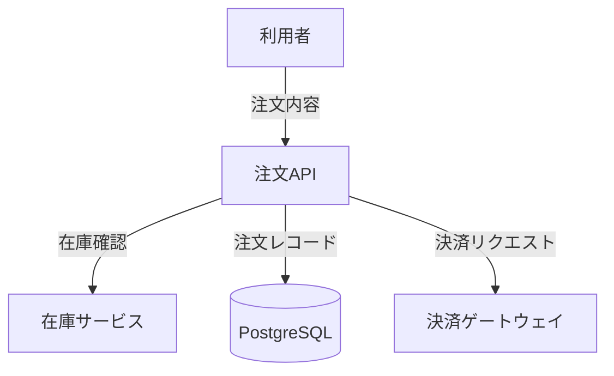
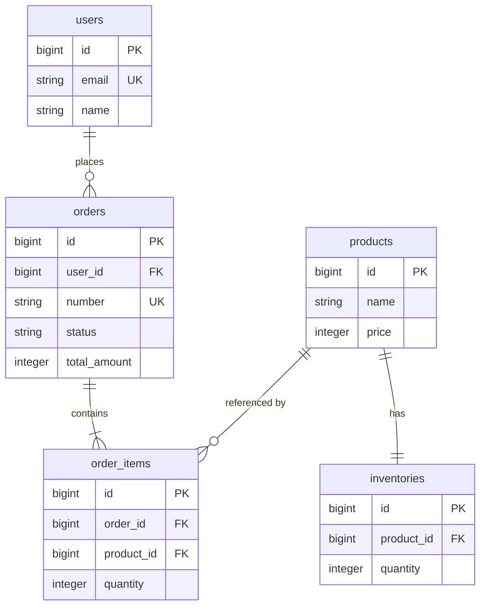

# 設計ドキュメント README テンプレート

`docs/mitorizu/README.md` の雛形。

**見出しの構造は変えないこと。** 各スキルが該当節を探して更新するため、
見出しが変わると更新対象を見つけられなくなる。

---

# <サービス名> 設計ドキュメント

- 最終更新: YYYY-MM-DD
- 生成: mitorizu

このドキュメントは <サービス名> の設計をまとめたものです。
**この1枚で全体像が分かるように書いています。**
詳細が必要な箇所は各ファイルへのリンクをたどってください。

> **要対応**: 在庫管理機能の API 設計に不足2件・過剰1件があります。
> 詳細は「7. 検証結果」を参照してください。

(検証が全て0件なら、この警告ブロックは削除する)

## 1. サービス概要

### 解決する課題

<誰の、どんな課題を解決するか。3〜5行>

### 対象利用者

| 利用者 | 説明 | 主な行動 |
| --- | --- | --- |
| <ロール> | <どんな人か> | <何をするか> |

### MVP のスコープ

**含むもの**

- <機能名>: <1行の説明>

**含まないもの** (意図的に外したもの)

| 機能 | 理由 | 後で追加する難易度 |
| --- | --- | --- |
| 管理画面 | Rails console で代替できる | 低 |
| 通知 | 手動連絡で回せる | 低 |

## 2. 全体構成

### データフロー

主要な処理の流れ。詳細は各機能の `dataflow.md` を参照。



### 技術構成

| 層 | 選定 | 理由 |
| --- | --- | --- |
| 言語・FW | Ruby on Rails 7.1 | <理由> |
| DB | PostgreSQL 16 | <理由> |
| 実行環境 | <環境> | <理由> |

## 3. 機能一覧

| 機能 | 概要 | 要件 | 画面 | データ | API | 状態 |
| --- | --- | --- | --- | --- | --- | --- |
| [注文管理](./features/order-management/) | 注文の作成・照会・キャンセル | 完了 | 完了 | 完了 | 完了 | 設計完了 |
| [在庫管理](./features/inventory/) | 在庫の引当と補充 | 完了 | 完了 | - | - | 設計中 |
| 通知 | メール・プッシュ通知 | - | - | - | - | MVP対象外 |

### 注文管理

<この機能が何をするか、3〜5行の要約>

主要な要件:

- REQ-001: 利用者が注文を確定したとき、システムは在庫を引き当てること
- REQ-008: もし注文が発送済みの場合、システムはキャンセルを拒否すること

画面: 注文一覧 (SCR-002) / 注文詳細 (SCR-003) / 注文作成 (SCR-004)

詳細: [要件定義](./features/order-management/requirements.md) |
[画面設計](./features/order-management/screens.md) |
[データモデル](./features/order-management/data-model.md) |
[API](./features/order-management/api.md)

### 在庫管理

(同じ構造を繰り返す)

## 4. データモデル

### 全体 ER 図

全機能を統合した図。機能ごとの詳細は各 `data-model.md` を参照。



### エンティティ一覧

| エンティティ | テーブル | 説明 | 定義した機能 |
| --- | --- | --- | --- |
| User | `users` | サービスの利用者 | order-management |
| Order | `orders` | 顧客の注文 | order-management |
| OrderItem | `order_items` | 注文の明細行 | order-management |
| Product | `products` | 販売する商品 | inventory |
| Inventory | `inventories` | 商品の在庫数 | inventory |

詳細: [エンティティカタログ](./entities.md)

### 設計上の主要な決定

| 論点 | 決定 | 理由 |
| --- | --- | --- |
| 削除方式 | 物理削除 | 取消は status で表現するため |
| 金額の型 | integer (円) | float は誤差が出る |
| enum の型 | string | 値の追加が容易 |

詳細: [確定事項](./decisions.md) | [ADR](./adr/)

## 5. API

### エンドポイント一覧

| メソッド | パス | 概要 | 使う画面 | 機能 |
| --- | --- | --- | --- | --- |
| GET | `/api/v1/orders` | 注文一覧 | SCR-002 | 注文管理 |
| GET | `/api/v1/orders/{id}` | 注文詳細 | SCR-003 | 注文管理 |
| POST | `/api/v1/orders` | 注文作成 | SCR-004 | 注文管理 |
| POST | `/api/v1/orders/{id}/cancel` | 注文キャンセル | SCR-002, SCR-003 | 注文管理 |

**使う画面が空欄のエンドポイントは存在しない** (レスポンスの過不足検証済み)。

### 共通仕様

| 項目 | 規約 |
| --- | --- |
| 認証 | `Authorization: Bearer <token>` |
| JSONキー | スネークケース |
| 日時 | ISO 8601 UTC |
| 金額 | integer (最小単位) |
| ページネーション | offset 方式 (`page` / `per`) |

詳細: [注文管理 API](./features/order-management/api.md)

## 6. インフラ構成


構成の意図:

- ALB で HTTPS を終端し、プライベートサブネットのコンテナへ転送する
- DB はプライベートサブネットに置き、外部から直接アクセスできない
- MVP のため単一 AZ。可用性の要件が出たら Multi-AZ にする

後から変更が高コストな決定:

| 項目 | 決定 | 理由 |
| --- | --- | --- |
| リージョン | ap-northeast-1 | 利用者が国内のため |
| VPC CIDR | 10.0.0.0/16 | 将来の拡張余地を確保 |
| DB | PostgreSQL (RDS) | JSON 型と全文検索を使うため |

ソース: [production.d2](./infra/production.d2)

図を再生成する場合:

```bash
d2 docs/mitorizu/infra/production.d2 docs/mitorizu/infra/production.svg
```

## 7. 検証結果

各機能の API 設計について、画面・API・テーブルの3方向を突き合わせた結果。

```
screens.md の表示項目 = API レスポンス ⊆ テーブルのカラム + 導出値
```

| 機能 | 不足 | 過剰 | 出所不明 | 判定 |
| --- | --- | --- | --- | --- |
| 注文管理 | 0 | 0 | 0 | OK |
| 在庫管理 | 2 | 1 | 0 | **要対応** |

- **不足**: 画面に表示するが API が返さない
- **過剰**: API が返すがどの画面でも使わない
- **出所不明**: API が返すがテーブルに裏付けが無い

**全て0件でなければ設計は完了していない。**

詳細: [注文管理](./features/order-management/traceability.md)

## 8. 要確認項目

判断材料が不足し、仮置きしている項目。**外れると後段の設計が崩れる。**

| 機能 | 項目 | 内容 | 仮置きした値 | 確認すべきこと |
| --- | --- | --- | --- | --- |
| 注文管理 | REQ-003 | セッションタイムアウト | 30分 | 業務要件上の妥当性 |
| 在庫管理 | REQ-021 | 在庫の引当タイミング | 注文確定時 | 予約引当が必要か |

(0件の場合は「現時点で要確認項目はありません」と明記する)

## 9. 用語集

主要な用語のみ。全一覧は [glossary.md](./glossary.md) を参照。

| 用語 | 英語名 | 定義 | 使ってはいけない別名 |
| --- | --- | --- | --- |
| 注文 | `Order` | 利用者が商品の購入を確定した記録 | オーダー、購入 |
| 在庫 | `Inventory` | 販売可能な商品の数量 | ストック |

**同じ概念に別名を付けないこと。** 大規模化したときに最大の負債になる。

## 10. ドキュメント一覧

| ファイル | 内容 |
| --- | --- |
| [glossary.md](./glossary.md) | 用語集 (ユビキタス言語) |
| [entities.md](./entities.md) | エンティティカタログ |
| [decisions.md](./decisions.md) | 確定事項のスナップショット |
| [adr/](./adr/) | アーキテクチャ決定記録 |
| [features/](./features/) | 機能ごとの設計 |
| [infra/](./infra/) | インフラ構成図 |

---

このドキュメントは [mitorizu](https://github.com/joe41203/mitorizu) で生成しました。
更新するには `/mitorizu:docs-index` を実行してください。
