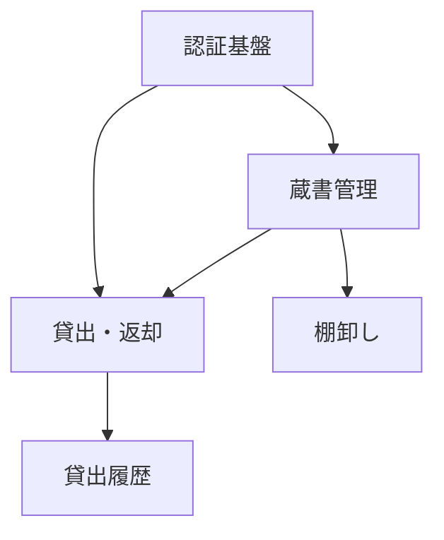

# 機能の分割と優先順位

大きな機能候補を、**設計・実装できる単位** に割る。

**ここで決めた単位が、以降の全ての設計単位になる。**
`docs/mitorizu/features/<slug>/` のディレクトリがこれに対応し、
要件定義・画面設計・データモデル・API 設計がこの単位で進む。

**後から変えるのが高コスト。** 時間をかけて決める価値がある。

**共通規約 `${CLAUDE_PLUGIN_ROOT}/references/conventions.md` を必ず先に読むこと。**

## 開始前に必ず読むもの

```bash
cat docs/mitorizu/.feedback/overrides.md 2>/dev/null
cat docs/mitorizu/.feedback/learnings.md 2>/dev/null
```

無ければ既定で進める。あれば**そちらを優先する**。

## 位置づけ

```
discovery    アイデア -> 課題と機能候補     (何を作るべきか)
features     機能候補 -> 実装単位への分割   (どう分けるか)  <- ここ
requirements 機能ごとの要件定義             (何を満たすか)
```

`discovery/features.md` があればそれを入力にする。
無い場合は、ユーザーから機能候補を聞いて始める。

## 成果物

```
docs/mitorizu/
  features.md          # 機能の一覧・分割・優先順位・依存関係
  features/
    <slug-1>/          # 各機能のディレクトリ (空で作る)
    <slug-2>/
```

## 進め方

### Phase 1: 機能候補を集める

| 入力元 | 使い方 |
| --- | --- |
| `docs/mitorizu/discovery/features.md` | そのまま候補として使う |
| 既存の `docs/mitorizu/features/` | 既に分割済み。追加分のみ扱う |
| ユーザーの説明 | 聞き取る |

候補が10個を超える場合、**まず大分類にまとめる**。
細かい機能を一つずつ検討すると全体像を見失う。

### Phase 2: 分割の粒度を決める

**1機能 = 1つの利用者価値。** これが基本。

| 粒度 | 判断 | 例 |
| --- | --- | --- |
| 大きすぎる | 設計が終わらない。画面が10枚以上になる | 「蔵書管理」 |
| **適切** | 設計が1〜2セッションで終わる。画面2〜5枚 | 「蔵書の貸出・返却」 |
| 小さすぎる | 単独で価値が無い。他と必ずセットで使う | 「返却ボタンの表示」 |

#### 分割の判断基準

以下のいずれかに該当したら**分ける**。

| 基準 | 例 |
| --- | --- |
| 利用者が違う | 「借りる人の機能」と「管理者の機能」 |
| 使うタイミングが違う | 「日常的に使う貸出」と「年1回の棚卸し」 |
| 無くても成立する | 貸出があれば予約は無くてもよい |
| リリース時期を分けたい | MVP に入れる / 入れない |

以下に該当したら**分けない**。

| 基準 | 例 |
| --- | --- |
| 必ずセットで使う | 「貸出」と「返却」は片方だけでは意味がない |
| 同じ画面で完結する | 一覧と絞り込み |
| データモデルが同一 | 同じテーブルしか触らない |

#### 迷ったら大きめに切る

**分割しすぎると、機能をまたぐ整合の負担が増える。**
用語のブレ、エンティティの重複、API の重複が起きやすくなる。

後から分けるのは比較的容易だが、統合するのは難しい。
迷ったら**大きめに切って、後で分ける**。

### Phase 3: 共有部分を切り出す

**複数機能が使うものは、独立した機能として先に作る。**

| 共有されやすいもの | 扱い |
| --- | --- |
| 認証・ログイン | 独立した機能にする |
| ユーザー・組織のモデル | 独立した機能にする |
| 共通レイアウト・ナビゲーション | 独立した機能にする |
| 通知の基盤 | 独立した機能にする |
| 権限管理 | 認証に含めるか独立させるか判断 |

これらを各機能に分散させると、**同じものを何度も設計する**ことになる。
用語やテーブルの重複も起きる。

### Phase 4: 依存関係を決める

機能間の依存を明示する。



| 依存の種類 | 例 |
| --- | --- |
| データの依存 | 貸出は蔵書のテーブルを参照する |
| 機能の依存 | 貸出履歴は貸出の記録が無いと意味がない |
| 前提の依存 | 全機能は認証を前提とする |

**循環依存があれば分割が間違っている。** 統合するか、境界を引き直す。

### Phase 5: 優先順位を決める

**MVP に入れるものを絞る。** ここが最も重要な判断。

判断の軸は2つ。

| 軸 | 問い |
| --- | --- |
| **仮説検証への寄与** | この機能が無いと、検証したい仮説を確かめられないか |
| **依存の位置** | 他の機能がこれを前提にしているか |

```markdown
| 機能 | 仮説検証 | 依存 | 優先度 | MVP |
| --- | --- | --- | --- | --- |
| 認証基盤 | 寄与しない | 全機能が前提 | 必須 | 含む |
| 蔵書管理 | 中核 | 貸出が前提とする | 必須 | 含む |
| 貸出・返却 | 中核 | - | 必須 | 含む |
| 貸出履歴 | 寄与しない | - | 中 | 除外 |
| 棚卸し | 寄与しない | - | 低 | 除外 |
```

**「仮説検証に寄与しない」かつ「他が依存しない」ものは除外する。**

ただし認証のように、**寄与しないが全機能の前提になるもの**は必須。

#### MVP を最小に保つ

MVP の機能数の目安は **3〜5個**。それを超えたら削る余地を探す。

```
機能が7個あります。以下は MVP から外せませんか?

- 貸出履歴: 貸出ができれば履歴は後から見られる (データは残る)
- 棚卸し: 年1回の作業。手作業でも回る
- 通知: 返却遅延が問題化してから
```

### Phase 6: スコープの境界を明示する

**「作らないもの」を明示的に記録する。** 作るものを列挙するだけでは不十分。

これが無いと、後続フェーズで「これも要る」が無限に湧く。
`/mitorizu:validate` の追跡可能性チェックは**スコープ内の整合性しか見ない**ため、
機械的にも検出できない。

#### 3種類に分けて書く

| 種類 | 意味 | 例 |
| --- | --- | --- |
| **MVP から除外** | 作るが後回し | 検索、通知、予約 |
| **このシステムでは作らない** | 別の手段で解決する | 経費精算 (既存システムを使う) |
| **そもそも対象外** | このシステムの守備範囲外 | 電子書籍の管理 |

```markdown
## スコープ外

### MVP から除外 (後で作る)

| 機能 | 理由 | 追加する条件 |
| --- | --- | --- |
| 検索 | 蔵書100冊なら一覧で足りる | 蔵書が500冊を超えたら |
| 通知 | 返却遅延が問題化してから | 延滞が月5件を超えたら |

### このシステムでは作らない

| やらないこと | 理由 | 代わりの手段 |
| --- | --- | --- |
| 書籍の購入申請 | 既存の稟議システムがある | 既存システムで申請する |
| 予算管理 | 経理部門の管轄 | 既存の予算管理を使う |

### そもそも対象外

| 対象外 | 理由 |
| --- | --- |
| 電子書籍 | 貸出の概念が無い |
| 個人所有の書籍 | 会社の資産ではない |
```

#### 境界に接するものを明示する

**自システムと外部の境界を書く。** 曖昧だと後で揉める。

```markdown
| 外部 | このシステムとの関係 | 連携するか |
| --- | --- | --- |
| 人事システム | 社員情報の源泉 | **しない** (手動で登録する) |
| 経理システム | 蔵書は固定資産 | **しない** (別々に管理する) |
| Slack | 通知の送り先 | MVP では連携しない |
```

**「連携しない」と決めることも設計。** 曖昧に残さない。

### Phase 7: スラッグを決める

各機能のディレクトリ名を決める。**後から変えると全パスが変わる。**

| 規則 | 例 |
| --- | --- |
| 英小文字とハイフン | `book-lending` |
| 機能を表す名詞または動名詞 | `authentication`, `book-lending` |
| 短く (3語以内) | `lending` より `book-lending` が明確なら後者 |
| 番号を付けない | `01-auth` としない (順序が変わる) |

ユーザーに確認する。

```
以下のディレクトリ構成で進めます。よろしいですか?

docs/mitorizu/features/
  authentication/     認証基盤
  book-catalog/       蔵書管理
  book-lending/       貸出・返却
```

### Phase 8: ディレクトリを作る

確認が取れたら、**空のディレクトリを作る**。
中身は各機能の設計時に作られる。

```bash
mkdir -p docs/mitorizu/features/authentication
mkdir -p docs/mitorizu/features/book-catalog
mkdir -p docs/mitorizu/features/book-lending
```

### Phase 9: 記録と次のステップ

1. `docs/mitorizu/features.md` を書く (テンプレート参照)
2. `docs/mitorizu/README.md` の「3. 機能一覧」を更新する
3. `docs/mitorizu/decisions.md` に分割の判断を記録する

```
機能を3つに分割しました。

  authentication  認証基盤      (必須・他の全機能が前提とする)
  book-catalog    蔵書管理      (必須)
  book-lending    貸出・返却    (必須)

MVP から除外: 貸出履歴 / 棚卸し / 通知 (理由は features.md に記録)

次のステップ:
  /mitorizu:requirements  最初の機能の要件定義

依存関係から、authentication -> book-catalog -> book-lending の順を推奨します。
```

### 終了前: 学んだことを記録する

このフェーズで**利用者から訂正や指示**を受けたら、
次回も同じ判断をすべきものだけを `docs/mitorizu/.feedback/overrides.md` に追記する。

**記録する前に利用者に確認する。**

## 複数機能を並列で設計するとき

依存の無い機能は**並列で設計できる**。ただし注意点がある。

| 起きること | 対策 |
| --- | --- |
| 用語がぶれる | 先に `glossary.md` に主要な用語を登録しておく |
| 同じエンティティを別々に定義する | 先に `entities.md` に共有エンティティを登録しておく |
| API の重複 | 設計後に `/mitorizu:validate` で検出する |

**並列で進めた後は必ず `/mitorizu:validate` を実行する。**

依存のある機能は順に進める。依存先の `data-model.md` が無いと、
参照するテーブルが分からない。

## 参照

- `${CLAUDE_SKILL_DIR}/references/features-template.md` — 機能一覧のテンプレート
- `${CLAUDE_PLUGIN_ROOT}/references/conventions.md` — 信頼性マーカー、対話規約
