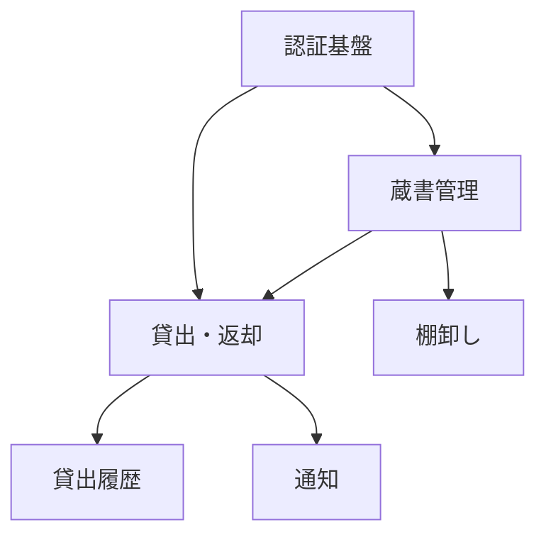

# 機能一覧のテンプレート

`docs/mitorizu/features.md` の雛形。

**このファイルが以降の全ての設計単位を決める。**

---

# 機能の分割: <サービス名>

- 作成日: YYYY-MM-DD
- 入力: `discovery/features.md` (あれば)

## 1. サマリ

| 項目 | 値 |
| --- | --- |
| 機能数 | 6 |
| MVP 対象 | 3 |
| MVP から除外 | 3 |

**推奨する実装順**: authentication -> book-catalog -> book-lending

## 2. 機能一覧

| スラッグ | 機能名 | 概要 | 依存 | 優先度 | MVP |
| --- | --- | --- | --- | --- | --- |
| `authentication` | 認証基盤 | ログインと権限 | - | 必須 | 含む |
| `book-catalog` | 蔵書管理 | 書籍の登録・一覧 | authentication | 必須 | 含む |
| `book-lending` | 貸出・返却 | 貸出状態の管理 | authentication, book-catalog | 必須 | 含む |
| `lending-history` | 貸出履歴 | 過去の貸出の閲覧 | book-lending | 中 | **除外** |
| `stocktaking` | 棚卸し | 蔵書の実在確認 | book-catalog | 低 | **除外** |
| `notification` | 通知 | 返却期限の通知 | book-lending | 低 | **除外** |

## 3. 依存関係



**循環依存はない。**

### 並列で設計できるもの

| 組み合わせ | 可否 | 理由 |
| --- | --- | --- |
| book-catalog と book-lending | **不可** | lending が catalog のテーブルを参照する |
| lending-history と stocktaking | 可 | 相互に依存しない |

並列で設計した場合、**必ず `/mitorizu:validate` で整合を確認する。**

## 4. 各機能の詳細

### authentication (認証基盤)

- 優先度: 必須
- MVP: 含む
- 依存: なし
- 依存される: 全機能

#### 含むもの

- ログイン・ログアウト
- セッション管理
- 権限の判定 (一般 / 管理者)

#### 含まないもの

| 除外したもの | 理由 |
| --- | --- |
| パスワードリセット | MVP では管理者が手動で対応 |
| 多要素認証 | 社内利用のため優先度が低い |
| SSO | 導入コストが高い。要望が出てから |

#### 分割の判断

[確実] 全機能が前提とするため独立させた。
各機能に認証ロジックを分散させると、権限判定が重複する。

### book-catalog (蔵書管理)

- 優先度: 必須
- MVP: 含む
- 依存: authentication

#### 含むもの

- 書籍の登録・編集・削除
- 書籍の一覧表示

#### 含まないもの

| 除外したもの | 理由 |
| --- | --- |
| 検索 | MVP では蔵書100冊のため一覧で足りる |
| ISBN からの自動取得 | 手入力で回る。外部API依存を避ける |
| カテゴリ分類 | 冊数が増えてから |

#### 分割の判断

[確実] 貸出とは利用タイミングが違うため分けた。
蔵書の登録は稀 (月数回)、貸出は日常的。

[要確認] 蔵書数が1000冊を超える場合、検索を MVP に含める必要がある。

### book-lending (貸出・返却)

(同じ構造を繰り返す)

#### 分割の判断

[確実] 貸出と返却は**分けなかった**。
片方だけでは意味がなく、同じテーブルを操作するため。

## 5. MVP から除外した機能

| 機能 | 理由 | 後から追加する難易度 | 追加を検討する条件 |
| --- | --- | --- | --- |
| 貸出履歴 | 貸出ができればデータは残る。閲覧は後から作れる | 低 | 「誰がいつ借りたか」の問い合わせが増えたら |
| 棚卸し | 年1回の作業。Excel で回る | 低 | 蔵書の紛失が問題化したら |
| 通知 | 返却遅延が問題化してから | 低 | 延滞が月5件を超えたら |

**除外したものもリストに残す。** 後で追加するときに使う。

## 6. 共有するもの

複数機能が使うため、`authentication` に含めるか、
各機能の設計時に `entities.md` で共有する。

| 共有物 | 定義する場所 | 使う機能 |
| --- | --- | --- |
| User エンティティ | authentication | 全機能 |
| 共通レイアウト | authentication | 全画面 |
| エラーレスポンス形式 | authentication | 全 API |

**先に登録しておくと、並列設計時の重複を防げる。**

## 7. 分割の判断記録

後から「なぜこう分けたのか」を問われたときのために残す。

| 判断 | 理由 | マーカー |
| --- | --- | --- |
| 認証を独立させた | 全機能の前提。分散させると権限判定が重複する | [確実] |
| 貸出と返却を分けなかった | 片方では意味がない。同じテーブルを操作する | [確実] |
| 蔵書管理と貸出を分けた | 利用タイミングが違う (月数回 vs 日常) | [確実] |
| 履歴を貸出から分けた | 貸出だけで価値が成立する | [推測] |

## 8. 要確認項目

| 項目 | 内容 | 確認すべきこと |
| --- | --- | --- |
| 蔵書数 | 100冊と想定 | 1000冊を超えるなら検索を MVP に含める |
| 利用者数 | 50人と想定 | 同時アクセス数の設計に影響する |

## 9. 次のステップ

```
/mitorizu:requirements
```

依存関係から、以下の順を推奨する。

1. `authentication` (他の全機能が前提とする)
2. `book-catalog` (貸出が前提とする)
3. `book-lending`

**並列で進める場合は、先に `glossary.md` と `entities.md` に
共有する用語・エンティティを登録しておく。**
