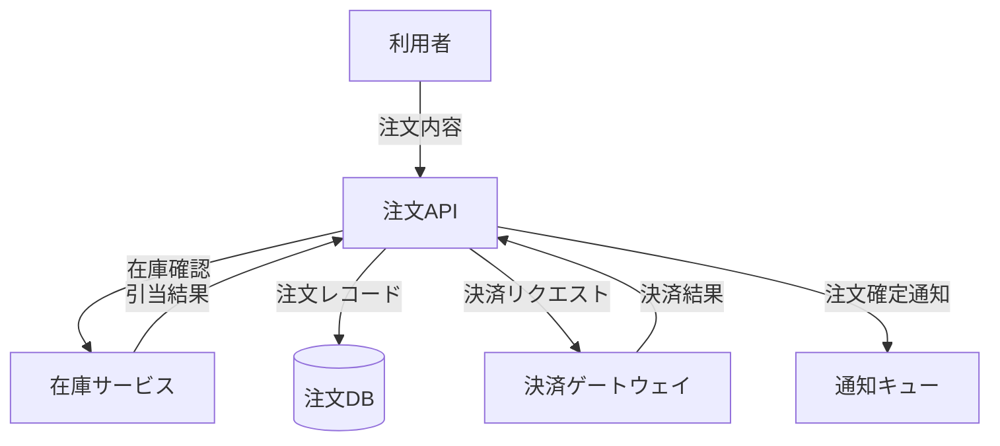

# 要件定義

対話のラリーを通じて要件を固め、EARS 記法の要件定義書とデータフロー図を生成する。

**共通規約 `${CLAUDE_PLUGIN_ROOT}/references/conventions.md` を必ず先に読むこと。**
信頼性マーカー、EARS 記法、出力先、対話の進め方はそこで定義されている。

## このスキルの成果物

```
docs/mitorizu/features/<feature-slug>/
  requirements.md    # 要件定義書 (EARS + 信頼性マーカー)
  interview.md       # ヒアリング記録
  dataflow.md        # データフロー図 (mermaid)
docs/mitorizu/
  glossary.md        # 用語集 (追記)
  decisions.md       # 確定事項スナップショット (追記)
```

## 開始前に必ず読むもの

**成果物を書き始める前に、このプロジェクトの学習内容を読む。**
既定より優先度が高い。

```bash
cat docs/mitorizu/.feedback/overrides.md 2>/dev/null
cat docs/mitorizu/.feedback/learnings.md 2>/dev/null
```

無ければ既定で進める。あれば**そちらを優先する**。
詳細は共通規約の「フィードバックの蓄積と反映」を参照。

## 前提

**`business-flow.md` があれば必ず読む。** このスキルの主入力。

```bash
cat docs/mitorizu/features/<slug>/business-flow.md 2>/dev/null
```

business-flow は業務担当者と合意した内容であり、**要件の根拠**になる。
無い場合はユーザーへのヒアリングから始めるが、
**業務の合意を取らずに要件を書くことになる**ため、
`/mitorizu:business-flow` を先に実行するよう提案する。

### business-flow から引き継ぐもの

| business-flow の節 | requirements での扱い |
| --- | --- |
| **業務ルール (BR-NNN)** | **各要件から `(BR-NNN)` で参照する。必須** |
| 操作と結果の表 | 各行を EARS 記法の要件に変換する |
| 業務のやり取り (時系列) | 順序に依存する要件の根拠にする |
| 判断が必要な場面 | システムが自動化しない範囲として明記する |
| 業務が止まらないようにするために | 異常系の要件 (EARS の Unwanted) にする |
| 決まっていないこと | `[要確認]` として引き継ぐ |

**BR-NNN の参照を怠ると `/mitorizu:validate` の A9 が全件で落ちる。**
業務ルールが実装されない状態を作ることになる。

```
| 1 | 社員 | 借りるボタンを押す | 貸出が記録される | BR-001, BR-002 |
        ↓
[確実] REQ-001: 社員が貸出ボタンを押したとき、システムは書籍を貸出中にし、
       返却期限を貸出日の14日後に設定すること。(BR-001)
```

### 業務ルールを再定義しない

**`BR-NNN` の内容を requirements に書き写さない。** 参照だけにする。

両方に実体があると、片方だけ直したときに矛盾する。
対応表を作り、要件IDと BR-NNN の紐付けだけを記録する。

```markdown
| BR | 内容 (business-flow.md より) | 対応する要件 |
| --- | --- | --- |
| BR-001 | 返却期限は貸出日の14日後 | REQ-001 |
| BR-002 | 同時に借りられるのは5冊まで | REQ-012 |
```

**要件化しない BR があれば、その理由を書く。**
「別機能で扱う」「MVP 対象外」など。空欄にしない。

## 進め方

### Phase 0: 既存資産の把握

**このスキルの主用途は「空リポジトリから MVP を設計する」こと。**
その場合この Phase はほぼ空振りするので、時間をかけずに素早く済ませる。

まず 1 回のコマンドで既存資産の有無を判定する。

```bash
ls docs/mitorizu/ 2>/dev/null
ls CLAUDE.md README.md 2>/dev/null
ls db/schema.rb prisma/schema.prisma 2>/dev/null
```

#### 空リポジトリだった場合

調査を打ち切り、すぐ Phase 1 に進む。
命名規約は **Rails way** を既定として採用する (共通規約の第8節)。
ユーザーに「既存はありますか」と聞かない。見れば分かることを聞かない。

#### 既存資産があった場合

以下を確認する。**Explore サブエージェントに委譲**してメインコンテキストを温存する。

1. `docs/mitorizu/glossary.md` `entities.md` `decisions.md` — 既存の確定事項
2. `CLAUDE.md` `README.md` — プロジェクト規約と目的
3. 既存スキーマ — `schema.rb` `prisma/schema.prisma` `migrations/` `*.sql`
4. 既存 API — `openapi.yaml` `routes` `controllers/`
5. 認証・権限まわりの既存実装

見つかった事実は `[確実]` として扱い、ユーザーに聞き直さない。
**既存スキーマがあれば、その命名規約に従う** (Rails way より既存を優先)。

分かったことを提示してから質問に入る。

```
既存コードから以下を確認しました:
- 認証は Devise によるメール+パスワード [確実]
- users / organizations テーブルが存在 [確実]
- 命名は Rails 規約 (複数形テーブル、_at サフィックス) [確実]

これらは前提として、不明点をお聞きします。
```

### Phase 1: ラリーによるヒアリング

**一度に全部聞かない。3〜5問のまとまりで、回答を見て次を組む。**

各ラウンドの構造は共通規約のとおり:

1. **冒頭に現在地を出す** — フェーズ番号、確定済み、未決
2. **3〜5問を AskUserQuestion で投げる** — 選択肢の先頭に推奨案を置き「(推奨)」を付ける
3. **末尾に解釈を書き戻す** — 「つまりこう理解した」を1〜3行

方針を左右する重い問い (アーキテクチャの分岐点、スコープの境界) は **1問だけ単独**で投げる。

#### ラウンドの設計

ラウンド1は必ず「何を作るか」の輪郭から入る。詳細から入らない。

| ラウンド | 主題 | 例 |
| --- | --- | --- |
| 1 | 目的とMVPの範囲 | 誰の何の課題を解くか / **MVPに含めないもの** |
| 2 | 利用者と権限 | 誰が使うか / ロールは何種類か |
| 3 | 中心となる概念 | 扱う主要なエンティティ / ライフサイクル |
| 4 | 主要な操作 | 作成・更新・削除の条件 / 状態遷移 |
| 5 | 制約と例外 | 上限値 / エラー時の振る舞い / 権限違反時 |

ラウンド数は固定ではない。**`[要確認]` が十分減るまで続ける**。
逆に、既存資産から十分に分かる場合は3ラウンドで終えてよい。

#### MVP のスコープを削る

**MVP 設計では「やらないこと」の確定が最も重要。**
機能を足す提案は誰でもできるが、削る判断は明示的に行わないと際限なく膨らむ。

ラウンド1で必ず以下を確認する。

- **最初のリリースで検証したい仮説は何か** — これに寄与しない機能は削る候補
- **無くても価値が成立する機能はどれか** — 通知、検索、権限の細分化などは後回しにできることが多い
- **手運用で代替できるものはあるか** — 管理画面は最初 Rails console で代替できる場合がある

削った機能は要件定義書の「やらないこと」に**理由付きで記録**する。
「なぜ入っていないのか」を後から問われる手間を省ける。

MVP で後回しにしやすい典型:

| 機能 | 代替 | 後で追加する難易度 |
| --- | --- | --- |
| 管理画面 | Rails console / 直接 SQL | 低 |
| 通知 (メール・プッシュ) | 手動連絡 | 低 |
| 検索・絞り込み | 一覧＋ブラウザの Ctrl+F | 低 |
| 権限の細分化 | 単一ロール | 中 |
| 監査ログ | なし | 中 (後付けは過去分が残らない) |
| 論理削除 | 物理削除 | **高 (データが失われる)** |
| 多言語対応 | 単一言語 | **高 (全画面に影響)** |

**難易度「高」のものは MVP でも設計に織り込む**。後から足すとコストが跳ね上がる。
削るかどうかをユーザーに確認するときは、この難易度を添えて判断材料にする。

#### 質問の作り方

- **Yes/No か選択式にする**。自由記述は回答負荷が高い
- 選択肢には**その選択がもたらす帰結**を description に書く
- 「どうしますか」ではなく「A と B のどちらですか、A なら〜になります」

悪い例: 「認証方式はどうしますか」
良い例: 「認証方式は? A: メール+パスワード (推奨。実装が単純) / B: OAuth のみ (パスワード管理が不要だが外部依存) / C: 両方」

#### 用語の統制

新しい名詞が出たら `glossary.md` と照合する。
類義語 (User / Account / Member など) を見つけたら**その場で確認**し、統一する。

```
「メンバー」という語が出ましたが、既存の用語集には「ユーザー」があります。
同じものですか? 別概念なら定義の違いを教えてください。
```

### Phase 2: 要件定義書の生成

`${CLAUDE_SKILL_DIR}/references/requirements-template.md` のテンプレートに従う。

**必ず守ること**:

- 機能要件は **EARS 記法**で書く (共通規約の表を参照)
- **全項目に信頼性マーカー**を付ける (`[確実]` `[推測]` `[要確認]`)
- 要件IDは `REQ-NNN` の通し番号
- 「〜など」「適切に」「必要に応じて」は使わない。検証できない表現は禁止

生成量が多い場合は**サブエージェントに委譲**し、結果マーカーで受け取る。
メインコンテキストには `[要確認]` の一覧だけを取り込む。

```
サブエージェントへの指示:
  requirements.md を生成し、完了したら以下の形式で返すこと。
  REQUIREMENTS_SUCCESS
  要確認項目:
  - REQ-003: セッションタイムアウト30分は仮置き
  - REQ-012: 同時編集時の競合解決方針が未定
```

### Phase 3: データフロー図

`dataflow.md` に mermaid `flowchart` でデータの流れを描く。

- **アクター、システム、データストア、外部サービス**を区別する
- エッジには**何が流れるか**を書く。単なる矢印にしない
- 抽象度は「主要な処理の流れが1枚で追える」程度に保つ。細部は書かない



**mermaid のラベルは必ずダブルクォートで囲む。**
日本語や括弧を含むラベルは、囲まないと Syntax Error になる。

書いたら検証する:

```bash
"${CLAUDE_PLUGIN_ROOT}/scripts/check-mermaid.sh" docs/mitorizu/features/<slug>/dataflow.md
```

エラーが出たら修正し、通るまで繰り返す。

### Phase 4: 確定事項の記録と要確認の再掲

1. `docs/mitorizu/decisions.md` に今回の確定事項を追記する
2. `docs/mitorizu/glossary.md` に新出用語を追記する
3. **`[要確認]` を一覧で再掲**し、ユーザーに確認を促す

```
要件定義書を作成しました。以下は判断材料が不足しており、
外れると後段の設計が崩れる項目です。確認をお願いします。

- REQ-003: セッションタイムアウトを30分と仮置きしました
- REQ-012: 同時編集時の競合解決方針が未定です
- REQ-018: 論理削除か物理削除か決まっていません
```

`[要確認]` が10件を超えた場合はヒアリング不足。次のラウンドを提案する。

### Phase 5: 設計ドキュメント README の更新

`docs/mitorizu/README.md` の該当節を更新する。

| 更新する節 | 内容 |
| --- | --- |
| 1. サービス概要 | 初回のみ。MVP のスコープ (含む / 含まない) |
| 3. 機能一覧 | この機能の行を追加。要約3〜5行と主要な要件を書く |
| 8. 要確認項目 | この機能の `[要確認]` を追記 |
| 9. 用語集 | 新出用語を追記 |

**該当節のみを更新し、他の節には触れない。**

初回実行では README は存在しない。その場合は**新規作成する**。
`${CLAUDE_PLUGIN_ROOT}/skills/docs-index/references/docs-readme-template.md`
の見出し構造をそのまま作り、上記の担当節だけを埋める。
他の節は見出しと「(未作成)」だけを置き、後続スキルに任せる。

同様に `glossary.md` `decisions.md` も不在なら新規作成する。

### 終了前: 学んだことを記録する

このフェーズで**利用者から訂正や指示**を受けたら、
次回も同じ判断をすべきものだけを `docs/mitorizu/.feedback/overrides.md` に追記する。

**記録する前に利用者に確認する。**

```
以下を次回以降の既定にしますか?
  「テーブル名は単数形を使う」(今回のご指摘)

A: 記録する (次回から自動で適用)
B: 今回限り (記録しない)
```

その場限りの指示 (機能名、今回の値) は記録しない。

### Phase 6: 次のステップの案内

要件が固まったら、次に進める設計スキルを案内する。

```
次のステップ:
- /mitorizu:screens     画面設計 (表示項目を定義。API設計の入力になる)
- /mitorizu:data-model  ER図とテーブル定義
- /mitorizu:api-design  OpenAPI (画面設計とデータモデルの後に実行)
```

**順序に意味がある**。画面設計 -> データモデル -> API設計 の順に進めると、
「画面に必要なデータが API から返らない」という不整合を防げる。

## 既存の要件群との整合

2つ目以降の機能を定義するときは、既存の要件と矛盾しないか検査する。

1. **用語の衝突** — 同じ概念に別名が付いていないか
2. **エンティティの重複** — 既にあるエンティティを再定義していないか
3. **要件の矛盾** — 既存要件と両立しない要件を追加していないか
4. **依存関係** — この機能が依存する既存機能を明示する

矛盾を見つけたら**要件定義書を書く前にユーザーに提示**する。
書いてから直すのは手戻りが大きい。

```
既存要件との矛盾を検出しました:

REQ-005 (既存, 機能A): 「システムは削除された注文を物理削除すること」
今回の要件: 「システムは過去1年分の注文履歴を参照できること」

物理削除すると履歴参照ができません。どちらを優先しますか?
```

## 参照

- `${CLAUDE_PLUGIN_ROOT}/references/conventions.md` — 信頼性マーカー、EARS、出力先、対話規約
- `${CLAUDE_SKILL_DIR}/references/requirements-template.md` — 要件定義書のテンプレート
- `${CLAUDE_SKILL_DIR}/references/ears-examples.md` — EARS 記法の実例集
