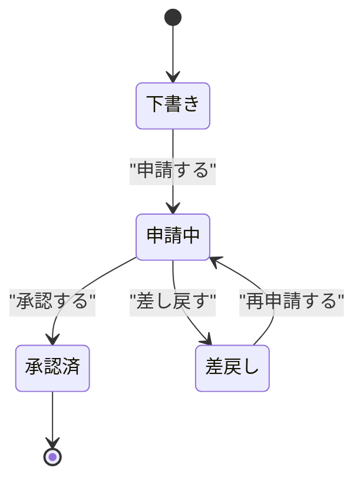

# 要件定義書テンプレート

`docs/mitorizu/features/<feature-slug>/requirements.md` の雛形。

---

# 要件定義: <機能名>

- 機能スラッグ: `<feature-slug>`
- 作成日: YYYY-MM-DD
- 最終更新: YYYY-MM-DD

## 1. 目的と背景

<この機能が解決する課題を3〜5行で。誰の何の困りごとか。>

[確実] 課題: <ユーザーが明示的に述べた課題>
[推測] 背景: <文脈から補完した背景>

## 2. スコープ

### やること

- [確実] <含まれる範囲>

### やらないこと

明示的に対象外とするものを書く。「書いていない = やらない」ではなく、
**あえて外したもの**を書く。後から「なぜ入っていないのか」と問われる手間を省く。

- [確実] <今回は対象外。理由>

## 3. 利用者とロール

| ロール | 説明 | 主な操作 | マーカー |
| --- | --- | --- | --- |
| <ロール名> | <誰か> | <何をするか> | [確実] |

## 4. 用語

この機能で新たに登場する用語。確定後 `docs/mitorizu/glossary.md` に統合する。

| 用語 | 英語名 | 定義 | 使ってはいけない別名 |
| --- | --- | --- | --- |
| <用語> | `<english_name>` | <定義> | <避ける語> |

## 5. 機能要件

EARS 記法で書く。全項目に信頼性マーカーを付ける。

### 5.1 <サブ機能名>

[確実] **REQ-001**: <利用者が〜したとき>、システムは<〜すること>。

[確実] **REQ-002**: もし<条件>の場合、システムは<〜すること>。

[要確認] **REQ-003**: <〜の間>、システムは<〜すること>。
  - 仮置きの根拠: <なぜこの値にしたか>
  - 確認事項: <何を確認すべきか>

### 5.2 <サブ機能名>

...

## 6. 状態遷移

状態を持つエンティティがある場合のみ記述する。



各遷移に対応する要件IDを併記する。

| 遷移 | 条件 | 要件ID |
| --- | --- | --- |
| 下書き -> 申請中 | 必須項目が全て埋まっている | REQ-005 |

## 7. 業務ルールとの対応

**`business-flow.md` で定義した `BR-NNN` を、ここで再定義しない。**
両方に実体があると、片方だけ直したときに矛盾する。

対応表だけを書く。ルールの内容は `business-flow.md` が正。

| BR | 内容 (business-flow.md より) | 対応する要件 | 状態 |
| --- | --- | --- | --- |
| BR-001 | 返却期限は貸出日の14日後 | REQ-001 | 要件化済 |
| BR-002 | 同時に借りられるのは5冊まで | REQ-012 | 要件化済 |
| BR-003 | 貸出中の蔵書は削除できない | REQ-020 | 要件化済 |
| BR-011 | 改定前の内容を残す | **要件化しない** | 別機能 (`book-catalog`) で扱う |

**要件化しない BR は理由を書く。** 空欄にしない。
`/mitorizu:validate` の A9 が「実装されない業務ルール」として検出する。

### 機能をまたぐ業務ルール

**この機能では要件化できないが、後付けが不可能なもの**がある。

```
BR-011 (改定前の内容を残す)
  -> この機能は制度を読むだけで書き換えない。要件化できない
  -> しかし後付け不可 (それ以前の改定が永久に失われる)
  -> data-model にだけ先に反映する (テーブルを作っておく)
```

この場合、**データモデルにだけ先に到達させる**。
`data-model` の Phase 3「画面に現れないデータを確認する」で扱う。

## 8. 制約と前提

- [確実] 想定利用者数: <数値>
- [推測] ピーク時のリクエスト数: <数値>
- [要確認] データ保持期間: <期間>

## 9. 既存機能との関係

### 依存する既存機能

| 機能 | 依存の内容 | 要件ID |
| --- | --- | --- |
| <機能名> | <何に依存するか> | REQ-NNN |

### 影響を与える既存機能

| 機能 | 影響の内容 | 対応 |
| --- | --- | --- |
| <機能名> | <どう影響するか> | <どうするか> |

## 10. 受入基準

要件が満たされたことを判定する条件。テストケースの元になる。

### AC-001 (REQ-001 に対応)

- 前提: <状態>
- 操作: <何をする>
- 期待結果: <何が起きる>

## 11. 要確認項目の一覧

`[要確認]` を付けた項目をここに再掲する。**この節が確認作業のチェックリストになる。**

| 項目 | 内容 | 仮置きした値 | 確認すべきこと |
| --- | --- | --- | --- |
| REQ-003 | セッションタイムアウト | 30分 | 業務要件上の妥当性 |

## 12. 改訂履歴

| 日付 | 変更内容 | 変更者 |
| --- | --- | --- |
| YYYY-MM-DD | 初版作成 | mitorizu |
