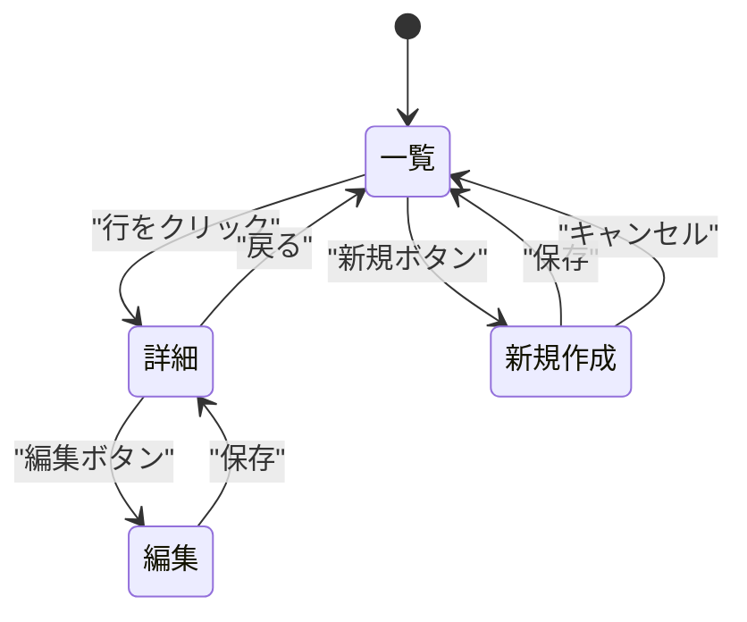

# 画面設計

画面ごとの表示項目・操作・遷移を定義する。

**このスキルの出力が API 設計の入力になる。**
ここで定義した表示項目が、API レスポンスの過不足を判定する唯一の基準になるため、
「何を表示するか」を漏れなく、かつ余計なものを含めずに書くことが重要。

**共通規約 `${CLAUDE_PLUGIN_ROOT}/references/conventions.md` を必ず先に読むこと。**

## 開始前に必ず読むもの

**成果物を書き始める前に、このプロジェクトの学習内容を読む。**
既定より優先度が高い。

```bash
cat docs/mitorizu/.feedback/overrides.md 2>/dev/null
cat docs/mitorizu/.feedback/learnings.md 2>/dev/null
```

無ければ既定で進める。あれば**そちらを優先する**。
詳細は共通規約の「フィードバックの蓄積と反映」を参照。

## 前提

`docs/mitorizu/features/<feature-slug>/requirements.md` が存在すること。
無ければ先に `/mitorizu:requirements` を実行するよう案内する。

## 成果物

```
docs/mitorizu/features/<feature-slug>/
  screens.md         # 画面一覧・表示項目・操作・遷移図
```

## 進め方

### Phase 1: 画面の洗い出し

要件定義書の機能要件 (REQ-NNN) から、必要な画面を導出する。

1. `requirements.md` を読む
2. 各要件を実現するのに必要な画面を列挙する
3. **画面一覧をユーザーに提示して確認を取る**

MVP では画面数を絞る。以下は後回しにできることが多い。

| 画面 | 代替 | 判断 |
| --- | --- | --- |
| 管理画面 | Rails console / 直接 SQL | MVP では省略可 |
| 設定画面 | 環境変数・DB 直編集 | MVP では省略可 |
| 検索画面 | 一覧のみ | MVP では省略可 |
| エラー画面 | 汎用エラーページ1枚 | 個別画面は不要 |

画面IDは `SCR-NNN` の通し番号で振る。

### Phase 2: 画面ごとの表示項目定義 (最重要)

**各画面で「何を表示するか」を1項目ずつ列挙する。**
この粒度が粗いと、API 設計で過不足を判定できなくなる。

各項目について以下を記録する。

| 列 | 内容 |
| --- | --- |
| 項目名 | 画面上のラベル |
| 内容 | 表示される値の説明 |
| 出所 | どのエンティティの何か (この時点では仮でよい) |
| 表示 | 表示する / 非表示 |
| 用途 | **非表示の場合は必須**。何に使うか |

#### 表示項目と非表示項目の区別

画面に文字として出るものだけが必要な項目ではない。
以下は「非表示だが必要な項目」として記録する。**用途を必ず書く。**

| 種類 | 例 | 用途の書き方 |
| --- | --- | --- |
| 後続 API のキー | 一覧行の `id` | 詳細画面への遷移、削除APIのキー |
| クライアント側の分岐 | `editable` | 編集ボタンの出し分け |
| キャッシュ制御 | `updated_at` | 条件付きリクエストの If-Modified-Since |
| ページネーション | `next_cursor` | 次ページ取得 |
| 並び順の保持 | `position` | ドラッグ&ドロップ時の順序送信 |

**用途が書けない項目は削除する。**
「将来使うかもしれない」は用途ではない。必要になったときに追加する。

この原則が API 設計に引き継がれ、
「どこからも参照されないフィールドを返さない」という制約になる。

#### 記述例

```markdown
### SCR-002 注文一覧

| 項目名 | 内容 | 出所 | 表示 | 用途 |
| --- | --- | --- | --- | --- |
| 注文番号 | 表示用の注文識別子 | Order.number | 表示 | - |
| 注文日 | YYYY/MM/DD 形式 | Order.ordered_at | 表示 | - |
| 顧客名 | 注文者の氏名 | Customer.name | 表示 | - |
| 合計金額 | 税込・カンマ区切り | 明細の集計 (導出) | 表示 | - |
| ステータス | バッジ表示 | Order.status | 表示 | - |
| (ID) | 内部識別子 | Order.id | 非表示 | 詳細画面への遷移、キャンセルAPIのキー |
| (キャンセル可否) | 真偽値 | Order.status から導出 | 非表示 | キャンセルボタンの出し分け |
```

`(括弧)` を付けて非表示項目であることを視覚的に区別する。

### Phase 3: 操作の定義

各画面で利用者が行える操作を列挙する。

| 列 | 内容 |
| --- | --- |
| 操作 | ボタン名・アクション名 |
| 条件 | 操作が可能な条件 (権限・状態) |
| 結果 | 操作後に何が起きるか |
| 要件ID | 対応する REQ-NNN |

```markdown
| 操作 | 条件 | 結果 | 要件ID |
| --- | --- | --- | --- |
| 詳細を見る | 常時 | SCR-003 へ遷移 | REQ-004 |
| キャンセル | status が pending のみ | 確認ダイアログ後に取消 | REQ-008 |
| CSV出力 | 管理者のみ | ファイルダウンロード | REQ-011 |
```

**操作は後で API のエンドポイントに対応する。**
条件は権限チェックの要件になるので、曖昧にしない。

### Phase 4: 画面遷移図

mermaid `stateDiagram-v2` で画面の遷移を描く。



**mermaid のラベルは必ずダブルクォートで囲む。**
日本語や括弧を含むラベルは、囲まないと Syntax Error になる。

書いたら検証する。

```bash
"${CLAUDE_PLUGIN_ROOT}/scripts/check-mermaid.sh" docs/mitorizu/features/<slug>/screens.md
```

### 終了前: 学んだことを記録する

このフェーズで**利用者から訂正や指示**を受けたら、
次回も同じ判断をすべきものだけを `docs/mitorizu/.feedback/overrides.md` に追記する。

**記録する前に利用者に確認する。**

```
以下を次回以降の既定にしますか?
  「テーブル名は単数形を使う」(今回のご指摘)

A: 記録する (次回から自動で適用)
B: 今回限り (記録しない)
```

その場限りの指示 (機能名、今回の値) は記録しない。

### Phase 5: 確認と次のステップ

1. `[要確認]` を一覧で再掲する
2. `docs/mitorizu/decisions.md` に確定事項を追記する
3. **`docs/mitorizu/README.md` の該当節を更新する**
   - 「3. 機能一覧」のこの機能の行に、画面名を追記する
   - 「8. 要確認項目」にこの機能の `[要確認]` を追記する
   - 該当節のみを更新し、他の節には触れない
   - README が無ければ新規作成する (テンプレートの見出し構造を作り、担当節のみ埋める)
4. 次のスキルを案内する

```
次のステップ:
- /mitorizu:data-model  ER図とテーブル定義
- /mitorizu:api-design  OpenAPI (data-model の後に実行)
```

**順序に意味がある。**
画面設計 -> データモデル -> API設計 の順で進めることで、
「画面に必要なデータが API から返らない」「使われないフィールドを返している」
という不整合を機械的に検出できる。

## 表示項目を書くときの原則

### 1. 粒度は「画面上の1つの値」

```
悪い: 顧客情報
良い: 顧客名 / 顧客のメールアドレス / 顧客の電話番号
```

まとめて書くと、API がどこまで返すべきか判定できない。

### 2. 導出値は「導出」と明記する

合計金額のようにテーブルに存在しない値は、出所に `(導出)` と書く。
データモデル設計時に「カラムを持つか、都度計算するか」の判断材料になる。

```
| 合計金額 | 税込 | 明細の集計 (導出) | 表示 | - |
| 注文件数 | 顧客ごとの累計 | orders の COUNT (導出) | 表示 | - |
```

導出値が多い画面は、パフォーマンス上の懸念があるため
非機能要件で応答時間の目標を確認する。

### 3. 一覧画面は「1行あたり」で書く

一覧画面の表示項目は、1行に表示される項目を書く。
ページネーション情報 (総件数、次ページの有無) は別途「一覧全体の項目」として書く。

```markdown
#### 一覧全体

| 項目名 | 内容 | 表示 | 用途 |
| --- | --- | --- | --- |
| 総件数 | 「全123件」 | 表示 | - |
| (次ページカーソル) | - | 非表示 | 次ページ取得 |
```

### 4. 権限で表示が変わる場合は分けて書く

```markdown
| 項目名 | 内容 | 出所 | 表示 | 用途 |
| --- | --- | --- | --- | --- |
| 原価 | 管理者のみ表示 | Product.cost | 表示 (管理者のみ) | - |
```

API 設計時に「権限によってレスポンスを変える」実装が必要になるため、
ここで明示しておく。

## 参照

- `${CLAUDE_PLUGIN_ROOT}/references/conventions.md` — 信頼性マーカー、出力先、対話規約
- `${CLAUDE_SKILL_DIR}/references/screens-template.md` — 画面設計書のテンプレート
