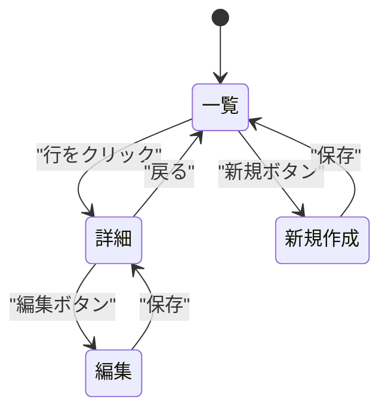

# 画面設計書テンプレート

`docs/mitorizu/features/<feature-slug>/screens.md` の雛形。

---

# 画面設計: <機能名>

- 機能スラッグ: `<feature-slug>`
- 作成日: YYYY-MM-DD
- 対応する要件定義: `requirements.md`

## 1. 画面一覧

| 画面ID | 画面名 | 役割 | 対応要件 | MVP |
| --- | --- | --- | --- | --- |
| SCR-001 | <画面名> | <何をする画面か> | REQ-001, REQ-002 | 含む |
| SCR-002 | <画面名> | <何をする画面か> | REQ-004 | 含む |
| SCR-010 | 管理画面 | <何をする画面か> | REQ-020 | **除外** (Rails console で代替) |

MVP から除外した画面は、理由を併記する。

## 2. 画面遷移図

## 3. 画面ごとの定義

### SCR-001 <画面名>

- 対応要件: REQ-NNN
- アクセス権限: <どのロールが見られるか>
- URL (案): `/path/to/screen`

#### 表示項目

| 項目名 | 内容 | 出所 | 表示 | 用途 | マーカー |
| --- | --- | --- | --- | --- | --- |
| <項目名> | <値の説明> | `Entity.attribute` | 表示 | - | [確実] |
| <項目名> | <値の説明> | 集計 (導出) | 表示 | - | [確実] |
| (ID) | 内部識別子 | `Entity.id` | 非表示 | 詳細画面への遷移キー | [確実] |
| (編集可否) | 真偽値 | `Entity.status` から導出 | 非表示 | 編集ボタンの出し分け | [推測] |

**非表示項目には用途を必ず書く。用途が書けないものは削除する。**

#### 一覧全体の項目 (一覧画面のみ)

| 項目名 | 内容 | 表示 | 用途 |
| --- | --- | --- | --- |
| 総件数 | 「全N件」 | 表示 | - |
| (次ページカーソル) | - | 非表示 | 次ページ取得 |

#### 操作

| 操作 | 条件 | 結果 | 要件ID |
| --- | --- | --- | --- |
| <ボタン名> | <権限・状態の条件> | <遷移先または結果> | REQ-NNN |

#### 入力項目 (フォームのある画面のみ)

| 項目名 | 型 | 必須 | 制約 | 出所 | 要件ID |
| --- | --- | --- | --- | --- | --- |
| <項目名> | text | 必須 | 最大100文字 | `Entity.attribute` | REQ-NNN |
| <項目名> | select | 任意 | <選択肢> | `Entity.attribute` | REQ-NNN |

制約は要件定義書と一致させる。ここで初めて出てくる制約があれば
要件定義書にも追記する。

#### 空状態・エラー時の表示

| 状況 | 表示内容 |
| --- | --- |
| データが0件 | <メッセージと次の行動への導線> |
| 読み込み失敗 | <エラーメッセージ> |
| 権限なし | <メッセージまたは遷移先> |

MVP でも空状態の設計は省略しない。最初のユーザーは必ず0件から始まる。

### SCR-002 <画面名>

(同じ構造を繰り返す)

## 4. 共通要素

全画面で共通する要素があれば記述する。

| 要素 | 内容 | 表示条件 |
| --- | --- | --- |
| ヘッダー | ロゴ・ユーザー名・ログアウト | ログイン後の全画面 |
| フラッシュメッセージ | 操作結果の通知 | 操作後 |

## 5. 要確認項目

| 項目 | 内容 | 仮置きした値 | 確認すべきこと |
| --- | --- | --- | --- |
| SCR-002 | 一覧の1ページ件数 | 20件 | 業務上の妥当性 |

## 6. API 設計への引き継ぎ

このドキュメントの表示項目が、API レスポンスの過不足判定の基準になる。

- **不足の検出**: 表示項目のうち、どの API レスポンスにも含まれないものが無いか
- **過剰の検出**: API レスポンスのフィールドのうち、この表に無いものが無いか

過剰が見つかった場合は、フィールドを削除するか、
このドキュメントに用途付きで追記するかを判断する。
