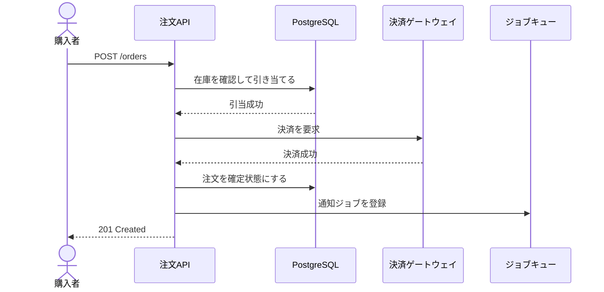
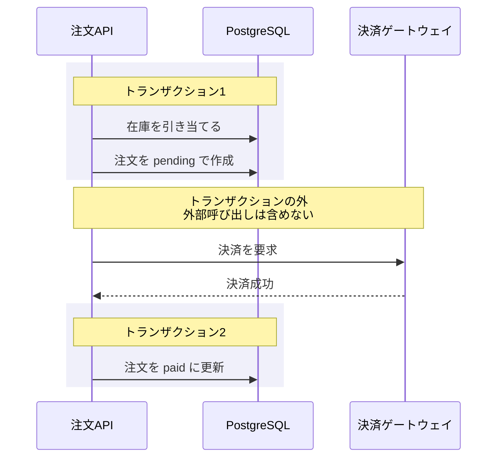

# シーケンス設計

主要な処理の**順序と失敗の扱い**を決める。

**実装者が推測で決める部分を無くすのが目的。**
「決済は成功したが在庫引当に失敗した」のような部分的失敗は、
設計で決めておかないと必ずバグになる。

**共通規約 `${CLAUDE_PLUGIN_ROOT}/references/conventions.md` を必ず先に読むこと。**

## 開始前に必ず読むもの

```bash
cat docs/mitorizu/.feedback/overrides.md 2>/dev/null
cat docs/mitorizu/.feedback/learnings.md 2>/dev/null
```

## 前提

以下が揃っていること。

- `requirements.md` — 業務ルールと異常系
- `api.md` — エンドポイントの一覧
- `data-model.md` — 更新するテーブル

## 成果物

```
docs/mitorizu/features/<feature-slug>/
  sequence.md        # 主要処理のシーケンス図と失敗時の扱い
```

## 何を描くか

**全エンドポイントを描かない。** 単純な CRUD には不要。

### 描くべきもの

| 基準 | 例 |
| --- | --- |
| **複数のコンポーネントをまたぐ** | 在庫サービス + 決済ゲートウェイ + 通知 |
| **失敗すると困る** | 課金、在庫引当、外部への送信 |
| **順序に意味がある** | 在庫を確保してから決済する |
| **非同期がある** | ジョブキューに入れる処理 |
| **部分的失敗がありうる** | 3つのうち2つ成功した場合の扱い |

### 描かなくてよいもの

| 基準 | 例 |
| --- | --- |
| 単一テーブルの読み書き | 一覧取得、詳細取得 |
| 失敗しても再実行すればよい | 検索、集計の表示 |
| 外部呼び出しが無い | プロフィール更新 |

**3〜5本に絞る。** 全部描くと保守されなくなる。

## 進め方

### Phase 1: 描く対象を選ぶ

`api.md` のエンドポイント一覧から、上記の基準で選ぶ。

```
以下の処理についてシーケンスを設計します。

  1. 注文の確定 (在庫引当 + 決済 + 通知。部分的失敗がありうる)
  2. 注文のキャンセル (返金が絡む)
  3. 日次の集計バッチ (非同期・冪等性が必要)

以下は単純なため描きません。
  一覧取得、詳細取得、プロフィール更新
```

### Phase 2: 登場するものを列挙する

**誰が何をするかを先に決める。** 図を描く前に整理する。

| 種別 | 例 | 表記 |
| --- | --- | --- |
| 利用者 | 購入者、管理者 | `actor` |
| クライアント | ブラウザ、モバイルアプリ | `participant` |
| 自システム | API サーバー、ジョブワーカー | `participant` |
| データストア | DB、キャッシュ | `participant` |
| 外部サービス | 決済ゲートウェイ、メール配信 | `participant` |

**外部サービスは必ず分ける。** 自分で制御できないものと、
できるものを区別しないと、失敗時の扱いを決められない。

### Phase 3: 正常系を描く

mermaid `sequenceDiagram` で描く。



**注意点:**

- ラベルは日本語でよい。**ダブルクォートは不要**
  (sequenceDiagram はメッセージ本文をクォートしない)
- `->>` は同期呼び出し、`-->>` は応答
- `-)` は非同期 (応答を待たない)
- participant の別名は `as` で付ける

書いたら検証する。

```bash
"${CLAUDE_PLUGIN_ROOT}/scripts/check-mermaid.sh" docs/mitorizu/features/<slug>/sequence.md
```

### Phase 4: トランザクション境界を明示する (最重要)

**どこからどこまでが1つの DB トランザクションかを書く。**

これが無いと、実装者が勝手に決める。決済の外部呼び出しを
トランザクションの中に入れてしまい、長時間ロックが発生する事故が典型。



**原則: 外部サービスの呼び出しをトランザクションに含めない。**

| 理由 | 何が起きるか |
| --- | --- |
| 応答が遅い | DB のロックが長時間続き、他の処理が詰まる |
| タイムアウトする | ロールバックしても外部側は処理済みかもしれない |
| リトライできない | トランザクションを跨いだ再実行ができない |

### Phase 5: 失敗時の扱いを決める (最重要)

**各ステップで失敗したらどうするかを表で書く。**
図だけでは書ききれない。

| # | 失敗する箇所 | 状態 | 対処 | 利用者への表示 |
| --- | --- | --- | --- | --- |
| 1 | 在庫引当 | 何も起きていない | 注文を作らない | 「在庫が不足しています」 |
| 2 | 決済 | 在庫が引き当て済 | **在庫を解放する** | 「決済に失敗しました」 |
| 3 | 注文の確定更新 | 在庫引当済 + 決済済 | **要対応。手動確認** | 「処理中です。しばらくお待ちください」 |
| 4 | 通知ジョブの登録 | 注文は確定済 | 無視してよい | (表示しない) |

**3番目のような「戻せない失敗」を必ず洗い出す。**
決済は成功したのに注文が作られていない状態は、放置すると顧客の損害になる。

#### 補償処理を書く

**巻き戻しが必要な失敗には、何をするかを具体的に書く。**

```markdown
### 決済失敗時の補償

1. 引き当てた在庫を解放する (`lendings` の該当行を削除)
2. 注文を `cancelled` にする (レコードは残す。監査のため)
3. 利用者にエラーを返す

**在庫の解放は同一トランザクションで行う。**
解放に失敗すると在庫が減ったままになるため。
```

#### 戻せない失敗の扱い

**全ての失敗を自動で回復できるわけではない。**
回復できないものは、そう明記して検知の仕組みを決める。

```markdown
### 決済成功後の DB 更新失敗

自動での回復はできない (決済の取り消しは非同期で結果が不確実)。

対処:
1. エラーログに決済IDと注文内容を記録する
2. 監視で検知して管理者に通知する
3. 管理者が手動で注文を作成するか、返金する

**この状態は月に数件発生しうる。** 運用手順を用意する。
```

### Phase 6: 同期と非同期の境界を決める

**どこまでが利用者を待たせる処理かを明示する。**

| 処理 | 同期/非同期 | 理由 |
| --- | --- | --- |
| 在庫引当 | 同期 | 結果を即座に返す必要がある |
| 決済 | 同期 | 成否を利用者に伝える |
| メール送信 | **非同期** | 遅延しても業務に影響しない |
| 集計の更新 | **非同期** | リアルタイム性が不要 |

**非同期にした処理は、失敗しても利用者には見えない。**
そのため以下を決める。

| 項目 | 決めること |
| --- | --- |
| リトライ | 何回まで再実行するか |
| 失敗の検知 | どうやって気づくか |
| 冪等性 | 2回実行されても問題ないか |

**ジョブは必ず2回以上実行されうる。** 冪等でない処理は事故になる。

### Phase 7: タイムアウトを決める

外部サービスの呼び出しには**必ずタイムアウトを設定する。**

| 呼び出し先 | タイムアウト | 超過時の扱い |
| --- | --- | --- |
| 決済ゲートウェイ | 30秒 | 注文を保留にし、後で照会する |
| メール配信 | 10秒 | リトライキューに入れる |
| 在庫サービス | 5秒 | エラーを返す |

**タイムアウトしたときの状態が最も厄介。**
相手が処理したかどうか分からないため、照会の手段を決める。

```markdown
決済がタイムアウトした場合、決済IDで照会APIを呼び、
実際の結果を確認する。照会もできない場合は保留状態にして
管理者に通知する。
```

### Phase 8: 記録と次のステップ

1. `[要確認]` を一覧で再掲する
2. `docs/mitorizu/README.md` の該当機能の節にシーケンス図を追加する
3. **戻せない失敗があれば運用手順として記録するよう案内する**

```
次のステップ:
- /mitorizu:tasks   実装タスクに分解する
                    (シーケンスで決めた失敗処理もタスクになる)
```

### 終了前: 学んだことを記録する

利用者から訂正を受けたら、次回も同じ判断をすべきものだけを
`docs/mitorizu/.feedback/overrides.md` に追記する。**確認してから書く。**

## よくある失敗

### 1. 正常系しか描かない

**シーケンス図の価値の半分は異常系にある。**
正常系だけなら api.md を読めば分かる。

### 2. トランザクション境界を書かない

実装者が勝手に決める。外部呼び出しをトランザクションに含めて
長時間ロックが発生する事故が典型。

### 3. 「エラーを返す」で終わらせる

**何が起きた状態でエラーを返すのかを書く。**
在庫が引き当てられたままなのか、解放されたのかで
実装がまったく違う。

### 4. 非同期処理の冪等性を考えない

ジョブは必ず2回以上実行されうる。
「メールが2通届く」程度なら軽微だが、「二重に課金する」は事故。

### 5. 図が細かすぎる

**1つの図に20メッセージを超えたら分割する。**
読めない図は保守されない。

## 参照

- `${CLAUDE_SKILL_DIR}/references/sequence-template.md` — シーケンス設計のテンプレート
- `${CLAUDE_PLUGIN_ROOT}/references/conventions.md` — 信頼性マーカー、対話規約
