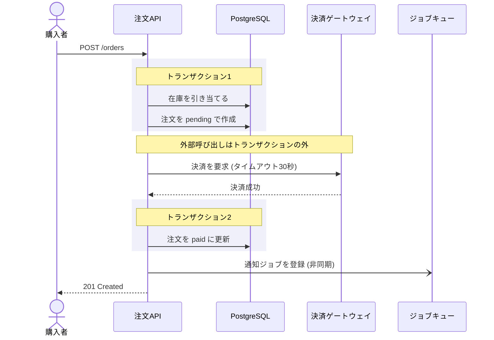

# シーケンス設計のテンプレート

`docs/mitorizu/features/<feature-slug>/sequence.md` の雛形。

**正常系だけ描いても価値は半分。** 失敗時の扱いが本体。

---

# シーケンス設計: <機能名>

- 機能スラッグ: `<feature-slug>`
- 作成日: YYYY-MM-DD
- 対応: `requirements.md` / `api.md` / `data-model.md`

## 1. 設計対象

| # | 処理 | 選んだ理由 |
| --- | --- | --- |
| SEQ-001 | 注文の確定 | 在庫・決済・通知をまたぐ。部分的失敗がありうる |
| SEQ-002 | 注文のキャンセル | 返金が絡む。戻せない失敗がある |
| SEQ-003 | 日次集計バッチ | 非同期。冪等性が必要 |

### 設計しない処理

| 処理 | 理由 |
| --- | --- |
| 一覧取得 | 単一テーブルの読み取りのみ |
| 詳細取得 | 同上 |
| プロフィール更新 | 外部呼び出しが無く、失敗しても再実行すればよい |

## 2. 登場するもの

| 記号 | 名前 | 種別 | 制御できるか |
| --- | --- | --- | --- |
| U | 購入者 | 利用者 | - |
| API | 注文API | 自システム | できる |
| DB | PostgreSQL | データストア | できる |
| PAY | 決済ゲートウェイ | 外部サービス | **できない** |
| MQ | ジョブキュー | 自システム | できる |

**外部サービスは必ず分ける。** 制御できないものの失敗は扱いが異なる。

## 3. SEQ-001 注文の確定

### 正常系

### トランザクション境界

| # | 範囲 | 含むもの | 含まないもの |
| --- | --- | --- | --- |
| 1 | 在庫引当 + 注文作成 | DB の更新2件 | 決済 |
| 2 | 注文の状態更新 | DB の更新1件 | 通知ジョブの登録 |

**外部サービスの呼び出しをトランザクションに含めない。**
応答が遅いと DB のロックが長時間続き、他の処理が詰まるため。

### 失敗時の扱い

| # | 失敗箇所 | その時点の状態 | 対処 | 利用者への表示 |
| --- | --- | --- | --- | --- |
| 1 | 在庫引当 | 何も起きていない | 注文を作らない | 「在庫が不足しています」 |
| 2 | 決済 | 在庫が引き当て済 | **在庫を解放する** | 「決済に失敗しました」 |
| 3 | 決済のタイムアウト | 在庫引当済・決済の結果が不明 | **照会APIで確認する** | 「処理中です」 |
| 4 | 注文の状態更新 | 在庫引当済 + 決済済 | **自動回復不可。手動対応** | 「処理中です」 |
| 5 | ジョブ登録 | 注文は確定済 | 無視してよい | (表示しない) |

### 補償処理

#### 決済失敗時 (#2)

1. 引き当てた在庫を解放する
2. 注文を `cancelled` にする (レコードは残す。監査のため)
3. 利用者にエラーを返す

**在庫の解放は同一トランザクションで行う。**
解放に失敗すると在庫が減ったままになる。

#### 決済タイムアウト時 (#3)

相手が処理したか不明なため、**必ず照会する**。

1. 決済IDで照会APIを呼ぶ
2. 成功していれば正常系の続きへ
3. 失敗していれば #2 の補償処理へ
4. 照会もできない場合は注文を保留にし、管理者に通知する

#### 決済成功後の更新失敗 (#4)

**自動での回復はできない。** 決済の取り消しは非同期で結果が不確実なため。

1. エラーログに決済IDと注文内容を記録する
2. 監視で検知して管理者に通知する
3. 管理者が手動で注文を作成するか、返金する

**この状態は月に数件発生しうる。** 運用手順を用意する。

### 同期と非同期の境界

| 処理 | 同期/非同期 | 理由 |
| --- | --- | --- |
| 在庫引当 | 同期 | 結果を即座に返す必要がある |
| 決済 | 同期 | 成否を利用者に伝える |
| 確認メール送信 | **非同期** | 遅延しても業務に影響しない |
| 在庫数の集計更新 | **非同期** | リアルタイム性が不要 |

#### 非同期処理の要件

| 項目 | 決定 |
| --- | --- |
| リトライ | 3回まで。指数バックオフ |
| 失敗の検知 | 3回失敗したらエラーキューに入れ、日次で確認する |
| 冪等性 | **必要**。ジョブIDで重複実行を防ぐ |

**ジョブは必ず2回以上実行されうる。**
「メールが2通届く」は軽微だが「二重に課金する」は事故。

### タイムアウト

| 呼び出し先 | タイムアウト | 超過時の扱い |
| --- | --- | --- |
| 決済ゲートウェイ | 30秒 | 照会APIで結果を確認する |
| メール配信 | 10秒 | リトライキューに入れる |

## 4. SEQ-002 注文のキャンセル

(同じ構造を繰り返す)

## 5. 要確認項目

| 項目 | 内容 | 仮置き | 確認すべきこと |
| --- | --- | --- | --- |
| 決済のタイムアウト | 30秒 | 30秒 | 決済代行の推奨値 |
| ジョブのリトライ回数 | 3回 | 3回 | 運用上の妥当性 |

## 6. 実装への引き継ぎ

**このドキュメントに書かれた失敗処理は、全てタスクになる。**

`/mitorizu:tasks` を実行する際、以下を実装タスクとして含める。

| 実装すべきもの | 対応する節 |
| --- | --- |
| 在庫解放の補償処理 | 3. 補償処理 #2 |
| 決済の照会処理 | 3. 補償処理 #3 |
| 手動対応の検知と通知 | 3. 補償処理 #4 |
| ジョブの冪等性の担保 | 3. 非同期処理の要件 |

**正常系だけ実装して終わりにしない。**
異常系の実装量は正常系と同等かそれ以上になる。
