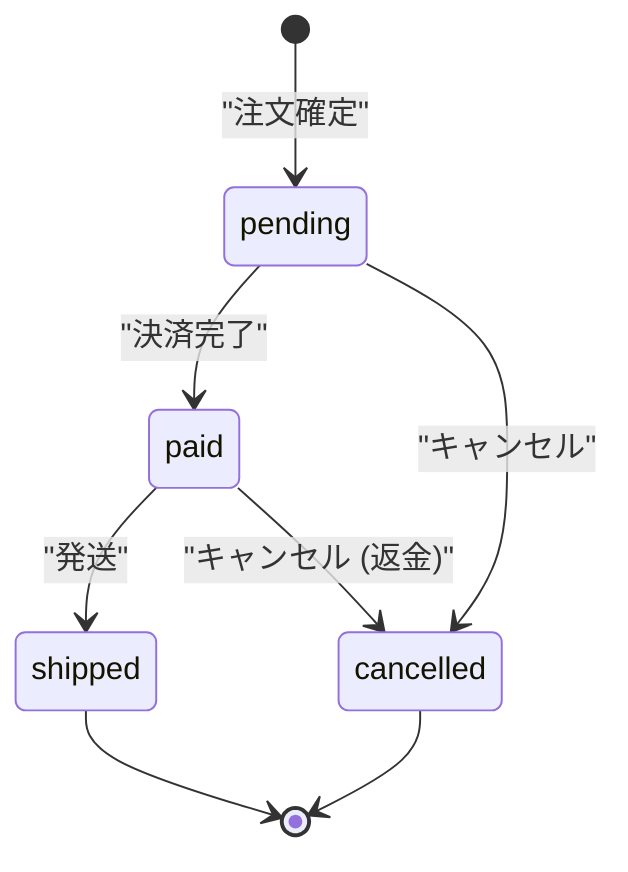

# 状態遷移の設計

状態を持つエンティティの遷移を設計する。

**状態が3つ以上あるとき、または遷移の条件が複雑なときに使う。**
「利用可能 / 貸出中」のような2状態なら、このスキルは不要。
`data-model` の中で扱えば足りる。

**共通規約 `${CLAUDE_PLUGIN_ROOT}/references/conventions.md` を必ず先に読むこと。**

## 開始前に必ず読むもの

```bash
cat docs/mitorizu/.feedback/overrides.md 2>/dev/null
cat docs/mitorizu/.feedback/learnings.md 2>/dev/null
```

## 前提

`requirements.md` があること。状態遷移は業務ルールそのもの。

## 成果物

```
docs/mitorizu/features/<feature-slug>/
  state-machine.md    # 状態遷移の定義
```

## このスキルが必要かの判断

**まず必要かを判断する。** 不要なら明示して終える。

| 状況 | 判断 |
| --- | --- |
| 状態が2つ以下 | **不要**。data-model で扱う |
| 状態が3つ以上 | 必要 |
| 遷移に条件がある (権限・期限・他エンティティの状態) | 必要 |
| 遷移で副作用がある (通知・在庫引当・課金) | 必要 |
| 逆行する遷移がある (差戻し・キャンセル) | 必要 |

```
このエンティティの状態は「利用可能 / 貸出中」の2つで、
遷移も単純です。state-machine スキルは不要と判断しました。
data-model で status カラムとして扱います。
```

## 進め方

### Phase 1: 状態を洗い出す

`requirements.md` から状態を表す語を拾う。

**状態の粒度に注意する。**

| 問題 | 例 | 対処 |
| --- | --- | --- |
| 状態が多すぎる | 12個ある | 属性で表現できるものを分離する |
| 状態と属性の混同 | 「支払済かつ発送済」を1状態にしている | 直交する軸は別カラムにする |
| 存在しない状態 | 実際には到達しない | 削除する |

#### 直交する軸を分ける

```
悪い: pending / paid / paid_and_shipped / cancelled / cancelled_after_payment
良い: status (pending/paid/shipped/cancelled) + payment_status (unpaid/paid/refunded)
```

**1つの状態機械に詰め込まない。** 組み合わせが爆発する。

### Phase 2: 遷移を定義する

**表で書く。** 図だけでは条件と副作用が書けない。

| # | From | To | トリガー | 条件 | 副作用 | 要件ID |
| --- | --- | --- | --- | --- | --- | --- |
| 1 | `pending` | `paid` | 決済完了 | 決済が成功 | 在庫を引き当てる | REQ-005 |
| 2 | `pending` | `cancelled` | キャンセル操作 | 注文者本人 | - | REQ-008 |
| 3 | `paid` | `shipped` | 発送登録 | 管理者のみ | 発送通知を送る | REQ-010 |
| 4 | `paid` | `cancelled` | キャンセル操作 | 発送前のみ | **返金する** | REQ-009 |

**副作用は必ず書く。** ここに書かれていない副作用は実装されない。

### Phase 3: 遷移図を描く

mermaid `stateDiagram-v2` で描く。**表の補助として使う。**



**ラベルは必ずダブルクォートで囲む。**

書いたら検証する。

```bash
"${CLAUDE_PLUGIN_ROOT}/scripts/check-mermaid.sh" docs/mitorizu/features/<slug>/state-machine.md
```

### Phase 4: 不正な遷移を定義する

**定義した遷移「以外」は全て不正。** これを明示する。

| From | To | なぜ不正か | エラー |
| --- | --- | --- | --- |
| `cancelled` | `paid` | 取消済の注文は復活しない | 409 `INVALID_STATE_TRANSITION` |
| `shipped` | `cancelled` | 発送後は返品フローを使う | 409 `ALREADY_SHIPPED` |
| `pending` | `shipped` | 決済前に発送はできない | 409 `PAYMENT_REQUIRED` |

**全ての不正遷移を列挙しない。** 起こりうるもの、
利用者が試みそうなものだけを書く。残りは「上記以外は全て 409」とまとめる。

### Phase 5: 終端状態を確認する

**どの状態からも抜けられなくなっていないか。**

| 状態 | 終端か | 抜ける方法 |
| --- | --- | --- |
| `pending` | いいえ | 決済 or キャンセル |
| `paid` | いいえ | 発送 or キャンセル |
| `shipped` | **はい** | (完了) |
| `cancelled` | **はい** | (完了) |

**意図しない終端状態はバグ。**
「エラー」状態を作ったが復旧手段が無い、というのはよくある失敗。

### Phase 6: 同時実行を考える

**2人が同時に遷移させたらどうなるか。**

| 状況 | 対策 |
| --- | --- |
| 同じ遷移を2回 | 冪等にする (2回目は成功扱い) |
| 別の遷移を同時に | 楽観ロック (`lock_version`) または DB 制約 |
| 副作用が二重に走る | 副作用は遷移成功後に1回だけ |

**在庫引当や課金のような副作用は、二重実行が致命的。**
DB の制約で防げるものは制約で防ぐ。

```markdown
[確実] 同一注文への同時キャンセルは、楽観ロックで片方を失敗させる。
       返金処理が二重に走ることを防ぐため。
```

### Phase 7: 引き継ぎ情報を整理する

**このスキルの出力が data-model と api-design の入力になる。**

#### data-model への引き継ぎ

| 項目 | 内容 |
| --- | --- |
| カラム | `status` (string / enum) |
| 初期値 | `pending` |
| 取りうる値 | `pending`, `paid`, `shipped`, `cancelled` |
| 同時実行対策 | `lock_version` が必要か |
| 遷移日時 | `paid_at`, `shipped_at`, `cancelled_at` を持つか |

**遷移日時を持つかは重要な判断。**
「いつ発送したか」を後から知りたいなら、遷移ごとにカラムが要る。

#### api-design への引き継ぎ

**状態を変える操作は専用エンドポイントにする。**
`PATCH` で `status` を直接書き換えさせない。不正な遷移を防げなくなる。

| 遷移 | エンドポイント |
| --- | --- |
| `pending` -> `paid` | `POST /orders/{id}/pay` |
| `* -> cancelled` | `POST /orders/{id}/cancel` |
| `paid` -> `shipped` | `POST /orders/{id}/ship` |

**画面での出し分けに使うフィールド**も定義する。

```
cancellable: boolean   キャンセルボタンの表示
shippable: boolean     発送ボタンの表示 (管理者のみ)
```

### Phase 8: 記録と次のステップ

1. `[要確認]` を一覧で再掲する
2. `docs/mitorizu/README.md` の該当機能の節に状態遷移図を追加する

```
次のステップ:
- /mitorizu:data-model   status カラムと遷移日時を設計する
- /mitorizu:api-design   遷移ごとの専用エンドポイントを設計する
```

### 終了前: 学んだことを記録する

利用者から訂正を受けたら、次回も同じ判断をすべきものだけを
`docs/mitorizu/.feedback/overrides.md` に追記する。**確認してから書く。**

## よくある失敗

### 1. 状態を増やしすぎる

状態が7つを超えたら、**直交する軸が混ざっていないか**を疑う。

```
悪い: draft / submitted / approved / rejected / approved_and_paid / approved_and_shipped
良い: approval_status (draft/submitted/approved/rejected)
     + fulfillment_status (pending/paid/shipped)
```

### 2. 副作用を書かない

```
悪い: paid -> cancelled (キャンセル)
良い: paid -> cancelled (キャンセル、**返金処理が走る**)
```

副作用が書かれていないと実装されない。

### 3. 逆行を考えない

「差戻し」「取消」「復活」があるかを必ず確認する。
後から追加すると、状態を持つ既存データの扱いに困る。

### 4. 権限を書かない

**誰がその遷移を起こせるか**を書く。
「発送」は管理者のみ、「キャンセル」は本人と管理者、のように違う。

## 参照

- `${CLAUDE_SKILL_DIR}/references/state-machine-template.md` — 状態遷移定義のテンプレート
- `${CLAUDE_PLUGIN_ROOT}/references/conventions.md` — 信頼性マーカー、対話規約
