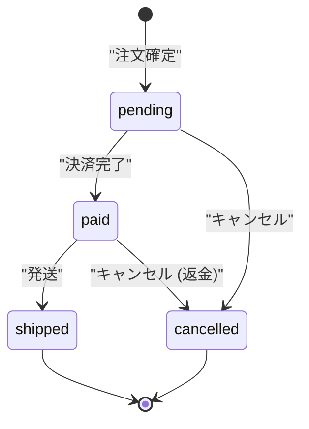

# 状態遷移定義のテンプレート

`docs/mitorizu/features/<feature-slug>/state-machine.md` の雛形。

---

# 状態遷移: <エンティティ名>

- 対象: `orders` テーブルの `status` カラム
- 対応要件: REQ-005 〜 REQ-010

## 1. 状態の一覧

| 値 | 意味 | 終端か |
| --- | --- | --- |
| `pending` | 注文受付。決済待ち | いいえ |
| `paid` | 決済完了 | いいえ |
| `shipped` | 発送済 | **はい** |
| `cancelled` | 取消済 | **はい** |

初期値: `pending`

**意図しない終端状態が無いことを確認する。**
抜けられない状態を作るのはよくある失敗。

## 2. 遷移図

## 3. 遷移の定義

**副作用と権限を必ず書く。** ここに無いものは実装されない。

| # | From | To | トリガー | 条件 | 権限 | 副作用 | 要件ID |
| --- | --- | --- | --- | --- | --- | --- | --- |
| 1 | `pending` | `paid` | 決済完了 | 決済が成功 | システム | 在庫を引き当てる | REQ-005 |
| 2 | `pending` | `cancelled` | キャンセル | - | 本人・管理者 | - | REQ-008 |
| 3 | `paid` | `shipped` | 発送登録 | - | 管理者のみ | 発送通知を送る | REQ-010 |
| 4 | `paid` | `cancelled` | キャンセル | 発送前のみ | 本人・管理者 | **返金する** | REQ-009 |

## 4. 不正な遷移

**定義した遷移以外は全て不正。** 起こりうるものを列挙する。

| From | To | なぜ不正か | エラー |
| --- | --- | --- | --- |
| `cancelled` | `paid` | 取消済は復活しない | 409 `INVALID_STATE_TRANSITION` |
| `shipped` | `cancelled` | 発送後は返品フローを使う | 409 `ALREADY_SHIPPED` |
| `pending` | `shipped` | 決済前に発送はできない | 409 `PAYMENT_REQUIRED` |

上記以外の未定義の遷移は全て 409 `INVALID_STATE_TRANSITION` を返す。

## 5. 同時実行の扱い

| 状況 | 対策 | マーカー |
| --- | --- | --- |
| 同じ遷移を2回 | 冪等にする (2回目も成功を返す) | [確実] |
| 同時にキャンセル | 楽観ロック (`lock_version`) | [確実] |
| 返金の二重実行 | 遷移成功後に1回だけ実行する | [確実] |

**副作用の二重実行は致命的。** 在庫引当や課金は特に注意する。
DB の制約で防げるものは制約で防ぐ。

## 6. data-model への引き継ぎ

| 項目 | 決定 |
| --- | --- |
| カラム | `status` (string) |
| 初期値 | `pending` |
| 取りうる値 | `pending` / `paid` / `shipped` / `cancelled` |
| 同時実行対策 | `lock_version` を持つ |
| 遷移日時 | `paid_at` `shipped_at` `cancelled_at` を持つ |

**遷移日時を持つ理由**: 「いつ発送したか」を後から知る必要があるため (REQ-012)。
不要なら持たない。持つと決めたら、その理由を書く。

## 7. api-design への引き継ぎ

状態を変える操作は**専用エンドポイント**にする。
`PATCH` で `status` を直接書き換えさせない (不正な遷移を防げなくなる)。

| 遷移 | エンドポイント | 権限 |
| --- | --- | --- |
| `pending` -> `paid` | `POST /orders/{id}/pay` | システム |
| `* -> cancelled` | `POST /orders/{id}/cancel` | 本人・管理者 |
| `paid` -> `shipped` | `POST /orders/{id}/ship` | 管理者 |

### 画面での出し分けに使うフィールド

| フィールド | 型 | 用途 |
| --- | --- | --- |
| `cancellable` | boolean | SCR-002 キャンセルボタンの表示 |
| `shippable` | boolean | SCR-003 発送ボタンの表示 (管理者のみ) |

**これらは screens.md の非表示項目として定義する。**
用途は「ボタンの出し分け」と書く。

## 8. 要確認項目

| 項目 | 内容 | 仮置き | 確認すべきこと |
| --- | --- | --- | --- |
| 返金の範囲 | 全額か一部か | 全額 | 手数料を差し引くか |
| キャンセル期限 | いつまで可能か | 発送前 | 決済後N時間などの制限があるか |
