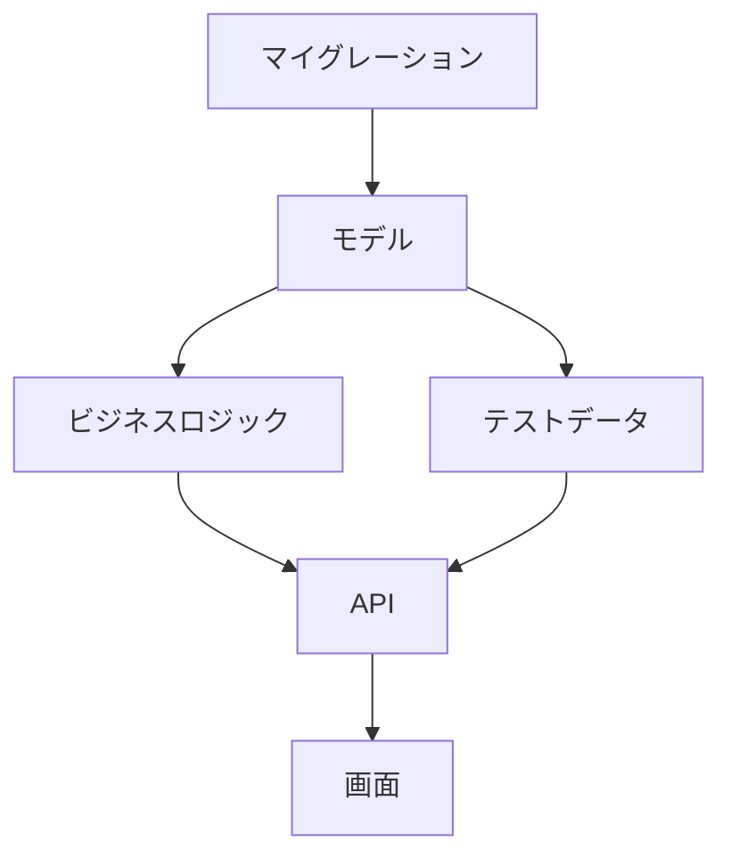

# 実装タスクへの分解

設計ドキュメントから、**何を・どの順で作るか** を決める。

**このスキルは実装しない。** タスクリストを作るところまで。
実装は Claude Code 本体や他のツールに任せる。

**共通規約 `${CLAUDE_PLUGIN_ROOT}/references/conventions.md` を必ず先に読むこと。**

## 開始前に必ず読むもの

**成果物を書き始める前に、このプロジェクトの学習内容を読む。**
既定より優先度が高い。

```bash
cat docs/mitorizu/.feedback/overrides.md 2>/dev/null
cat docs/mitorizu/.feedback/learnings.md 2>/dev/null
```

無ければ既定で進める。あれば**そちらを優先する**。

## 前提

以下が揃っていること。無ければ先に実行するよう案内する。

- `requirements.md` — 受入基準の元になる
- `screens.md` — 画面の実装単位
- `data-model.md` — マイグレーションの内容
- `api.md` — エンドポイントの実装単位

**`traceability.md` の検証が0件であること。**
不整合を抱えたままタスク分解すると、実装中に必ず手戻りが起きる。
0件でなければ `/mitorizu:validate` を先に実行するよう案内する。

## 成果物

```
docs/mitorizu/features/<feature-slug>/
  tasks.md           # 実装タスクの一覧と依存関係
```

## 進め方

### Phase 1: 実装単位を洗い出す

設計ドキュメントから、実装すべきものを機械的に列挙する。

| 設計書 | 実装単位になるもの |
| --- | --- |
| `data-model.md` | テーブルごとのマイグレーション、モデル |
| `api.md` | エンドポイントごとのコントローラ、シリアライザ |
| `screens.md` | 画面ごとのビュー、コンポーネント |
| `requirements.md` | ビジネスロジック (状態遷移、バリデーション) |

**この時点では順序を考えない。** 洗い出しに集中する。

### Phase 2: 依存関係を決める

実装には**必然的な順序**がある。守らないと動かない。



| 依存 | 理由 |
| --- | --- |
| マイグレーション -> モデル | テーブルが無いとモデルが動かない |
| モデル -> ビジネスロジック | モデルが無いとロジックが書けない |
| ビジネスロジック -> API | ロジックが無いと API が中身を持てない |
| API -> 画面 | API が無いと画面がデータを取れない |

**この順序は変えない。** ただし**機能をまたぐ場合は並列にできる**。

```
機能A: マイグレーション -> モデル -> ロジック -> API -> 画面  ┐
機能B: マイグレーション -> モデル -> ロジック -> API -> 画面  ┤ 並列可
```

共有エンティティがある場合のみ、そこを先に作る。

### Phase 3: 粒度を決める

**1タスク = 1つの意味のある単位。** 大きすぎても小さすぎても使いにくい。

| 粒度 | 判断 |
| --- | --- |
| 大きすぎる | 「API を実装する」(エンドポイントが5つある) |
| **適切** | 「GET /books を実装する」 |
| 小さすぎる | 「books コントローラの index メソッドに1行追加」 |

目安は **1タスク30分〜2時間**。それを超えるなら分割する。

判断基準:

- **テストが書ける単位か** — 書けないなら大きすぎる
- **単独でレビューできるか** — できないなら大きすぎる
- **単独で意味があるか** — 無いなら小さすぎる

### Phase 4: 各タスクに情報を紐づける

**タスクだけでは実装できない。** 何を見ればよいかを書く。

| 列 | 内容 | 必須 |
| --- | --- | --- |
| ID | `T-NNN` の通し番号 | 必須 |
| タスク | 何を作るか | 必須 |
| 依存 | 先に終わっている必要があるタスク | 必須 |
| **参照** | **設計書のどこを見るか** | **必須** |
| **受入基準** | **どうなれば完了か** | **必須** |
| 要件ID | 対応する REQ-NNN | - |
| 見積 | 目安の時間 | - |

参照は**ファイルと節**まで書く。「設計書を見る」では足りない。

```
| T-003 | Book モデルの実装 | T-001 | data-model.md の books テーブル定義 | ... |
```

### Phase 5: 受入基準を書く

**受入基準は `requirements.md` の受入基準 (AC-NNN) から導出する。**
EARS 記法で書かれているため、そのままテスト条件になる。

```
REQ-002: もし書籍が既に貸出中の場合、システムは貸出を拒否し、
         現在の借り手名を表示すること。
   ↓
AC-002: 貸出中の書籍に対して貸出APIを呼ぶと 409 が返り、
        レスポンスに借り手名が含まれる
   ↓
T-012 の受入基準: 上記 AC-002 が満たされる
```

受入基準が書けないタスクは、**設計が不足している**サイン。
何をもって完了とするかが決まっていない。設計に戻る。

### Phase 6: MVP の範囲を確認する

**全タスクを実装する必要はない。**
`requirements.md` の「やらないこと」に対応するタスクは除外する。

```markdown
| ID | タスク | MVP | 理由 |
| --- | --- | --- | --- |
| T-001 | books マイグレーション | 含む | - |
| T-020 | 検索機能 | **除外** | MVP では一覧のみ (REQ で対象外) |
```

除外したタスクも**リストには残す**。後で追加するときに使う。

### Phase 7: 実装順序を提示する

依存関係を満たす順序で並べる。**並列にできるものは明示する。**

```markdown
## 実装順序

### ステップ1 (並列可)
- T-001 books マイグレーション
- T-002 employees マイグレーション

### ステップ2 (並列可)
- T-003 Book モデル (T-001 に依存)
- T-004 Employee モデル (T-002 に依存)

### ステップ3
- T-005 lendings マイグレーション (T-001, T-002 に依存)
```

**最初に動くものが出るまでの最短経路**を示す。
全部作ってから動かすのではなく、早く1本通す。

```
最短で動作確認できる経路: T-001 -> T-003 -> T-008 -> T-015
(一覧が表示できるところまで。貸出機能は含まない)
```

### Phase 8: 確認と次のステップ

1. **受入基準が空欄のタスクが無いか確認する**
2. `docs/mitorizu/README.md` の該当節を更新する
   - 「3. 機能一覧」にタスク数と実装状況の列を追加する
3. 実装への引き継ぎを案内する

```
タスク分解が完了しました。

  docs/mitorizu/features/book-lending/tasks.md  (18タスク)
  MVP 対象: 14タスク / 除外: 4タスク

実装に進む場合、以下を参照してください。
  tasks.md          何を作るか、どの順で
  api.md            API の仕様
  data-model.md     テーブル定義とマイグレーション

このスキルは実装しません。実装は Claude Code 本体で進めてください。
実装後に設計とのズレが出たら /mitorizu:validate で検証できます。
```

### 終了前: 学んだことを記録する

このフェーズで**利用者から訂正や指示**を受けたら、
次回も同じ判断をすべきものだけを `docs/mitorizu/.feedback/overrides.md` に追記する。

**記録する前に利用者に確認する。**

## 分解の原則

### 1. テストできる単位で切る

```
悪い: 「認証機能を実装する」
良い: 「メールとパスワードでログインできる」
     「5回失敗するとアカウントがロックされる」
```

後者はそれぞれテストが書ける。

### 2. 縦に切る (横に切らない)

```
悪い (横割り): 全モデル -> 全コントローラ -> 全ビュー
良い (縦割り): 一覧機能 (モデル+API+画面) -> 詳細機能 -> 作成機能
```

横割りは**最後まで何も動かない**。縦割りなら1機能ずつ動作確認できる。

ただし**共有部分 (認証、共通レイアウト) は先に作る**。

### 3. 早く動かす

**最初に動くものが出るまでの経路を最短にする。**

```
優先: 一覧が表示できる (データを手で入れてもよい)
後回し: 登録機能、バリデーション、エラー処理
```

動くものがあると、設計の誤りに早く気づける。

### 4. 実装しないものも書く

MVP から外したタスクもリストに残す。理由を添える。
「なぜ入っていないのか」を後から問われる手間を省ける。

## 参照

- `${CLAUDE_SKILL_DIR}/references/tasks-template.md` — タスクリストのテンプレート
- `${CLAUDE_PLUGIN_ROOT}/references/conventions.md` — 信頼性マーカー、対話規約
